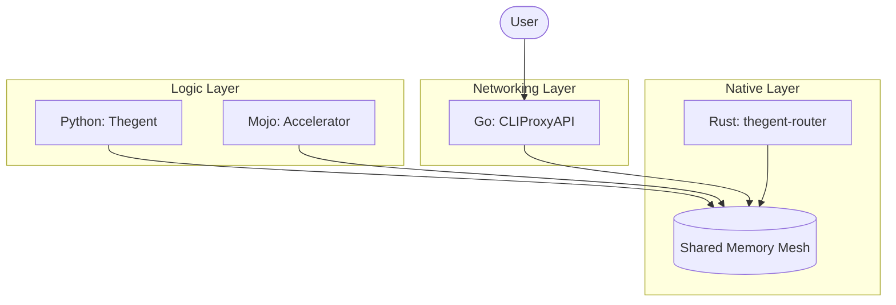

# Thegent 2026 Polyglot Architecture: Shared State Design

## 1. The "Single Source of Truth" (SHM)

Instead of each runtime maintaining its own metrics and state, we will use a **Memory-Mapped Shared Region** managed by a Rust library with bindings for Python and Go.

### State Layout (Conceptual)

```rust
struct GlobalState {
    // Provider Health & Quotas
    providers: [ProviderState; 32],

    // Circuit Breakers
    circuit_breakers: [AtomicBool; 32],

    // Global Token Buckets (Rate Limiting)
    rate_limits: [TokenBucket; 64],

    // Real-time Telemetry Ring Buffer
    telemetry_log: RingBuffer<SpanEntry, 1024>,
}
```

## 2. Cross-Language Interop Strategy

| Path               | Mechanism               | Use Case                                        |
| :----------------- | :---------------------- | :---------------------------------------------- |
| **Python -> Rust** | `PyO3` / Native         | Heuristics, Logic acceleration, SHM access.     |
| **Go -> Rust**     | `CGO` or `unix-sockets` | Metric reporting, Rate limit checks from Proxy. |
| **Mojo -> Rust**   | `C-ABI`                 | High-speed math on shared state.                |
| **Python -> Go**   | `JSON-RPC` (local)      | Provider config updates, Auth flow triggers.    |

---

## 3. Library Research (2026 Edition)

### Rust

- **`iceoryx2`**: High-performance, cross-language IPC that "just works" for C, Rust, and Python.
- **`shm-rs`**: For low-level memory mapping.
- **`capnproto-rust`**: Zero-copy serialization.

### Go

- **`nng-go`**: Scalability protocols for high-speed messaging.
- **`mmap-go`**: To map the Rust-managed SHM files.

### Python

- **`orjson`**: Still the fastest for JSON.
- **`extism`**: For the Zig/Wasm plugin host.
- **`pydantic-core`**: (Rust-based) for high-speed validation.

---

## 4. Migration WBS (Refined)

### Step 1: The `thegent-shm` Extension

- **Task**: Implement a Rust crate that defines the shared memory layout.
- **Task**: Export `get_shm_ptr()` via C-ABI.

### Step 2: Go Integration

- **Task**: Update `cliproxyapi-plusplus/internal/usage` to write directly to the SHM ring buffer instead of (or in addition to) the Postgres/File store.
- **Task**: Use `mmap-go` to attach to the `thegent` mesh.

### Step 3: Mojo Logic Offloading

- **Task**: Identify the most expensive Python functions in `router.py`.
- **Task**: Implement them in Mojo, reading the SHM state directly for zero-latency routing decisions.

---

## 5. Visual Flow


