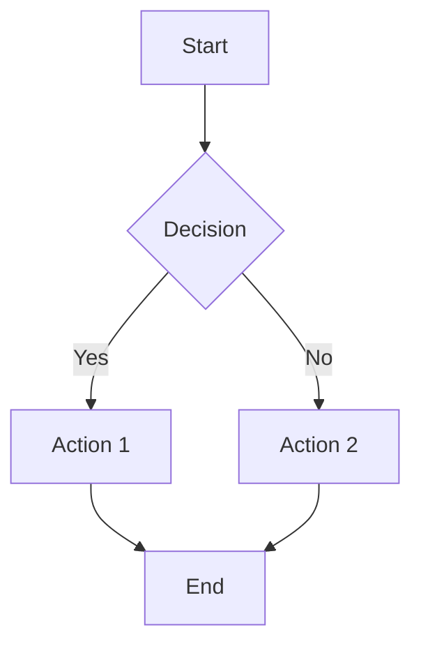

# VitePress Rich Documentation — Usage Guide

> **Purpose**: Developer guide for using VitePress rich documentation features
> **Date**: 2026-02-17

---

## Overview

This guide explains how to use the rich documentation features implemented in VitePress, including Mermaid diagrams, interactive code playgrounds, demo GIFs, and auto-generated content.

---

## Rich Elements

### 1. Mermaid Diagrams

Mermaid diagrams are automatically rendered from markdown code blocks.

**Usage**:

````markdown

````

**Supported Diagram Types**:

- Flowcharts (`graph TD`, `graph LR`)
- Sequence diagrams (`sequenceDiagram`)
- Class diagrams (`classDiagram`)
- State diagrams (`stateDiagram`)
- Gantt charts (`gantt`)
- And more...

**Theme**: Automatically adapts to light/dark mode

---

### 2. CodePlayground Component

Interactive code playgrounds for tryable code examples.

**Usage**:

```vue
<CodePlayground
  lang="python"
  title="Example"
  code="from thegent import Agent
agent = Agent('codex')
result = agent.run('Hello world')
print(result)"
/>
```

**Props**:

- `lang` - Language (python, bash, javascript, etc.)
- `code` - Code to display
- `title` - Optional title
- `endpoint` - Optional API endpoint for execution (future)

**Features**:

- Copy code button
- Run button (ready for API integration)
- Output/error display
- Dark mode support

---

### 3. DemoGif Component

Display demo GIFs in documentation.

**Usage**:

```vue
<DemoGif src="cli-demo.gif" alt="CLI Demo" caption="Running thegent commands" />
```

**Props**:

- `src` - GIF filename (in `docs/public/assets/demos/`)
- `alt` - Alt text
- `caption` - Optional caption

**Generating GIFs**:

```bash
# Generate from VHS tape files
./scripts/generate-demo-gifs.sh

# Or use agent workflow
python3 scripts/agent-generate-demos.py
```

---

### 4. Callout Component

Display callouts, warnings, tips, etc.

**Usage**:

```vue
<Callout type="warning">
  This is a warning callout
</Callout>

<Callout type="tip">
  This is a tip
</Callout>
```

**Types**: `info`, `warning`, `danger`, `tip`, `note`, `success`, `question`, `example`

**Collapsible Callouts**:

```vue
<Callout type="tip" collapsible>
  Click to expand this tip
</Callout>
```

---

### 5. Math Support (KaTeX)

Render mathematical equations using KaTeX.

**Inline Math**:

```markdown
The formula $E = mc^2$ shows mass-energy equivalence.
```

**Block Math**:

```markdown
$$
\int_0^1 x^2 dx = \frac{1}{3}
$$
```

**Complex Equations**:

```markdown
$$
\begin{pmatrix}
a & b \\
c & d
\end{pmatrix}
\begin{pmatrix}
x \\
y
\end{pmatrix}
=
\begin{pmatrix}
ax + by \\
cx + dy
\end{pmatrix}
$$
```

**Features**:

- Automatic rendering
- Syntax highlighting
- Responsive display
- Dark mode support

**See**: [Math & Emoji Examples](../examples/math-emoji-example.md)

---

### 6. Emoji Support

Use emojis in your documentation.

**Usage**:

```markdown
:smile: :rocket: :heart: :fire: :star:
```

**Common Emojis**:

- `:smile:` 😄
- `:rocket:` 🚀
- `:heart:` ❤️
- `:fire:` 🔥
- `:star:` ⭐
- `:thumbsup:` 👍
- `:ok_hand:` 👌

**Technical Emojis**:

- `:computer:` 💻
- `:keyboard:` ⌨️
- `:file_folder:` 📁
- `:page_facing_up:` 📄

**Status Emojis**:

- `:white_check_mark:` ✅
- `:x:` ❌
- `:warning:` ⚠️
- `:bulb:` 💡

**See**: [Math & Emoji Examples](../examples/math-emoji-example.md)

---

### 7. Tooltip Component

Add helpful tooltips to text.

**Usage**:

```vue
<Tooltip content="This is a helpful tooltip" position="top">
  Hover over this text
</Tooltip>
```

**Positions**:

- `top` - Tooltip above (default)
- `bottom` - Tooltip below
- `left` - Tooltip to the left
- `right` - Tooltip to the right

**Props**:

- `content` - Tooltip text (required)
- `position` - Position (`top`, `bottom`, `left`, `right`)
- `delay` - Delay in milliseconds (default: 200)

**Examples**:

```vue
<!-- Basic tooltip -->
<Tooltip content="Application Programming Interface">API</Tooltip>

<!-- Technical term -->
<Tooltip content="Model Context Protocol" position="right">MCP</Tooltip>

<!-- With delay -->
<Tooltip content="Delayed tooltip" delay="500">Hover me</Tooltip>
```

**Features**:

- Smooth animations
- Keyboard accessible
- Responsive positioning
- Dark mode support

**See**: [Tooltip Examples](../examples/tooltip-example.md)

---

### 8. Breadcrumb Component

Display breadcrumb navigation.

**Usage**:

```vue
<Breadcrumb />

<!-- Or with custom items -->
<Breadcrumb
  :items="[
    { text: 'Home', link: '/' },
    { text: 'Guides', link: '/guides/' },
    { text: 'Current Page' },
  ]"
  separator="/"
/>
```

**Auto-Generation**: Automatically generates from route if no items provided.

**See**: Component is automatically included in Layout.

---

### 9. Back-to-Top Button

Smooth scroll to top button (automatically included).

**Features**:

- Appears after scrolling 400px
- Smooth scroll animation
- Keyboard accessible
- Mobile responsive

---

## Auto-Generated Content

### API Documentation

Auto-generated from Python docstrings.

**Generate**:

```bash
# Generate all API docs
python3 scripts/generate-api-docs.py

# Generate specific module
python3 scripts/generate-api-docs.py --module agents/base.py
```

**Output**: `docs/reference/api/`

**Format**: Markdown with extracted docstrings, signatures, and method documentation

---

### Architecture Diagrams

Auto-generated Mermaid diagrams from code structure.

**Generate**:

```bash
# Generate dependency graph and class hierarchy
python3 scripts/generate-architecture-diagrams.py

# Generate only dependency graph
python3 scripts/generate-architecture-diagrams.py --type dependencies
```

**Output**: `docs/reference/architecture/`

**Diagrams**:

- Dependency graph (module imports)
- Class hierarchy (inheritance)

---

### CLI Examples

Auto-generated interactive CLI examples from Typer commands.

**Generate**:

```bash
python3 scripts/generate-cli-examples.py
```

**Output**: `docs/reference/cli-examples.md`

**Format**: Markdown with CodePlayground components

---

### Sidebar

Auto-generated from directory structure.

**Generate**:

```bash
python3 scripts/generate-sidebar.py
```

**Output**: `docs/.vitepress/sidebar.ts`

**Features**:

- Automatically extracts titles from frontmatter or H1
- Supports nested directories
- Excludes special directories (.vitepress, node_modules, etc.)

**Integration**: Already imported in `config.ts`

---

### LLM-Friendly Documentation

Generate `.llms.txt` files for LLM consumption.

**Generate**:

```bash
python3 scripts/generate-llms-docs.py
```

**Output**: `.llms/` directory

**Features**:

- Removes Vue components
- Cleans HTML comments
- Optionally includes/excludes code blocks
- Generates index file

---

## Unified Workflow

Run all generators at once:

```bash
# Run all generators
python3 scripts/vitepress-agent-workflow.py

# Or use npm script
bun run docs:generate

# Skip slow operations (demo GIFs)
python3 scripts/vitepress-agent-workflow.py --skip-demos

# Run specific phases
python3 scripts/vitepress-agent-workflow.py --api-docs --sidebar
```

**Phases**:

1. API Documentation Generation
2. Architecture Diagrams Generation
3. CLI Examples Generation
4. Demo GIFs Generation (optional)
5. Sidebar Generation
6. LLM-Friendly Documentation Generation

---

## Development Workflow

### 1. Making Changes

1. **Update Code/Documentation**:
   - Modify Python files (for API docs)
   - Update markdown files (for content)
   - Add new CLI commands (for CLI examples)

2. **Regenerate Content**:

   ```bash
   bun run docs:generate
   ```

3. **Preview Changes**:

   ```bash
   bun run docs:dev
   ```

4. **Build**:
   ```bash
   bun run docs:build
   ```

### 2. Adding New Features

**New Mermaid Diagram**:

- Add markdown code block with ` ```mermaid `
- Diagram renders automatically

**New CodePlayground**:

- Use `<CodePlayground>` component in markdown
- Or Vue file

**New Demo GIF**:

1. Create VHS tape file in `docs/demos/cli/`
2. Or create Playwright script in `docs/demos/web/`
3. Run `./scripts/generate-demo-gifs.sh`

**New Math Equation**:

- Use `$...$` for inline math
- Use `$$...$$` for block math
- KaTeX automatically renders

**New Emoji**:

- Use `:emoji_name:` syntax
- See [emoji list](https://github.com/markdown-it/markdown-it-emoji)

**New Tooltip**:

- Use `<Tooltip>` component
- Wrap text that needs explanation

---

## CI/CD Integration

### Pre-Build Hook

Add to CI/CD pipeline:

```yaml
# Example GitHub Actions
- name: Generate Documentation
  run: |
    python3 scripts/vitepress-agent-workflow.py --skip-demos

- name: Build Documentation
  run: |
    bun run docs:build
```

### Pre-Commit Hook

Optional pre-commit hook:

```bash
#!/bin/bash
# .git/hooks/pre-commit

# Regenerate sidebar before commit
python3 scripts/generate-sidebar.py
git add docs/.vitepress/sidebar.ts
```

---

## Troubleshooting

### Mermaid Diagrams Not Rendering

- Check syntax in code block
- Verify `vitepress-plugin-mermaid` is installed
- Check browser console for errors

### CodePlayground Not Showing

- Verify component is registered in `theme/index.ts`
- Check Vue component syntax
- Ensure code prop is properly escaped

### Sidebar Not Updating

- Regenerate: `python3 scripts/generate-sidebar.py`
- Check `config.ts` imports sidebar correctly
- Verify file paths are correct

### API Docs Missing

- Check Python files have docstrings
- Verify source directory path
- Check output directory permissions

---

## Best Practices

1. **Keep Docstrings Updated**: API docs auto-generate from docstrings
2. **Use Frontmatter**: Helps with sidebar generation and metadata
3. **Organize by Directory**: Sidebar structure follows directory structure
4. **Test Locally**: Always preview with `docs:dev` before committing
5. **Regenerate Regularly**: Run workflow before major releases

---

## See Also

- [VITEPRESS_RICH_DOCUMENTATION_IMPLEMENTATION_PLAN.md](../research/VITEPRESS_RICH_DOCUMENTATION_IMPLEMENTATION_PLAN.md) - Full implementation plan
- [VITEPRESS_PHASE1_COMPLETE.md](../research/VITEPRESS_PHASE1_COMPLETE.md) - Phase 1 details
- [VITEPRESS_PHASE2_IMPLEMENTATION.md](../research/VITEPRESS_PHASE2_IMPLEMENTATION.md) - Phase 2 details
- [VITEPRESS_PHASE3_COMPLETE.md](../research/VITEPRESS_PHASE3_COMPLETE.md) - Phase 3 details
- [WORK_STREAM.md](../reference/WORK_STREAM.md) - Unified work stream

---

**Status**: ✅ **Ready for Use**
