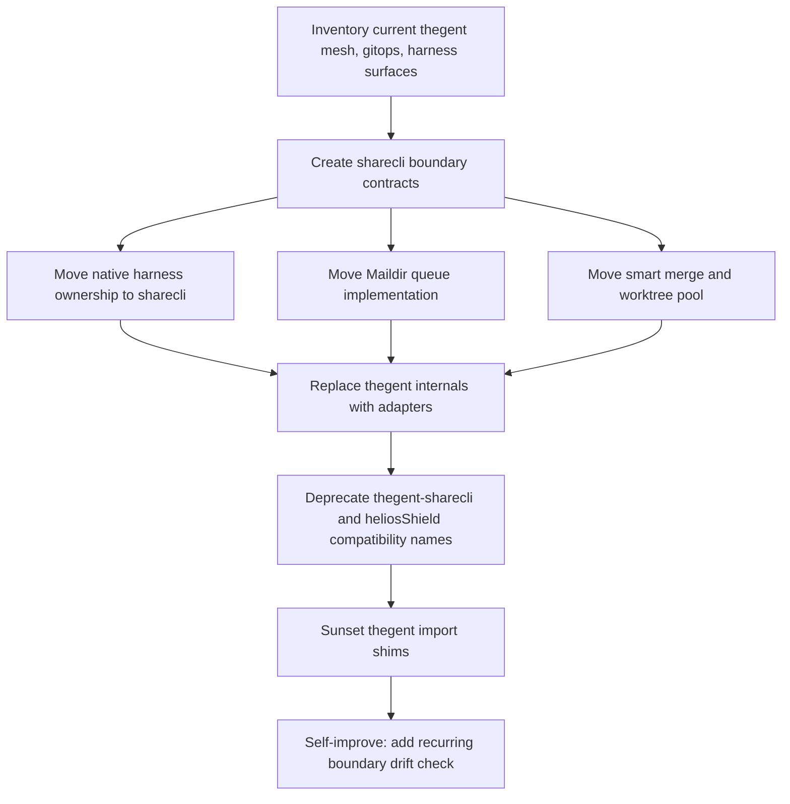

# thegent / sharecli Boundary Audit - 2026-06-21

## Purpose

This audit reconstructs the historical `thegent` scope and defines the next
repository boundary for `thegent-sharecli -> sharecli`. It is pre-code planning:
no modules are moved by this document. The goal is to make the next migration
decision-complete before implementation.

## Evidence Used

- `docs/research/HOLISTIC_RESEARCH_SYNTHESIS_2026-02-20.md`
- `docs/research/PROJECT_SPECIFIC_RESEARCH_REVIEW.md`
- `docs/reference/WORK_STREAM.md`
- `docs/reports/2026-02-23-worklog-wave76-lane-e.md`
- `docs/reports/2026-02-19-ENV-MIGRATION-PROGRESS.md`
- `docs/guides/COMPLETE_USER_GUIDE.md`
- Current code under `src/thegent/mesh/`, `src/thegent_gitops/`,
  `src/thegent/governance/heliosShield_bridge.py`, and `crates/harness-native/`
- `docs/specs/contracts/sharecli-boundary-contracts.md`
- `docs/specs/contracts/sharecli-boundary-drift-check.md`
- `KooshaPari/sharecli`, cloned locally at `C:\Users\koosh\migration-work\sharecli`
- `KooshaPari/thegent-sharecli`, cloned locally at
  `C:\Users\koosh\migration-work\thegent-sharecli`

Remote and local checkout note: both `sharecli` and `thegent-sharecli` exist.
`sharecli` is public, active, Rust-based, and last pushed on 2026-06-20.
`thegent-sharecli` is public and present, but `sharecli/AGENTS.md` and
`sharecli/BOUNDARY.md` classify it as archived / duplicate prototype lineage.

## Historical Scope Chart

| Period                | Evidence                                                                                                                                                                                                        | thegent scope at that point                                                                                     | Boundary implication                                                                                  |
| --------------------- | --------------------------------------------------------------------------------------------------------------------------------------------------------------------------------------------------------------- | --------------------------------------------------------------------------------------------------------------- | ----------------------------------------------------------------------------------------------------- |
| Portfolio split       | `DEVELOPER_QUICKSTART.md` names `sharecli/` as the unified CLI for the agent harness, while `thegent/` is agent orchestration and governance MCP.                                                               | Separate projects existed conceptually: `thegent` for orchestration, `sharecli` for harness execution.          | `sharecli` should own command proxying and execution substrate.                                       |
| Absorption phase      | `HOLISTIC_RESEARCH_SYNTHESIS_2026-02-20.md` states `sharecli` and `heliosShield` were absorbed into `thegent`; `COMPLETE_USER_GUIDE.md` calls Agent Mesh "formerly heliosShield".                               | thegent became an umbrella hub containing orchestration, mesh, harness, shell, git parallelism, and governance. | This created scope sprawl and mixed control-plane code with execution substrate code.                 |
| Workstream closure    | `WORK_STREAM.md` and Wave 76 close `sharecli-smart-merge`, `sharecli-git-parallelism`, and `sharecli-task-queue` inside `src/thegent/mesh`.                                                                     | sharecli-class items were implemented inside thegent with tests.                                                | These are code-backed migration candidates, not speculative features.                                 |
| Repo split revival    | `sharecli` was created 2026-03-25 as Rust process management. `thegent-sharecli` was created the same day as a Python prototype.                                                                                | The split reappeared as two repos with overlapping names but different stacks.                                  | Canonical target is `sharecli`; `thegent-sharecli` is not a durable boundary.                         |
| Consolidation commits | `sharecli` history includes `feat: consolidate sharecli with dedup/queue modules from thegent-sharecli`, `docs: ShareCLI boundary lock`, and `docs(agents): clarify boundary with thegent-sharecli (archived)`. | The active repo already absorbed relevant prototype concepts.                                                   | Fold any remaining `thegent-sharecli` planning into `sharecli`; do not grow `thegent-sharecli`.       |
| Current checkout      | `src/thegent/mesh`, `src/thegent_gitops`, `crates/harness-native`, and `heliosShield_bridge.py` remain in thegent.                                                                                              | thegent still contains both coordination policy and low-level execution substrate.                              | Move in stages: contracts first, then implementation ownership, then deprecate compatibility imports. |

## Boundary Decision

`sharecli` owns process orchestration and the execution substrate. `thegent`
owns the orchestration, governance, agent runtime, and tool registry control
plane. Any `thegent-sharecli` namespace or branch should fold into canonical
`sharecli`, not become a third durable surface.

This matches `sharecli/BOUNDARY.md`: sharecli owns cross-project CLI process
lifecycle and shared orchestration hooks, and explicitly does not own the agent
runtime or tool registry.

### Move to sharecli

| Surface                                       | Current location                                                                        | Reason                                                                                                     | Migration posture                                                                                     |
| --------------------------------------------- | --------------------------------------------------------------------------------------- | ---------------------------------------------------------------------------------------------------------- | ----------------------------------------------------------------------------------------------------- |
| Maildir task queue                            | `src/thegent/mesh/task_queue.py`                                                        | Filesystem queue is execution substrate and already tagged `sharecli-task-queue`.                          | Move behind a small queue contract; keep `thegent.mesh.task_queue` as a temporary import shim.        |
| Smart merge                                   | `src/thegent/mesh/smart_merge.py` and merge tests                                       | AST-aware merge is harness / parallel edit infrastructure.                                                 | Move implementation to sharecli; thegent calls through a merge service adapter.                       |
| Git worktree parallelism                      | `src/thegent/mesh/git_parallelism.py`, `src/thegent_gitops/`                            | Worktree pools and git concurrency are agent execution plumbing.                                           | Move shared worktree pool and conflict queue logic to sharecli; keep governance decisions in thegent. |
| Native harness dispatcher                     | `crates/harness-native/`                                                                | Rust command proxy, queue, cache, retry, debounce, jobserver, and throttle strategies are harness runtime. | Canonicalize in sharecli as the native runtime crate; thegent depends on a CLI/API contract.          |
| Environment purification and shell guardrails | research review and harness docs                                                        | This is OS-level safety after command execution.                                                           | Add to sharecli roadmap before broad code movement.                                                   |
| Legacy heliosShield bridge execution helpers  | `src/thegent/governance/heliosShield_bridge.py`                                         | It creates shared tasks, broadcasts intents, and invokes harness state.                                    | Split: sharecli owns harness operations; thegent owns governance calls into that adapter.             |
| thegent-sharecli prototype concepts           | `thegent-sharecli/src/thegent_cli_share/adapters/{dedup,queue}.py` and app/domain files | sharecli history already indicates dedup/queue concepts were consolidated from this repo.                  | Treat as source evidence only; do not add new work to this repo.                                      |

### Keep in thegent

| Surface                                                   | Reason                                                                                |
| --------------------------------------------------------- | ------------------------------------------------------------------------------------- |
| Agent orchestration, team coordination, and swarm policy  | Control-plane behavior and human/agent workflow decisions.                            |
| Governance, policy, evidence, compliance, trust, and HITL | These are decisions about whether work may proceed, not how commands execute.         |
| MCP server and adapter orchestration                      | thegent remains the integration and tool-routing hub.                                 |
| Agent runtime and tool registry                           | `sharecli/BOUNDARY.md` says these are not sharecli-owned.                             |
| Memory, research, traceability, and registry              | These are agent context and knowledge systems, not harness mechanics.                 |
| User-facing high-level CLI commands                       | Keep UX in thegent where it coordinates policies and delegates execution to sharecli. |

### Shared contract only

| Contract                  | Producer | Consumer | Minimum behavior                                                         |
| ------------------------- | -------- | -------- | ------------------------------------------------------------------------ |
| Queue contract            | sharecli | thegent  | enqueue, claim, ack, requeue, list, stale-inflight detection.            |
| Merge contract            | sharecli | thegent  | configure driver, run merge, report conflicts, record evidence.          |
| Worktree contract         | sharecli | thegent  | allocate workspace, publish status, release workspace, queue conflicts.  |
| Harness health contract   | sharecli | thegent  | status, version, root path, active workers, queue depth, degraded state. |
| Execution safety contract | sharecli | thegent  | sandbox tier, command policy result, resource envelope, audit record.    |

## Current Coupling Findings

- `src/thegent/mesh` imports mostly local modules plus `thegent.infra.shim_subprocess`
  and `thegent.config` in CLI paths. This is separable if subprocess execution
  and settings are abstracted.
- `src/thegent_gitops` imports `thegent.infra.shim_subprocess` and has a type-only
  relationship to `thegent.mesh.smart_merge`. It should move with worktree and
  merge contracts, but it needs a subprocess adapter first.
- `src/thegent/governance/heliosShield_bridge.py` imports `ThegentSettings`,
  `shim_subprocess`, and `MeshManager`. This is a mixed boundary file: its
  governance-facing API can stay, but harness operations should delegate to
  sharecli.
- `crates/harness-native` is already a natural sharecli crate. Its Rust surface
  contains command dispatch, cache keys, agent detection, queue strategy, retry,
  throttle, debounce, coalesce, jobserver, and speculative execution strategies.
- `sharecli` currently implements Rust process management around `ProcessPool`,
  `SharedRuntime`, `ResourceManager`, `ProcessStats`, CLI commands, TOML config,
  and process-compose generation.
- `thegent-sharecli` is Python with a hexagonal package
  `src/thegent_cli_share` and adapters for dedup and queue. It is useful for
  concept recovery, but the active implementation target is `sharecli`.

## File Disposition Backlog

| File or group                                       | Disposition            | Rationale                                                                                                               |
| --------------------------------------------------- | ---------------------- | ----------------------------------------------------------------------------------------------------------------------- |
| `src/thegent/mesh/task_queue.py`                    | move                   | Maildir queue is execution substrate and already verified as `sharecli-task-queue`.                                     |
| `src/thegent/mesh/smart_merge.py`                   | move                   | Smart merge is parallel edit infrastructure and maps to `sharecli-smart-merge`.                                         |
| `src/thegent/mesh/git_parallelism.py`               | move                   | Shared worktree pool and git concurrency belong to sharecli.                                                            |
| `src/thegent/mesh/worktree.py`                      | move                   | Worktree lifecycle is execution substrate.                                                                              |
| `src/thegent/mesh/merge.py`                         | move                   | Legacy merge wrapper belongs with sharecli merge contract.                                                              |
| `src/thegent/mesh/cache.py`                         | move                   | Singleflight/cache heat-map behavior is command proxy optimization.                                                     |
| `src/thegent/mesh/sandbox.py`                       | move                   | Sandbox tier mechanics belong to execution safety.                                                                      |
| `src/thegent/mesh/isolation.py`                     | move                   | Resource/worktree isolation is harness substrate.                                                                       |
| `src/thegent/mesh/resources.py`                     | move                   | Process resource limits belong to sharecli process orchestration.                                                       |
| `src/thegent/mesh/process_detection.py`             | move                   | Process discovery is sharecli-owned per active `sharecli` boundary.                                                     |
| `src/thegent/mesh/audit.py`                         | adapter                | Keep policy decisions in thegent, but execution evidence collection should be emitted by sharecli.                      |
| `src/thegent/mesh/observability.py`                 | adapter                | thegent can present mesh status, but process stats and queue depth should come from sharecli.                           |
| `src/thegent/mesh/cli.py` and `main.py`             | adapter                | User commands can remain, but should delegate to sharecli contracts.                                                    |
| `src/thegent/mesh/mesh.py`                          | adapter                | Mixed control-plane and Maildir queue usage; split queue/process mechanics out.                                         |
| `src/thegent/mesh/agent_patterns.py`                | adapter                | Pattern detection may remain surfaced in thegent but should consume sharecli process inventory.                         |
| `src/thegent/mesh/injection.py`                     | review                 | Shell/session injection can be sharecli-owned if it is command execution; keep in thegent only for policy-gated UX.     |
| `src/thegent/mesh/coordination.py`                  | review                 | File coordination crosses control plane and execution substrate; split after contracts are defined.                     |
| `src/thegent/mesh/consensus.py`                     | keep                   | Consensus is orchestration policy unless it directly controls process execution.                                        |
| `src/thegent/mesh/helios_bridge.py`                 | sunset                 | Name is legacy; replace with sharecli adapter naming.                                                                   |
| `src/thegent/mesh/git.py`                           | sunset                 | Thin re-export over `thegent_gitops`; replace after gitops migration.                                                   |
| `src/thegent_gitops/*`                              | move                   | Git operations, worktree pools, identity, lock cleanup, and native git status belong with sharecli execution substrate. |
| `src/thegent/governance/heliosShield_bridge.py`     | adapter                | Governance API stays, harness operations delegate to sharecli. Rename after compatibility window.                       |
| `crates/harness-native/*`                           | move                   | Native command dispatcher and strategy runtime are sharecli-owned.                                                      |
| `tests/mesh/*`                                      | split                  | Move substrate behavior tests with implementation; keep thegent adapter tests.                                          |
| `tests/unit/governance/test_heliosShield_bridge.py` | adapter                | Convert to governance adapter contract tests.                                                                           |
| `thegent-sharecli/src/thegent_cli_share/*`          | sunset/source evidence | Archived Python prototype; use for concept recovery only.                                                               |
| `sharecli/src/*`                                    | keep in sharecli       | Active Rust canonical process manager. Extend here rather than in thegent.                                              |

## Caller and Test Owner Map

This map turns the disposition backlog into implementation lanes. A row is not
ready for code movement until its listed tests either move with the owner-side
implementation or become explicit adapter/shim tests in `thegent`.

| Surface                                         | Direct callers and coupling                                                                                                 | Test owner or gate                                                                                                                       |
| ----------------------------------------------- | --------------------------------------------------------------------------------------------------------------------------- | ---------------------------------------------------------------------------------------------------------------------------------------- |
| `task_queue.py`                                 | `src/thegent/mesh/mesh.py`, `src/thegent/mesh/cli.py`, `src/thegent/mesh/__init__.py`, process-detection tests.             | `tests/mesh/test_task_queue.py`; adapter coverage in `tests/mesh/test_process_detection.py`.                                             |
| `smart_merge.py`                                | `src/thegent/mesh/git_parallelism.py`, `src/thegent_gitops/worktree.py`, `src/thegent/mesh/__init__.py`.                    | `tests/mesh/test_smart_merge.py`; integration rows using `WorktreePool`.                                                                 |
| `git_parallelism.py`                            | Smart-merge integration tests and public mesh imports.                                                                      | `tests/mesh/test_git_parallelism.py`, `tests/unit/test_git_parallelism.py`, smart-merge integration cases.                               |
| `worktree.py`                                   | `src/thegent/mesh/isolation.py` lazy import.                                                                                | `tests/mesh/test_worktree.py`, isolation adapter coverage.                                                                               |
| `merge.py`                                      | Legacy smart-merge CLI/compat surface.                                                                                      | `tests/mesh/test_merge.py`.                                                                                                              |
| `cache.py`                                      | Exported by `src/thegent/mesh/__init__.py`; internal substrate optimization.                                                | `tests/mesh/test_cache.py`.                                                                                                              |
| `sandbox.py`                                    | Execution safety mechanics.                                                                                                 | `tests/mesh/test_sandboxing.py`; future sharecli execution-safety tests.                                                                 |
| `isolation.py`                                  | Lazy worktree manager import; resource/worktree isolation split.                                                            | `tests/mesh/test_isolation.py`.                                                                                                          |
| `resources.py`                                  | Process resource limits.                                                                                                    | `tests/mesh/test_resources.py`; future sharecli limits tests.                                                                            |
| `process_detection.py`                          | `agent_patterns.py`, process discovery tests, agent registry/discovery docs.                                                | `tests/mesh/test_process_detection.py`.                                                                                                  |
| `audit.py`                                      | Audit manager surface only.                                                                                                 | `tests/mesh/test_audit.py`; keep policy assertions in thegent.                                                                           |
| `observability.py`                              | `src/thegent/mesh/main.py` status command.                                                                                  | `tests/mesh/test_observability.py`; sharecli health contract tests.                                                                      |
| `cli.py` and `main.py`                          | User-visible Typer/CLI entrypoints; import `MeshManager`, detection, queue commands, and legacy `SmartMerge`.               | `tests/mesh/test_main_discover.py` plus command smoke tests added during adapter stage.                                                  |
| `mesh.py`                                       | Owns `MaildirQueue` composition and process iteration.                                                                      | `tests/mesh/test_process_detection.py`; queue/process adapter tests.                                                                     |
| `agent_patterns.py`                             | Imports `process_detection`; reads `.heliosShield/agents.conf`.                                                             | Process detection tests plus adapter tests for sharecli process inventory.                                                               |
| `injection.py`                                  | Shell/session subprocess operations.                                                                                        | `tests/mesh/test_injection.py`; review before move because UX policy may stay in thegent.                                                |
| `coordination.py`                               | File coordination, OCC, conflict prediction.                                                                                | `tests/mesh/test_coordination.py`, `tests/mesh/test_file_coordination.py`; split only after merge/worktree contracts land.               |
| `consensus.py`                                  | No current substrate caller found in the quick import pass.                                                                 | Keep in thegent; add drift check if future process execution imports appear.                                                             |
| `helios_bridge.py` and `git.py`                 | Legacy naming / thin re-export to `thegent_gitops.git`.                                                                     | `tests/mesh/test_git.py`; deprecation tests before sunset.                                                                               |
| `src/thegent_gitops/*`                          | `src/thegent/mesh/git.py`, `src/thegent_gitops/__init__.py`, `src/thegent_gitops/worktree.py` type-only smart-merge import. | Move with worktree contract; preserve `tests/mesh/test_git.py` and worktree/smart-merge integrations.                                    |
| `src/thegent/governance/heliosShield_bridge.py` | `reward_model.py`, `teammates.py`, `mesh/cli.py`, teammate integration/unit tests.                                          | `tests/test_integration_teammates_heliosShield.py`, `tests/unit/governance/test_heliosShield_bridge.py`, `tests/test_unit_teammates.py`. |
| `crates/harness-native/*`                       | Listed in `crates/Cargo.toml`; owns dispatcher/cache/retry/throttle/jobserver strategies.                                   | Move or mirror into sharecli first; Rust crate tests become sharecli gates.                                                              |

## Pre-Code Migration DAG

## Execution Stages

| Stage                                 | Output                                                                                                                                                   | Gate                                                                               |
| ------------------------------------- | -------------------------------------------------------------------------------------------------------------------------------------------------------- | ---------------------------------------------------------------------------------- | ---------------------------------------------------------------------- |
| R&D 0: Source recovery                | Confirm local or remote `sharecli` and `thegent-sharecli` refs, branches, and commit logs.                                                               | Evidence list includes repo refs or states they are unavailable.                   |
| R&D 1: Contract spec                  | `docs/specs/contracts/sharecli-boundary-contracts.md` defines queue, merge, worktree, harness health, process lifecycle, and execution safety contracts. | thegent can compile/import against contracts without moved implementations.        |
| Build 2: sharecli runtime home        | Move or mirror `crates/harness-native` under canonical sharecli ownership.                                                                               | Native crate tests pass in sharecli and callers still work through stable CLI/API. |
| Build 3: Python substrate movement    | Move queue, smart merge, and git parallelism into sharecli package namespace.                                                                            | Existing tests pass through compatibility shims.                                   |
| Build 4: thegent adapter cleanup      | Replace direct mesh/harness imports in governance and CLI with sharecli adapters.                                                                        | `rg "heliosShield                                                                  | thegent-sharecli"` only finds compatibility docs or deprecation notes. |
| Sunset 5: remove compatibility shims  | Remove temporary thegent import shims after downstream callers are updated.                                                                              | Import-boundary tests reject new substrate imports in thegent.                     |
| Self-improve 6: recurring drift check | `docs/specs/contracts/sharecli-boundary-drift-check.md` defines staged reporter-to-fail behavior for import and implementation drift.                    | Boundary drift becomes a failing check with actionable output.                     |

## Open Questions for R&D

1. Should `crates/harness-native` be moved as-is, or renamed to a sharecli
   native runtime crate during migration?
2. Should `thegent.mesh` remain as a user-visible CLI namespace, or become a
   compatibility namespace that delegates to `sharecli`?
3. Which compatibility window is acceptable for `heliosShield` naming:
   immediate removal, one release, or docs-only alias?
4. Should sharecli expose a Python API, a CLI-only API, or both?
5. How much of `thegent-sharecli`'s hexagonal domain model should be preserved
   as documentation versus ported into Rust types?

## Next Concrete Work

1. Mirror this audit in `sharecli/BOUNDARY.md` or an equivalent sharecli-side
   migration plan so the target repo owns the future surface.
2. Keep the boundary drift reporter in advisory mode through
   `task quality:sharecli-boundary` until the first migrated lane lands.
3. Turn the caller/test-owner map into four disjoint PR lanes: native harness,
   queue, merge/worktree/gitops, and thegent adapter cleanup.
4. Start the first code movement lane with `native-harness`: mirror or move the
   runtime into sharecli ownership, add owner-side tests, then enforce the
   `native-harness` drift lane.
