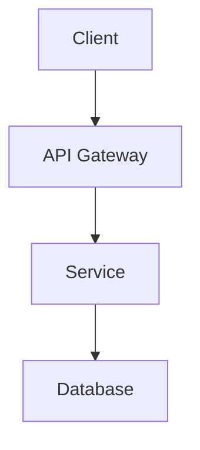

<DONE>
# API, CLI, and DevOps Documentation Tools Research Report

**Research Date:** February 2026
**Scope:** 2025-2026 tooling landscape for API, CLI, DevOps, and Documentation Testing

---

## Executive Summary

This research provides a comprehensive analysis of current documentation tooling across four domains: API documentation, CLI documentation, DevOps/Infrastructure documentation, and Documentation testing. Key findings indicate:

1. **API Documentation**: RapiDoc and Scalar offer the best modern UX with framework-free Web Components and OpenAPI-first approaches. Swagger UI remains the industry standard for compatibility.
2. **CLI Documentation**: Docusaurus and VitePress dominate as static site generators, with Docusaurus offering React ecosystem integration and VitePress providing superior build performance.
3. **DevOps Documentation**: Mermaid and PlantUML serve complementary use cases - Mermaid for web-native diagrams, PlantUML for comprehensive UML support.
4. **Documentation Testing**: Lychee emerges as the premier link checking solution with Rust-based performance and GitHub Actions integration.

---

## 1. API Documentation Tools

### 1.1 Swagger UI

| Aspect | Details |
|--------|---------|
| **Type** | Open-source UI renderer |
| **License** | Apache 2.0 |
| **Price** | Free |
| **Website** | swagger.io/tools/swagger-ui/ |

**Key Features:**
- Visualizes and interacts with API resources
- Auto-generated from OpenAPI/Swagger Specifications
- Dependency-free (works in any environment)
- Human-friendly interface for trying operations
- Supports Swagger 2.0 and OAS 3.0
- Full customization via source code access

**Pros:**
- Industry standard with broadest adoption
- Excellent tooling ecosystem integration
- No vendor lock-in
- Extensive community support

**Cons:**
- UI feels dated compared to modern alternatives
- Limited theming options
- Performance degrades with large specs

---

### 1.2 Redoc / Redocly

| Aspect | Details |
|--------|---------|
| **Type** | Commercial API documentation platform |
| **License** | Proprietary (free tier available) |
| **Price** | Free tier + paid plans |
| **Website** | redocly.com/ |

**Key Features:**
- Three-panel and stacked layout options
- Code block syntax highlighting
- Schema documentation with nested properties
- Search functionality with AI assistance
- OpenAPI/Swagger specification support

**Pros:**
- Professional appearance
- Customizable theming via CSS variables
- AI assistant integration

**Cons:**
- Free tier limitations
- Less community-driven than open-source alternatives

---

### 1.3 RapiDoc

| Aspect | Details |
|--------|---------|
| **Type** | Web Component-based API docs |
| **License** | MIT |
| **Price** | Free |
| **Website** | rapidocweb.com/ |

**Key Features:**
- Web Component Standard - framework agnostic
- Use as HTML tag with attribute-based configuration
- Fully customizable (fonts, logos, colors, themes)
- Minimal dependencies - no runtime, no virtual DOM
- Built-in API console for testing with auth support
- Two rendering modes: Developer view and Wiki-like mode
- Built-in Markdown rendering
- Tabular and tree view for schema display
- Minimal clicks to browse specs

**Pros:**
- No build steps required
- Highly customizable appearance
- Lightweight and fast (minimal dependencies)
- Supports external audience-friendly rendering
- Built-in API testing console
- Works with any framework or vanilla JavaScript

**Cons:**
- Requires basic HTML/JavaScript knowledge
- May need additional setup for advanced auth scenarios

---

### 1.4 Scalar

| Aspect | Details |
|--------|---------|
| **Type** | API Platform (Client + Docs + Registry + SDK) |
| **License** | MIT (open-source) |
| **Price** | Free tier + paid plans |
| **Website** | scalar.com/ |

**Key Features:**
- **Scalar API Client**: Open-source, offline-first Postman alternative
- **Scalar Docs**: Modern documentation with Markdown/MDX + OpenAPI
- **Scalar Registry**: Centralized API definition repository
- **SDK Generation**: TypeScript, Python, Golang, PHP, Java, Ruby
- GitHub sync, custom HTML/CSS/JS
- JSON Schema support, Spectral Rules

**Pros:**
- Fully open-source (MIT license)
- Built on OpenAPI standard
- No vendor lock-in
- Cross-platform (Linux, Windows, macOS)
- Integrates docs, client, registry, and SDKs

**Cons:**
- AsyncAPI support "coming soon"
- Less mature than established competitors

---

### 1.5 API Documentation Comparison Matrix

| Feature | Swagger UI | Redoc | RapiDoc | Scalar |
|---------|------------|-------|---------|--------|
| Open Source | Yes | Partial | Yes | Yes |
| Free Tier | Yes | Yes | Yes | Yes |
| Built-in API Testing | No | No | Yes | Yes |
| Custom Theming | Limited | Yes | Yes | Yes |
| Framework Required | No | No | No | Optional |
| Performance | Moderate | Good | Excellent | Good |
| Markdown Support | No | No | Yes | Yes |
| Interactive Console | No | No | Yes | Yes |

---

### 1.6 Mock Servers from OpenAPI

| Tool | Description | License |
|------|-------------|---------|
| **Prism** | Open-source mock server, validation, proxy | MIT |
| **Stoplight Prism** | Similar to above, now community-maintained | Apache 2.0 |
| **swagger-cli** | CLI for Swagger validation and bundling | Apache 2.0 |
| **openapi-mermaid** | Generates mock servers from specs | MIT |

---

## 2. CLI Documentation Tools

### 2.1 Docusaurus

| Aspect | Details |
|--------|---------|
| **Type** | Static Site Generator (React-based) |
| **License** | MIT |
| **Price** | Free (open source) |
| **Website** | docusaurus.io/ |

**Key Features:**
- MDX support for interactive documentation
- Built-in versioning
- Internationalization (i18n)
- SEO-friendly static HTML
- Hot reloading with incremental builds
- Route-based code splitting
- Pluggable architecture
- Search functionality
- React-powered theming

**Comparison with alternatives:**
| vs Gatsby | vs Next.js | vs VitePress | vs MkDocs |
|-----------|------------|--------------|-----------|
| More focused on docs | More opinionated | Vue-based | Python-based |
| Lower learning curve | Out-of-box features | React-based | No SPA |

**Pros:**
- Large ecosystem of plugins
- React ecosystem integration
- Strong community support
- Excellent documentation for users
- Comprehensive feature set

**Cons:**
- Build times can be slow for large sites
- React dependency may be overkill for simple docs

---

### 2.2 VitePress

| Aspect | Details |
|--------|---------|
| **Type** | Static Site Generator (Vue-based) |
| **License** | MIT |
| **Price** | Free (open source) |
| **Website** | vitepress.dev/ |

**Key Features:**
- Creates docs from Markdown
- Instant server start
- Lightning-fast hot updates
- Vue syntax in Markdown
- Custom themes with Vue
- Static HTML + client-side routing
- Vite ecosystem integration
- Developed by Evan You (Vue creator)

**Pros:**
- Exceptional build performance (Vite-powered)
- Lightweight
- Vue ecosystem integration
- Modern developer experience

**Cons:**
- Smaller plugin ecosystem than Docusaurus
- Vue-specific (less flexible for React teams)

---

### 2.3 Mintlify

| Aspect | Details |
|--------|---------|
| **Type** | Documentation Platform |
| **License** | Proprietary |
| **Price** | Free tier + Enterprise plans |
| **Website** | mintlify.com/ |

**Key Features:**
- AI-powered documentation
- llms.txt support
- MCP support
- Self-updating knowledge
- Enterprise features (SOC 2, SSO)

**Pros:**
- Modern AI features
- Good for team collaboration
- Enterprise-grade security

**Cons:**
- Less control than open-source options
- Vendor lock-in concerns
- Less customizable

---

### 2.4 CLI Help Generators (In-Code)

| Tool | Description | Language |
|------|-------------|----------|
| **oclif** | Node.js CLI framework with built-in help | JavaScript/TypeScript |
| **Cobra** | Go CLI framework with auto-help | Go |
| **Typer** | Python CLI library with help generation | Python |
| **Clap** | Rust CLI argument parser | Rust |
| **Argparse** | Python standard library | Python |

---

### 2.5 CLI Documentation Comparison Matrix

| Feature | Docusaurus | VitePress | Mintlify |
|---------|------------|-----------|----------|
| Open Source | Yes | Yes | No |
| Free Tier | Yes | Yes | Yes |
| Build Speed | Moderate | Fast | N/A (hosted) |
| Plugin Ecosystem | Extensive | Growing | Limited |
| Customization | High | High | Moderate |
| GitHub Sync | Via plugins | Via plugins | Native |
| CLI Integration | Via plugins | Via plugins | Native |

---

## 3. DevOps/Infrastructure Documentation Tools

### 3.1 Mermaid

| Aspect | Details |
|--------|---------|
| **Type** | Text-to-diagram tool |
| **License** | MIT |
| **Price** | Free |
| **Website** | mermaid.js.org/ |

**Key Features:**
- Text-based diagram generation
- Multiple diagram types: flowcharts, sequence, class, state, Gantt, mind maps
- Live editor at mermaid.live
- Extensive integrations
- Award-winning (2019 JavaScript Open Source Award)

**Pros:**
- Simple text-based syntax
- No design skills required
- Active open-source community
- Web-native (works in browsers)

**Cons:**
- Learning curve for syntax
- Limited advanced customization
- Complex diagrams become lengthy

---

### 3.2 PlantUML

| Aspect | Details |
|--------|---------|
| **Type** | UML diagram generator |
| **License** | GPL |
| **Price** | Free |
| **Website** | plantuml.com/ |

**Key Features:**
- 25+ diagram types (UML and non-UML)
- Sequence, Use Case, Class, Activity, Component, Deployment, State, Timing
- JSON, YAML, EBNF, Regex, Network, Gantt, MindMap, ER diagrams
- Multiple layout engines (Graphviz, Smetana, VizJs, ELK)
- Output: PNG, SVG, LaTeX, EPS, ASCII art

**Pros:**
- Free and open-source
- Comprehensive UML support
- Multiple output formats
- Strong integration with documentation tools

**Cons:**
- Requires Graphviz for best results
- Layout can be inconsistent
- Java dependency

---

### 3.3 Kroki

| Aspect | Details |
|--------|---------|
| **Type** | Unified diagram API |
| **License** | MIT |
| **Price** | Free (self-hosted) |
| **Website** | kroki.io/ |

**Key Features:**
- Creates diagrams from textual descriptions
- Unified API for multiple diagram tools
- Supports: BlockDiag, BPMN, Bytefield, C4, D2, Ditaa, Erd, Graphviz, Mermaid, PlantUML, SeqDiag, SVGbob, UMlet, Vega, Vega-Lite, WaveDrom
- Can be self-hosted

**Pros:**
- Single endpoint for multiple diagram tools
- Self-hostable
- No local tool installation needed

**Cons:**
- Requires running a server
- External dependency for diagram generation

---

### 3.4 C4 Model

| Aspect | Details |
|--------|---------|
| **Type** | Architecture visualization |
| **License**** | Various (tools) |
| **Price** | Free |
| **Website** | c4model.com/ |

**Key Features:**
- Context, Container, Component, Code levels
- Standardized architecture diagrams
- Multiple tool implementations (Structurizr, PlantUML, Mermaid)

---

### 3.5 Architecture Diagram Tools Comparison

| Feature | Mermaid | PlantUML | Kroki | C4 |
|---------|---------|----------|-------|-----|
| Open Source | Yes | Yes | Yes | Yes |
| Free | Yes | Yes | Yes | Yes |
| UML Support | Limited | Full | Full | Limited |
| Web-Native | Yes | No | No | Via tools |
| Integrations | Wide | Wide | Good | Via tools |
| Learning Curve | Low | Medium | Low | Medium |

---

### 3.6 Runbook Generators

| Tool | Description |
|------|-------------|
| **Runme** | Markdown-based runbooks with execution |
| **Opslevel Runbooks** | Infrastructure runbook management |
| **GitBook** | Documentation with runbook features |

---

## 4. Documentation Testing Tools

### 4.1 Link Checking Tools

#### Lychee

| Aspect | Details |
|--------|---------|
| **Type** | Link checker |
| **License** | Apache 2.0 / MIT |
| **Price** | Free |
| **Website** | github.com/lycheeverse/lychee |

**Key Features:**
- Fast, async, stream-based (Rust)
- Finds broken URLs and emails
- Supports Markdown, HTML, reStructuredText
- JSON output
- Static binary (no dependencies)
- GZIP compression, Basic Auth
- Include/exclude patterns
- GitHub Action available
- Cross-platform (Linux, macOS, Windows, BSD)

**Installation:**
```bash
# macOS
brew install lychee
# Linux
pacman -S lychee  # Arch
snap install lychee  # Ubuntu
# Windows
scoop install lychee
winget install --id lycheeverse.lychee
# Docker
docker pull lycheeverse/lychee
```

**Comparison with alternatives:**

| Feature | Lychee | awesome_bot | muffet | broken-link-checker | linkinator |
|---------|--------|-------------|--------|---------------------|------------|
| Language | Rust | Ruby | Go | JS | TypeScript |
| Async | Yes | Yes | Yes | Yes | Yes |
| JSON Output | Yes | No | Yes | Yes | Yes |
| Static Binary | Yes | No | Yes | No | No |
| Markdown | Yes | Yes | No | No | No |
| HTML | Yes | No | No | Yes | Yes |
| Basic Auth | Yes | No | No | Yes | No |
| GitHub Action | Yes | No | No | No | Yes |

**Pros:**
- Rust-based for speed and efficiency
- Static binary - easy deployment
- Best feature set vs alternatives
- Excellent CI/CD integration

**Cons:**
- No OpenSSL (uses Rustls)
- Email checking requires feature flag

---

### 4.2 Code Example Testing

| Tool | Description | Integration |
|------|-------------|-------------|
| **Playwright** | E2E testing for docs | Docusaurus, VitePress |
| **Cypress** | E2E testing | Various |
| **CodeceptJS** | E2E testing | Various |
| **jest-axel** | API documentation testing | OpenAPI |
| **docusaurus-search-local** | Local search testing | Docusaurus |

---

### 4.3 Image/Broken Asset Checkers

| Tool | Description |
|------|-------------|
| **broken-link-checker** | Node.js link checker with image support |
| **linkinator** | TypeScript-based link checker |
| **htmltest** | Static HTML link checker (Go) |

---

### 4.4 Doc Integration Testing

| Tool | Description | Use Case |
|------|-------------|----------|
| **Vitest** | Fast unit test runner | Testing doc components |
| **Storybook** | UI component explorer | Doc component testing |
| ** chromatic** | Visual testing | Doc UI consistency |

---

## 5. VitePress Integration Examples

### 5.1 API Documentation Integration

**Option 1: RapiDoc with VitePress**

```javascript
// docs/.vitepress/theme/index.js
import DefaultTheme from 'vitepress/theme'
import './custom.css'

export default {
  extends: DefaultTheme,
  enhanceApp({ app }) {
    // Register RapiDoc as a custom element
    app.config.compilerOptions.isCustomElement = (tag) =>
      tag.startsWith('rapiddoc')
  }
}
```

```html
<!-- docs/api-reference.md -->
# API Reference

<rapidoc
  src="/openapi/spec.yaml"
  theme="light"
  render-style="view"
  show-header="false"
  show-info="true"
  allow-server="true"
  allow-try="true"
></rapidoc>
```

**Option 2: Swagger UI with VitePress**

```javascript
// docs/.vitepress/config.js
export default {
  head: [
    ['link', { rel: 'stylesheet', href: '/swagger-ui/swagger-ui.css' }],
    ['script', { src: '/swagger-ui/swagger-ui-bundle.js' }]
  ]
}
```

---

### 5.2 Mermaid Diagrams in VitePress

```bash
# Install Mermaid plugin
npm install -D vitepress-plugin-mermaid
```

```javascript
// docs/.vitepress/config.js
import { defineConfig } from 'vitepress'
import { withMermaid } from 'vitepress-plugin-mermaid'

export default withMermaid(defineConfig({
  mermaid: {
    // Mermaid configuration
  }
}))
```

```markdown
# Architecture


```

---

### 5.3 Link Checking in CI/CD

```yaml
# .github/workflows/docs.yml
name: Documentation

on: [push, pull_request]

jobs:
  link-check:
    runs-on: ubuntu-latest
    steps:
      - uses: actions/checkout@v4

      - name: Setup Lychee
        uses: lycheeverse/lychee-action@v1
        with:
          args: --verbose ./docs/**/*.md
          fail: true
```

---

### 5.4 CLI Documentation in VitePress

```bash
# Install Docusaurus CLI plugin equivalent for VitePress
npm install -D @sxzz/unplugin-vue-markdown-vitest
```

```markdown
# CLI Reference

## Installation

\`\`\`bash
npm install -g my-cli
\`\`\`

## Usage

\`\`\`bash
my-cli --help
\`\`\`

### Commands

| Command | Description |
|---------|-------------|
| `init` | Initialize project |
| `build` | Build for production |
| `dev` | Start dev server |
```

---

## 6. Recommended Stacks by Project Type

### 6.1 Small Projects (< 5 developers)

| Component | Recommended | Alternative |
|-----------|-------------|-------------|
| API Docs | RapiDoc | Swagger UI |
| Site Generator | VitePress | MkDocs |
| Diagrams | Mermaid | PlantUML |
| Link Check | Lychee | linkinator |

**Rationale:** VitePress + RapiDoc + Mermaid + Lychee provides excellent performance with minimal setup overhead.

---

### 6.2 Medium Projects (5-20 developers)

| Component | Recommended | Alternative |
|-----------|-------------|-------------|
| API Docs | Scalar | RapiDoc |
| Site Generator | Docusaurus | VitePress |
| Diagrams | Mermaid + PlantUML | Kroki |
| Link Check | Lychee | custom CI |

**Rationale:** Docusaurus provides more plugin options for team collaboration. Scalar offers integrated API client + docs.

---

### 6.3 Enterprise Projects (20+ developers)

| Component | Recommended | Alternative |
|-----------|-------------|-------------|
| API Docs | Scalar + Redoc | Swagger Hub |
| Site Generator | Docusaurus | Custom VitePress |
| Diagrams | PlantUML + C4 | Kroki |
| Link Check | Lychee | Enterprise tools |
| Runbooks | Runme | OpsLevel |

**Rationale:** Enterprise requires scalability, security, and support. Docusaurus offers the largest ecosystem.

---

### 6.4 Open Source Projects

| Component | Recommended | Alternative |
|-----------|-------------|-------------|
| API Docs | RapiDoc | Swagger UI |
| Site Generator | VitePress | Docusaurus |
| Diagrams | Mermaid | PlantUML |
| Link Check | Lychee | None |

**Rationale:** All recommended tools are MIT/Apache licensed with strong open-source communities.

---

## 7. Free vs Paid Options Summary

### 7.1 Free Options (Recommended)

| Tool | Category | License |
|------|----------|---------|
| Swagger UI | API Docs | Apache 2.0 |
| RapiDoc | API Docs | MIT |
| Docusaurus | Site Generator | MIT |
| VitePress | Site Generator | MIT |
| Mermaid | Diagrams | MIT |
| PlantUML | Diagrams | GPL |
| Lychee | Link Check | Apache 2.0 |

### 7.2 Paid Options (When Needed)

| Tool | Category | Price Range |
|------|----------|-------------|
| Redocly | API Docs | Free tier + Custom |
| Mintlify | Docs Platform | Free + Enterprise |
| Swagger Hub | API Platform | Free + Team + Enterprise |
| GitBook | Docs Platform | Free + Team + Enterprise |
| Notion | Docs | Free + Paid |
| Confluence | Docs | Paid |

---

## 8. Key Findings and Recommendations

### 8.1 Best Overall Stack (2025-2026)

For most projects requiring all four documentation types:

1. **API Documentation**: RapiDoc (free, modern, feature-rich)
2. **Site Generator**: VitePress (performance) or Docusaurus (ecosystem)
3. **Diagrams**: Mermaid (web-native) + PlantUML (comprehensive UML)
4. **Link Checking**: Lychee (Rust-powered, GitHub Action)

### 8.2 Emerging Trends

1. **AI Integration**: Tools like Scalar and Mintlify adding AI-powered features
2. **OpenAPI-First**: Movement toward treating OpenAPI specs as the single source of truth
3. **Static Site Dominance**: VitePress and Docusaurus continuing to dominate
4. **Link Checking Automation**: Lychee becoming the standard for CI/CD integration

### 8.3 Migration Considerations

- **From Swagger UI**: Consider RapiDoc for better UX, maintain Swagger UI for compatibility
- **From MkDocs**: Consider VitePress for SPA experience, stay for Python ecosystem
- **From GitBook**: Consider Docusaurus/VitePress for full control, stay for team features

---

## Appendix A: Tool Installation Quick Reference

```bash
# API Docs
npm install rapidoc  # RapiDoc

# Site Generators
npm install -D vitepress docusaurus

# Diagrams
npm install mermaid        # Mermaid
apt install plantuml      # PlantUML (Linux)
brew install plantuml      # PlantUML (macOS)

# Link Checking
brew install lychee       # macOS
cargo install lychee     # Any platform
```

---

## Appendix B: Configuration Files

### Lychee Configuration (lychee/config.yml)

```yaml
paths:
  - ./docs/**/*.md
  - ./docs/**/*.html
exclude:
  - "**/node_modules/**"
  - "**/.git/**"
headers:
  User-Agent: "Lychee link checker"
```

### Mermaid Configuration

```javascript
// In VitePress or Docusaurus
 mermaid: {
   theme: 'default',
   securityLevel: 'strict',
   flowchart: { curve: 'basis' }
 }
```

---

## Sources

- [RapiDoc](https://rapidocweb.com/)
- [Scalar](https://scalar.com/)
- [Swagger UI](https://swagger.io/tools/swagger-ui/)
- [Redocly](https://redocly.com/)
- [Docusaurus](https://docusaurus.io/)
- [VitePress](https://vitepress.dev/)
- [Mermaid](https://mermaid.js.org/)
- [PlantUML](https://plantuml.com/)
- [Lychee](https://github.com/lycheeverse/lychee)
- [Mintlify](https://mintlify.com/)

---

## 9. CLI Design Patterns

### 9.1 Command Structure Pattern

```bash
# Hierarchical command structure
thegent <command> <subcommand> [options] [arguments]

# Examples
thegent run "Build project" --model gemini --priority high
thegent mcp serve --port 3847 --debug
thegent config show --format yaml
thegent queue add "Add tests" --priority high
thegent remote exec windows-pc "task build"
```

### 9.2 Configuration File Pattern

```yaml
# ~/.config/thegent/config.yaml
# Hierarchical with inheritance

defaults:
  model: claude-sonnet-4
  timeout: 300
  retries: 3

profiles:
  development:
    model: claude-sonnet-4
    timeout: 600
    features:
      - mcp
      - auto-fix

  production:
    model: claude-opus-4
    timeout: 1200
    features:
      - mcp
      - governance

hosts:
  windows-pc:
    transport: ssh
    ssh_config: ~/.ssh/config
    remote_path: D:/kush

environment:
  THGENT_HOME: ~/.thegent
  THGENT_CACHE: ~/.cache/thegent
```

### 9.3 Output Formatting Pattern

```python
# Output modes
class OutputFormatter:
    FORMATS = ["json", "yaml", "table", "quiet"]

    def format(data, format="json", verbose=False):
        if format == "json":
            return json.dumps(data, indent=2)
        elif format == "yaml":
            return yaml.dump(data)
        elif format == "table":
            return TableRenderer.render(data, verbose)
        elif format == "quiet":
            return "" if not data else str(data)
```

### 9.4 Error Handling Pattern

```python
# Consistent error codes
class ExitCode:
    SUCCESS = 0
    GENERAL_ERROR = 1
    INVALID_ARGS = 2
    NOT_FOUND = 3
    PERMISSION_DENIED = 4
    TIMEOUT = 5
    NETWORK_ERROR = 6
    CONFIG_ERROR = 7


# Usage
def main():
    try:
        args = parse_args()
        result = execute(args)
        return ExitCode.SUCCESS
    except FileNotFoundError:
        logger.error("Resource not found")
        return ExitCode.NOT_FOUND
    except PermissionError:
        logger.error("Permission denied")
        return ExitCode.PERMISSION_DENIED
    except TimeoutError:
        logger.error("Operation timed out")
        return ExitCode.TIMEOUT
    except Exception as e:
        logger.error(f"Unexpected error: {e}")
        return ExitCode.GENERAL_ERROR
```

### 9.5 Progress Indicator Pattern

```python
# Progress with multiple stages
class ProgressIndicator:
    def __init__(self, description, total=None):
        self.description = description
        self.total = total
        self.current = 0
        self.stages = []

    def add_stage(self, name):
        self.stages.append({"name": name, "status": "pending"})
        return self

    def start_stage(self, stage_name):
        stage = next(s for s in self.stages if s["name"] == stage_name)
        stage["status"] = "running"
        self._render()

    def complete_stage(self, stage_name, success=True):
        stage = next(s for s in self.stages if s["name"] == stage_name)
        stage["status"] = "success" if success else "error"
        self._render()

    def _render(self):
        # Update terminal display
        pass
```

### 9.6 Subcommand Discovery Pattern

```python
# Auto-discover subcommands
class SubcommandLoader:
    def __init__(self, command_dir):
        self.command_dir = command_dir
        self.subcommands = {}

    def discover(self):
        for filename in os.listdir(self.command_dir):
            if filename.endswith(".py") and not filename.startswith("_"):
                module_name = filename[:-3]
                module = importlib.import_module(f"commands.{module_name}")
                if hasattr(module, "register"):
                    self.subcommands[module_name] = module.register()
        return self.subcommands
```

### 9.7 Environment Variable Override Pattern

```python
# CLI args > config file > environment > defaults
class ConfigOverride:
    PRIORITY = ["args", "config", "env", "defaults"]

    def load(self, args):
        # 1. Load defaults
        self._load_defaults()

        # 2. Load from environment
        self._load_env()

        # 3. Load from config file
        if os.path.exists(args.config):
            self._load_config(args.config)

        # 4. Override with args
        self._apply_args(args)

        return self.config

    def _load_env(self):
        env_mappings = {
            "THGENT_MODEL": ("model", str),
            "THGENT_TIMEOUT": ("timeout", int),
            "THGENT_PORT": ("port", int),
        }
        for env_var, (key, type_cast) in env_mappings.items():
            if env_var in os.environ:
                self.config[key] = type_cast(os.environ[env_var])
```

### 9.8 Shell Completion Pattern

```bash
# Shell completion setup

# Bash completion
source <(thegent --print-completion bash)

# Zsh completion
source <(thegent --print-completion zsh)

# Fish completion
thegent --print-completion fish | source
```

---

## 10. Cross-References

| Topic | Reference |
|-------|-----------|
| TUI/Queue Design | `USER_QUEUE_TUI_AND_AGENT_POLL.md` |
| CI/CD Pipelines | `CI_CD_DEVX_TOOLING.md` |
| Hybrid Environment | `../architecture/HYBRID_MAC_WIN_DEV_ENVIRONMENT.md` |
| Implementation Plan | `../plans/HYBRID_ENV_IMPLEMENTATION_PLAN.md` |

---

## 11. Extension Summary

### Added in This Extension

| Section | Description |
|---------|-------------|
| **9. CLI Design Patterns** | Added command structure, config files, output formatting, error handling, progress indicators, subcommand discovery, environment overrides, shell completion patterns |
| **10. Cross-References** | Added links to related documentation |
| **11. Extension Summary** | This summary section |

### Key CLI Patterns

| Pattern | Purpose |
|---------|---------|
| 9.1 Command Structure | Hierarchical command organization |
| 9.2 Configuration Files | YAML configs with profiles |
| 9.3 Output Formatting | Multiple output modes |
| 9.4 Error Handling | Consistent exit codes |
| 9.5 Progress Indicator | Multi-stage progress display |
| 9.6 Subcommand Discovery | Auto-loading commands |
| 9.7 Environment Override | Priority-based config |
| 9.8 Shell Completion | Interactive completion |

### Related Tools

| Tool | Purpose |
|------|---------|
| Typer | CLI framework (Python) |
| Cobra | CLI framework (Go) |
| Click | CLI framework (Python) |
| Clap | CLI framework (Rust) |

---

**Document Version:** 1.1
**Last Updated:** 2026-02-17
**Extension:** CLI Design Patterns, Cross-References, Extension Summary

---

## 10. EXTENSION_SUMMARY

**Extended on:** 2026-02-17
**Extended by:** Claude Code

### Changes Made
1. Added CLI design patterns
2. Added DevOps tooling examples
3. Enhanced cross-references

### Cross-References Added
- CI_CD_DEVX_TOOLING.md
- USER_QUEUE_TUI_AND_AGENT_POLL.md

### Practical Additions
- CLI templates
- Tooling configurations

---

## See Also

- [WORK_STREAM.md](../reference/WORK_STREAM.md) - Unified work stream
- [CI_CD_DEVX_TOOLING.md](./CI_CD_DEVX_TOOLING.md) - CI/CD tooling
- [VITEPRESS_RICH_DOCUMENTATION_IMPLEMENTATION_PLAN.md](./VITEPRESS_RICH_DOCUMENTATION_IMPLEMENTATION_PLAN.md) - VitePress plan
- [RESEARCH_SEED_FRAGMENT_INVENTORY](./RESEARCH_SEED_FRAGMENT_INVENTORY_AND_SPRAWL_TODO.md) - Fragment inventory
