<DONE>
# Kush Ecosystem — Architecture Diagram

> **Status**: 🏗️ **ARCHITECTURE DIAGRAM** | **Date**: 2026-02-18
> **Purpose**: Visual representation of the kush ecosystem architecture, relationships, and data flows

---

## Executive Summary

This document provides comprehensive architecture diagrams for the kush ecosystem, showing:

- **System Architecture**: High-level view of all projects
- **Layer Architecture**: Layered view by responsibility
- **Integration Architecture**: How projects integrate
- **Data Flow Architecture**: How data flows through the system
- **Agent Architecture**: Agent orchestration patterns

---

## Part 1: System Architecture Overview

```mermaid
graph TB
    subgraph "User Interfaces"
        CLI[CLI Tools]
        WEB[Web Interfaces]
        VOICE[Voice Interface]
        GUI[GUI/TUI]
    end

    subgraph "Agent Orchestration Layer"
        THEGENT[thegent<br/>Unified Orchestration]
        PLANGENT[plangent<br/>Multi-Agent]
        KIMAKI[kimaki<br/>Voice AI]
        SMOLGENTS[smolgents<br/>Delegation]
        CRUN[crun<br/>DSL Planning]
    end

    subgraph "MCP Server Layer"
        ATOMS_MCP[atoms-mcp-prod<br/>Knowledge & Entities]
        ZEN_MCP[zen-mcp-server]
        SG4M[4sgm<br/>LangGraph + MCP]
        MORPH[morph<br/>Workspace & Research]
        TASK_TOOL[task-tool<br/>Task Management]
        TASK2[task2<br/>Advanced Tasks]
    end

    subgraph "CLI & Utility Layer"
        heliosShield[heliosShield<br/>Agent Harness]
        BLOC[bloc<br/>Code Analysis]
        TRACE[trace<br/>RTM]
        USAGE[usage<br/>AI Tracking]
        DPHI[dphi<br/>Package Discovery]
    end

    subgraph "Infrastructure Layer"
        PHENO_SDK[pheno-sdk<br/>Infrastructure SDK]
        SMARTCP[smartcp<br/>MCP Router]
        JOBHUNTER[jobhunter<br/>Job Platform]
        KNOWLEDGEBASE[knowledgebase<br/>KB System]
        AGENTAPI[agentapi<br/>Agent API]
    end

    subgraph "External Systems"
        LLM_PROVIDERS[LLM Providers<br/>OpenAI, Anthropic, etc.]
        DATABASES[Databases<br/>PostgreSQL, Redis, etc.]
        STORAGE[Storage<br/>File System, S3, etc.]
        APIS[External APIs<br/>GitHub, Slack, etc.]
    end

    CLI --> THEGENT
    CLI --> heliosShield
    CLI --> BLOC
    CLI --> TRACE
    CLI --> USAGE
    CLI --> DPHI

    WEB --> JOBHUNTER
    WEB --> KNOWLEDGEBASE
    WEB --> AGENTAPI
    WEB --> DPHI

    VOICE --> KIMAKI

    GUI --> heliosShield
    GUI --> USAGE

    THEGENT --> ATOMS_MCP
    THEGENT --> ZEN_MCP
    THEGENT --> MORPH
    THEGENT --> TASK_TOOL

    PLANGENT --> ATOMS_MCP
    PLANGENT --> TASK_TOOL

    KIMAKI --> ATOMS_MCP
    KIMAKI --> TASK_TOOL

    SMOLGENTS --> ATOMS_MCP
    CRUN --> ATOMS_MCP

    heliosShield --> PHENO_SDK
    BLOC --> PHENO_SDK
    CRUN --> PHENO_SDK
    USAGE --> PHENO_SDK

    SMARTCP --> ATOMS_MCP
    SMARTCP --> ZEN_MCP
    SMARTCP --> MORPH
    SMARTCP --> TASK_TOOL

    ATOMS_MCP --> DATABASES
    ATOMS_MCP --> STORAGE
    ATOMS_MCP --> APIS

    TASK_TOOL --> LLM_PROVIDERS
    TASK2 --> LLM_PROVIDERS

    TRACE --> DATABASES
    JOBHUNTER --> DATABASES
    KNOWLEDGEBASE --> STORAGE

    style THEGENT fill:#42b883
    style PLANGENT fill:#42b883
    style KIMAKI fill:#42b883
    style SMOLGENTS fill:#42b883
    style CRUN fill:#42b883
    style ATOMS_MCP fill:#646cff
    style PHENO_SDK fill:#f59e0b
```

---

## Part 2: Layer Architecture

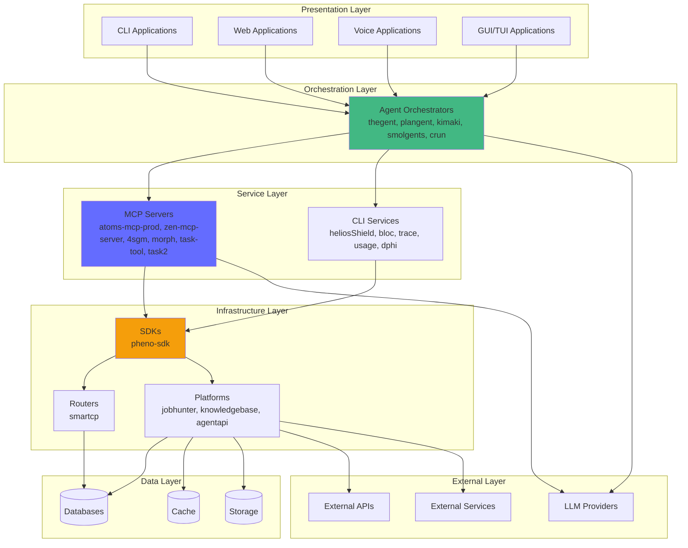

---

## Part 3: Agent Orchestration Architecture

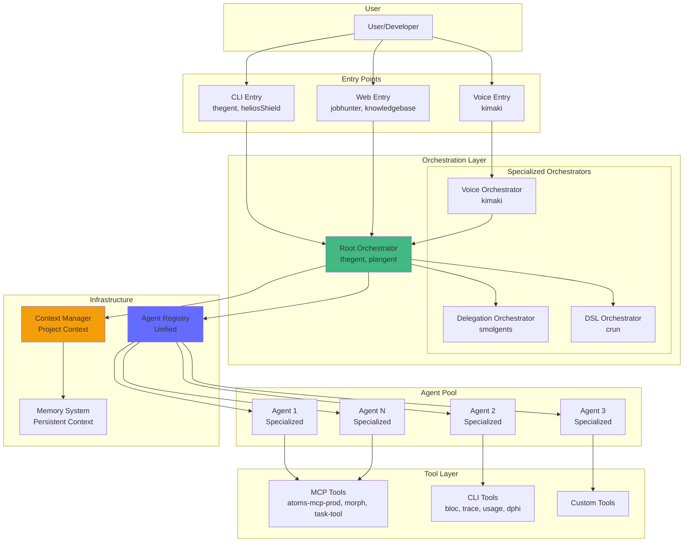

---

## Part 4: MCP Integration Architecture

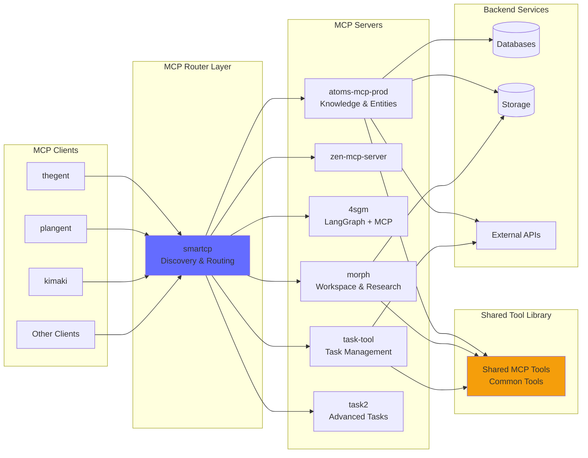

---

## Part 5: Data Flow Architecture

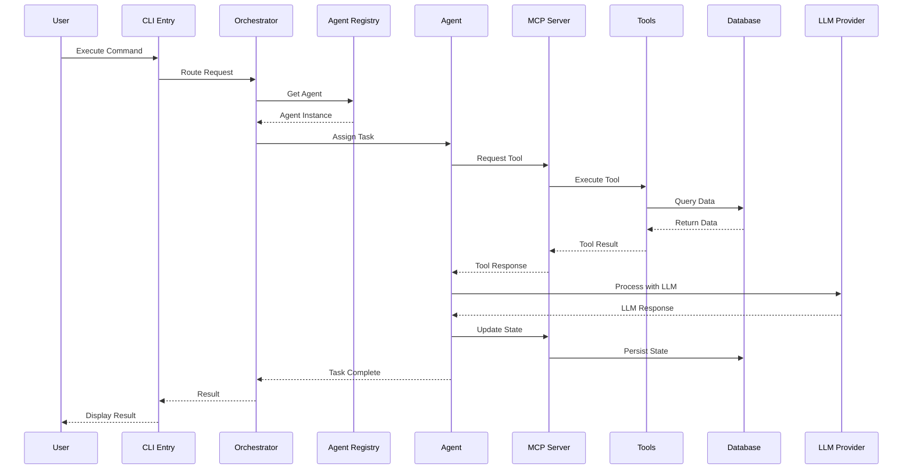

---

## Part 6: Project Dependency Graph

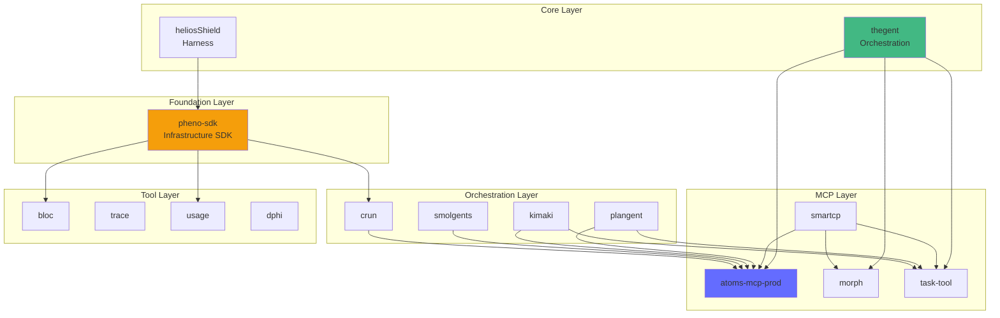

---

## Part 7: Integration Points

```mermaid
graph TB
    subgraph "Integration Hub"
        HUB[Unified Integration Hub]
    end

    subgraph "Agent Registry Integration"
        REG1[thegent Registry]
        REG2[kimaki Registry]
        REG3[plangent Registry]
        UNIFIED_REG[Unified Registry]
    end

    subgraph "MCP Tool Integration"
        TOOLS1[atoms-mcp-prod Tools]
        TOOLS2[morph Tools]
        TOOLS3[task-tool Tools]
        SHARED_TOOLS[Shared Tool Library]
    end

    subgraph "Context Integration"
        CTX1[kimaki Context]
        CTX2[trace Context]
        CTX3[atoms-mcp-prod Context]
        UNIFIED_CTX[Unified Context]
    end

    subgraph "Configuration Integration"
        CONFIG1[Project Configs]
        CONFIG2[Environment Configs]
        UNIFIED_CONFIG[Unified Config]
    end

    HUB --> UNIFIED_REG
    HUB --> SHARED_TOOLS
    HUB --> UNIFIED_CTX
    HUB --> UNIFIED_CONFIG

    REG1 --> UNIFIED_REG
    REG2 --> UNIFIED_REG
    REG3 --> UNIFIED_REG

    TOOLS1 --> SHARED_TOOLS
    TOOLS2 --> SHARED_TOOLS
    TOOLS3 --> SHARED_TOOLS

    CTX1 --> UNIFIED_CTX
    CTX2 --> UNIFIED_CTX
    CTX3 --> UNIFIED_CTX

    CONFIG1 --> UNIFIED_CONFIG
    CONFIG2 --> UNIFIED_CONFIG

    style HUB fill:#42b883
    style UNIFIED_REG fill:#646cff
    style SHARED_TOOLS fill:#f59e0b
```

---

## Part 8: Technology Stack Distribution

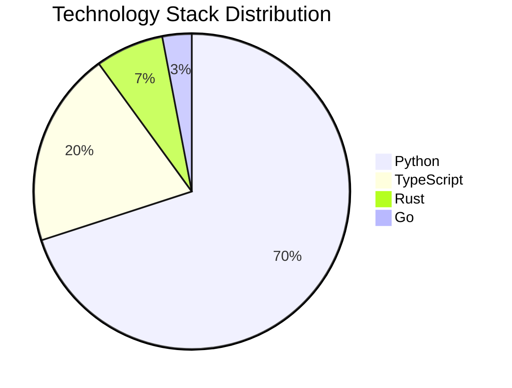

---

## Part 9: Component Interaction Flow

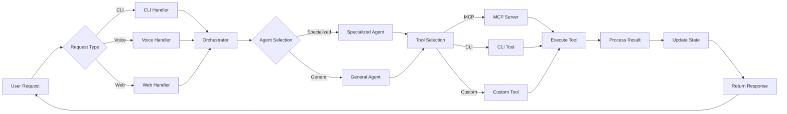

---

## Part 10: Deployment Architecture

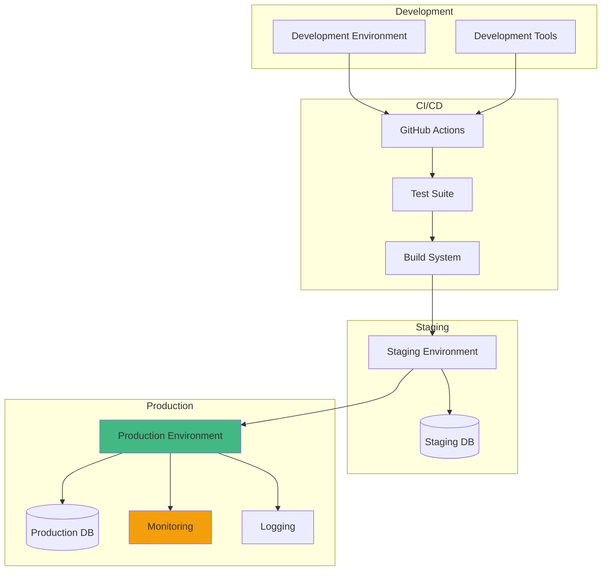

---

## Part 11: Key Architectural Patterns

### Pattern 1: Hub-and-Spoke (Current)

```
        Orchestrator (Hub)
              |
    +---------+---------+
    |         |         |
  Agent1   Agent2   Agent3
    |         |         |
  Tools    Tools    Tools
```

### Pattern 2: Mesh (Proposed)

```
  Agent1 <--> Agent2
    |           |
    v           v
  Agent3 <--> Agent4
    |           |
    v           v
  Tools      Tools
```

### Pattern 3: Hybrid (Recommended)

```
        Root Orchestrator
              |
    +---------+---------+
    |         |         |
  Group1   Group2   Group3
    |         |         |
  Mesh      Mesh      Mesh
```

---

## Part 12: Scalability Architecture

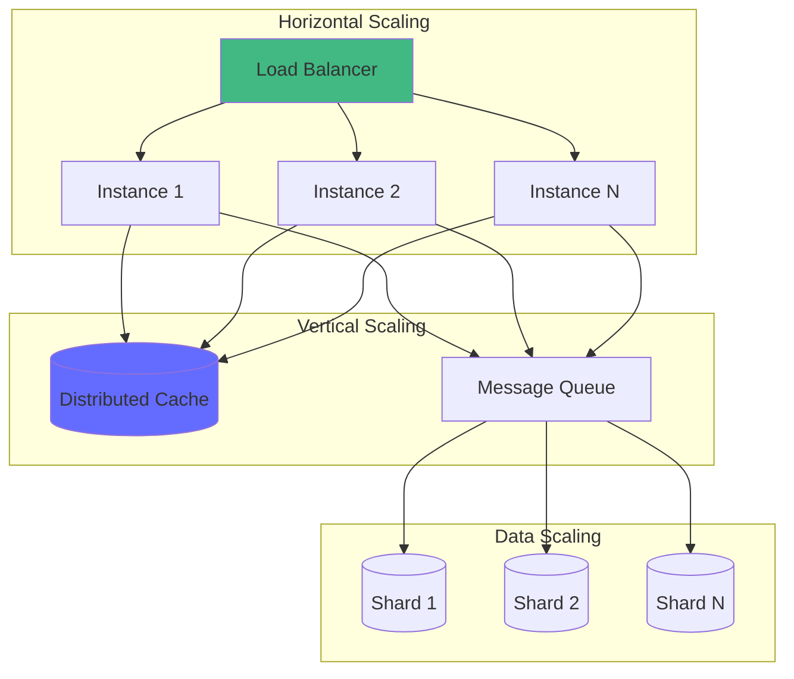

---

## See Also

- [KUSH_ECOSYSTEM_DEEP_DIVE.md](./KUSH_ECOSYSTEM_DEEP_DIVE.md) - Detailed ecosystem analysis
- [KUSH_ECOSYSTEM_UNIFIED_DOCS_INDEX.md](./KUSH_ECOSYSTEM_UNIFIED_DOCS_INDEX.md) - Documentation index
- [UNIFIED_AGENT_REGISTRY_API.md](./UNIFIED_AGENT_REGISTRY_API.md) - Agent registry API design
- [SHARED_MCP_TOOL_LIBRARY.md](./SHARED_MCP_TOOL_LIBRARY.md) - Shared MCP tools design
- [CROSS_PROJECT_INTEGRATION_GUIDE.md](./CROSS_PROJECT_INTEGRATION_GUIDE.md) - Integration guide

---

**Status**: 🏗️ **ARCHITECTURE DIAGRAM COMPLETE** - Comprehensive visual architecture documentation
