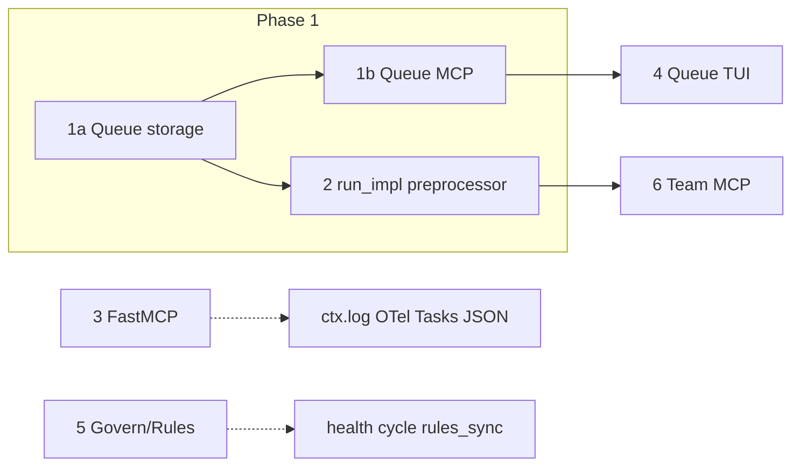

<DONE>
# MCP Full Parity & FastMCP Transport Spec Audit

**Purpose:** Achieve full parity (CLI ↔ MCP ↔ Codex/CC ecosystem), maximize FastMCP transport spec feature usage, and extend to the full Claude Code / Codex ecosystem per thegent's multi-platform parity plans.

**Status:** Audit complete; implementation plan actionable.

**Last updated:** 2025-02-16

**References:**
- [MULTI_PLATFORM_PARITY_MASTER_PLAN.md](../plans/MULTI_PLATFORM_PARITY_MASTER_PLAN.md) — Master matrix, §9 MCP coverage
- [CLAUDE_CODE_FEATURE_PARITY_AUDIT.md](./CLAUDE_CODE_FEATURE_PARITY_AUDIT.md) — Feature audit
- [MCP_TOOL_OPTIMIZATION_PLAN.md](../plans/MCP_TOOL_OPTIMIZATION_PLAN.md) — Tool polish
- [CODEX_DONUT_HARNESS_PLAN.md](../plans/CODEX_DONUT_HARNESS_PLAN.md) — Codex/CC harness
- [FastMCP docs](https://gofastmcp.com/llms.txt) — Transport, transforms, providers

---

## 1. Executive Summary

| Goal | Current | Target |
|------|---------|--------|
| **CLI ↔ MCP parity** | ~95% (plan_progress, plan_analyze added) | 100% |
| **FastMCP feature usage** | Partial (middleware, transforms, elicitation, progress) | Maximal |
| **Codex/CC ecosystem** | MCP tools; rules sync; run -M codex/claude | Full harness per PARITY plan |
| **Queue/Team MCP** | Not implemented | Phase 1–6 per CODEX plan |

### Table of Contents

| § | Section |
|---|---------|
| 1 | [Executive Summary](#1-executive-summary) |
| 2 | [CLI ↔ MCP Parity Matrix](#2-cli--mcp-parity-matrix) |
| 3 | [FastMCP Transport Spec Feature Usage](#3-fastmcp-transport-spec-feature-usage) |
| 4 | [Codex / Claude Code Ecosystem Parity](#4-codex--claude-code-ecosystem-parity-from-parity-plan) |
| 5 | [Implementation Plan](#5-implementation-plan-prioritized) |
| 6 | [Verification Checklist](#6-verification-checklist) |
| 7 | [Research Findings](#7-research-findings-deep-dive) |
| 8 | [Phase Planning](#8-phase-planning-dependencies--acceptance) |
| 9 | [Platform Config Paths](#9-platform-config-paths-reference) |
| 10 | [Risk Analysis](#10-risk-analysis) |
| 11 | [Research Sources](#11-research-sources) |
| 12 | [Rollback & Recovery](#12-rollback--recovery) |
| 13 | [Client Compatibility](#13-client-compatibility-matrix) |
| 14 | [Rules Sync Spec](#14-rules-sync-spec) |
| 15 | [Security Considerations](#15-security-considerations) |
| 16 | [Task Protocol Summary](#16-task-protocol-summary-mcp-2025-11-25) |
| 17 | [Open Questions](#17-open-questions-future-research) |
| 18 | [Quick Reference](#18-quick-reference) |
| A | [Glossary](#appendix-a-glossary) |

---

## 2. CLI ↔ MCP Parity Matrix

### 2.1 Full Parity (Implemented)

| CLI Command | MCP Tool | Notes |
|-------------|----------|-------|
| `thegent run` | `thegent_run` | ✓ |
| `thegent bg` | `thegent_bg` | ✓ |
| `thegent free` | `thegent_free` | ✓ |
| `thegent ps` | `thegent_ps` | ✓ |
| `thegent status` | `thegent_status` | ✓ |
| `thegent logs` | `thegent_logs` | ✓ |
| `thegent stop` | `thegent_stop` | ✓ |
| `thegent wait` | `thegent_wait` | ✓ |
| `thegent pause` / `resume` | `thegent_pause`, `thegent_resume` | ✓ |
| `thegent plan get-next` | `thegent_plan_get_next` | ✓ |
| `thegent plan wait-next` | `thegent_plan_wait_next` | ✓ |
| `thegent plan progress` | `thegent_plan_progress` | ✓ |
| `thegent plan incorporate` | `thegent_plan_incorporate` | ✓ |
| `thegent plan analyze` | `thegent_plan_analyze` | ✓ |
| `thegent dag list` | `thegent_dag_list` | ✓ |
| `thegent dag status` | `thegent_dag_status` | ✓ |
| `thegent dag ready/run/sync/recover` | `thegent_dag_*` (mcp_tools_modes) | ✓ |
| `thegent history` | `thegent_history` | ✓ |
| `thegent retry` | `thegent_retry` | ✓ |
| `thegent govern escalate list/add/approve/resolve` | `thegent_escalate_*` | ✓ |
| `thegent handoff` / `handoff-list` / `handoff-show` / `handoff-confirm` | `thegent_handoff*` | ✓ |
| `thegent route` | `thegent_terminal_route` | ✓ |
| `thegent plan do-next` | `thegent_do_next` | ✓ |
| `thegent plan claim` / `complete` | `thegent_workstream_claim`, `thegent_workstream_complete` | ✓ |
| `thegent loop` / `loop-takeover` / `loop-stop` | `thegent_loop*` | ✓ |
| `thegent inbox list` / `inbox wait` | `thegent_inbox_*` | ✓ |
| `thegent list-agents` / `list-droids` / `list-models` | `thegent_list_*` | ✓ |
| `thegent terminal list` / `inspect` / `send` / `attach` | `thegent_terminal_*` | ✓ |
| `thegent continuity snapshot` | `thegent_continuity_snapshot` | ✓ |
| `thegent session-contracts` / `health-gate` / `health-report` / `health-trend` | `thegent_session_contract*` | ✓ |
| `thegent observe summary` | `thegent_observe_summary` | ✓ |
| `thegent ddg search` | `thegent_ddg_search` | ✓ |
| `thegent resolve-model-route` | `thegent_resolve_model_route` | ✓ |

### 2.2 Gaps (CLI Only — No MCP Yet)

| CLI Command | Proposed MCP Tool | Priority | Notes |
|-------------|-------------------|----------|-------|
| `thegent queue add/list/claim/done/release` | `thegent_queue_*` | P1 | Phase 1 per PARITY plan |
| `thegent team create/list/message/shutdown` | `thegent_team_*` (extend) | P1 | Phase 6; team_create/list/delegate exist in modes |
| `thegent rules sync` | `thegent_rules_sync` | P2 | Phase 9 |
| `thegent govern go health` | `thegent_govern_health` | P2 | 8 dimensions; CLI-only today |
| `thegent govern go cycle` | `thegent_govern_cycle` | P2 | AgilePlus cycle |
| `thegent codex-notify` | N/A (server-side) | — | Codex config; not MCP |
| `thegent mcp install {cursor,codex,...}` | N/A (CLI install) | — | Config generation |
| `thegent archive` | `thegent_archive` | P3 | Session archival |
| `thegent events` | `thegent_events` | P3 | Run events |
| `thegent dlq list` | `thegent_dlq_list` | P3 | Dead-letter queue |
| `thegent cost status` / `govern cost` | `thegent_cost_status` | P3 | Cost governance |
| `thegent trust status` | `thegent_trust_status` | P3 | Trust/signatures |
| `thegent drift` / `drift-monitor` | `thegent_drift*` | P3 | Drift detection |
| `thegent sitback-dashboard` | `thegent_sitback_dashboard` | ✓ | Via mcp_sitback |
| `thegent suggest-prompt` | `thegent_suggest_prompt` | ✓ | Exists |

### 2.3 Plan/Protocol/DAG Tools (mcp_tools_modes)

| Tool | CLI Equivalent | Status |
|------|----------------|--------|
| `thegent_plan_status` | `thegent plan status` (implicit) | ✓ |
| `thegent_plan_get` | — | ✓ |
| `thegent_plan_save` | — | ✓ |
| `thegent_plan_approve` | — | ✓ |
| `thegent_plan_create` | — | ✓ |
| `thegent_protocol_list` / `get` | — | ✓ |
| `thegent_discussion_*` / `research_finalize` / `validation_report` | — | ✓ |
| `thegent_team_create` / `list` / `delegate` | `thegent team *` | ✓ (partial) |
| `thegent_dag_ready` / `run` / `sync` / `recover` | `thegent dag *` | ✓ |

---

## 3. FastMCP Transport Spec Feature Usage

### 3.1 Currently Used

| Feature | Usage | Location |
|---------|-------|----------|
| **Tool annotations** | `readOnlyHint`, `destructiveHint`, `idempotentHint` | All @mcp.tool decorators |
| **ToolResult** | `content`, `structured_content`, `meta` | All tools |
| **Elicitation** | `ctx.elicit()` for cwd, owner | `run`, `bg`, `dag_list` |
| **Progress** | `ctx.report_progress()` | `thegent_run`, `thegent_loop` |
| **ResourcesAsTools** | `mcp.add_transform(ResourcesAsTools)` | Tool-only clients |
| **PromptsAsTools** | `mcp.add_transform(PromptsAsTools)` | Tool-only clients |
| **Middleware** | Caching, rate limiting, response limiting, error handling, logging, timing | `mcp_server.py` |
| **Proxy/Mount** | `create_proxy` + `mount` for flyto, playwright, serena, octocode | Lifespan |
| **Bearer auth** | `BearerAuthMiddleware` | HTTP endpoints |
| **Lifespan** | `@lifespan` startup/teardown | Config validation, proxy mount |
| **Custom route** | `/health` | Health check |
| **TOOL_ICONS** | Unicode icons per tool | G-FM-04 (wire when FastMCP supports) |
| **EventStore** | MemoryStore / Redis | Caching backend |
| **Dependency injection** | `CurrentContext`, `get_default_cwd`, `get_default_owner` | Depends() |

### 3.2 Not Yet Used (Gaps)

| Feature | Doc | Potential Use |
|---------|-----|---------------|
| **Background Tasks** | [tasks](https://gofastmcp.com/servers/tasks.md) | Long-running/bg as async task with progress |
| **Sampling** | [sampling](https://gofastmcp.com/servers/sampling.md) | LLM completion from server (e.g. suggest_prompt) |
| **Client Roots** | [roots](https://gofastmcp.com/clients/roots.md) | Project boundary for cwd resolution |
| **Namespace Transform** | [namespace](https://gofastmcp.com/servers/transforms/namespace.md) | Prefix tools for multi-tenant |
| **Version Filter** | [version_filter](https://gofastmcp.com/servers/transforms/version_filter.md) | API versioning |
| **Visibility Filter** | [visibility](https://gofastmcp.com/servers/visibility.md) | Per-client tool visibility |
| **Pagination** | [pagination](https://gofastmcp.com/servers/pagination.md) | Large lists (ps, dag_list, history) |
| **Server Logging** | [logging](https://gofastmcp.com/servers/logging.md) | `ctx.log()` to client |
| **OpenTelemetry** | [telemetry](https://gofastmcp.com/servers/telemetry.md) | OTel spans (OPT-021) |
| **OAuth / CIMD** | [auth](https://gofastmcp.com/servers/auth/authentication.md) | Beyond bearer |
| **Storage Backends** | [storage-backends](https://gofastmcp.com/servers/storage-backends.md) | Redis for EventStore |
| **MCP JSON Config** | [mcp-json-configuration](https://gofastmcp.com/integrations/mcp-json-configuration.md) | `thegent mcp install` output |
| **fastmcp.json** | [server-configuration](https://gofastmcp.com/deployment/server-configuration.md) | Portable project config |
| **Icons (native)** | [icons](https://gofastmcp.com/servers/icons.md) | Wire TOOL_ICONS when supported |

### 3.3 Integration Coverage (Codex / Claude Code / Cursor)

| Client | FastMCP Doc | thegent Support |
|--------|-------------|-----------------|
| **Claude Code** | [claude-code](https://gofastmcp.com/integrations/claude-code.md) | MCP via stdio/HTTP; skills sync |
| **Codex** | — | MCP via HTTP; .codex/skills; codex-notify |
| **Cursor** | [cursor](https://gofastmcp.com/integrations/cursor.md) | MCP via HTTP; .cursor/rules |
| **Claude Desktop** | [claude-desktop](https://gofastmcp.com/integrations/claude-desktop.md) | MCP config |
| **Gemini CLI** | [gemini-cli](https://gofastmcp.com/integrations/gemini-cli.md) | MCP config |
| **Goose** | [goose](https://gofastmcp.com/integrations/goose.md) | MCP config |

---

## 4. Codex / Claude Code Ecosystem Parity (from PARITY Plan)

### 4.1 Platform × MCP Coverage

| Platform | MCP Config Path | thegent Install | Queue/Team MCP |
|----------|-----------------|-----------------|----------------|
| **Claude Code** | ~/.claude.json | `thegent mcp install claude_code` | Phase 1 |
| **Codex** | ~/.codex/mcp.json, ~/.config/codex/mcp.json | `thegent mcp install codex` | Phase 1 |
| **Cursor** | ~/.cursor/mcp.json, .cursor/mcp.json | `thegent mcp install cursor` | Phase 1 |
| **Factory Droid** | .factory/mcp.json | Project config | Phase 1 |
| **Augment** | Via Cursor/Codex | Add Context Engine MCP | Phase 12 |
| **OpenCode** | oc config | `thegent mcp install opencode` | Phase 13 |

### 4.2 Queue MCP Tools (Phase 1 — Not Yet Implemented)

| Tool | Purpose |
|------|---------|
| `thegent_queue_list` | List queue items |
| `thegent_queue_claim` | Atomic claim with lease |
| `thegent_queue_done` | Mark done |
| `thegent_queue_add` | Add item |
| `thegent_queue_edit` | Edit item |
| `thegent_queue_release` | Release claim |
| `thegent_queue_extend_lease` | Extend lease |

### 4.3 Team MCP Tools (Phase 6 — Partial)

| Tool | Status |
|------|--------|
| `thegent_team_create` | ✓ (mcp_tools_modes) |
| `thegent_team_list` | ✓ |
| `thegent_team_delegate` | ✓ |
| `thegent_team_task_list` | ⏳ |
| `thegent_team_task_assign` | ⏳ |
| `thegent_team_task_claim` | ⏳ |
| `thegent_team_task_done` | ⏳ |
| `thegent_team_message` | ⏳ |
| `thegent_team_broadcast` | ⏳ |
| `thegent_team_shutdown` | ⏳ |

---

## 5. Implementation Plan (Prioritized)

### 5.1 Tier 1 — Full Parity + Queue (Must)

| Task | Effort | Deps |
|------|--------|------|
| Queue storage module (`src/thegent/queue/`) | Medium | — |
| `thegent_queue_list`, `claim`, `done`, `add`, `edit`, `release`, `extend_lease` | Medium | Queue module |
| `run_impl` $defer/$pending/$block/$idea preprocessor | Medium | Queue module |
| Migrate prompt-submit-guard to `.thegent` queue | Small | Queue |
| codex-notify handler | Small | — |
| `thegent govern go health` MCP tool | Small | cli_impl or new |
| `thegent_rules_sync` MCP tool | Small | rules sync impl |

### 5.2 Tier 2 — FastMCP Maximal Usage (Should)

| Task | Effort | Notes |
|------|--------|-------|
| `ctx.log()` for key operations | Small | Server logging to client |
| Pagination for ps, dag_list, history (limit/offset) | Small | Large list handling |
| OpenTelemetry spans (OPT-021) | Medium | model, provider, lane |
| Background Tasks for `thegent_bg` | Medium | Async task with progress |
| MCP JSON config generator | Small | `thegent mcp install` output |
| Wire TOOL_ICONS when FastMCP supports it | Small | Icons param |
| Client Roots for cwd | Small | Project boundary |

### 5.3 Tier 3 — Team + Governance (Should)

| Task | Effort | Notes |
|------|--------|------|
| `thegent_team_task_list`, `assign`, `claim`, `done` | Medium | TeammateManager |
| `thegent_team_message`, `broadcast`, `shutdown` | Small | Team lifecycle |
| `thegent_govern_cycle` MCP | Small | AgilePlus |
| `thegent_archive` MCP | Small | Session archival |
| `thegent_events` MCP | Small | Run events |

### 5.4 Tier 4 — Defer (Nice)

| Task | Notes |
|------|-------|
| Namespace transform | Multi-tenant |
| Version filter | API versioning |
| Visibility filter | Per-client tools |
| OAuth beyond bearer | Enterprise |
| `fastmcp.json` | Portable config |

---

## 6. Verification Checklist

### 6.1 CLI ↔ MCP Parity

- [x] All plan tools (get-next, wait-next, progress, incorporate, analyze)
- [x] All DAG tools (list, status, ready, run, sync, recover)
- [x] All execution tools (history, retry)
- [x] All escalation tools (list, add, approve, resolve)
- [x] All handoff tools
- [x] terminal_route, thegent_free
- [ ] Queue tools (Phase 1)
- [ ] Rules sync MCP
- [ ] Govern health/cycle MCP

### 6.2 FastMCP Features

- [x] Tool annotations
- [x] ToolResult + structured_content + meta
- [x] Elicitation (cwd, owner)
- [x] Progress (run, loop)
- [x] ResourcesAsTools, PromptsAsTools
- [x] Middleware (caching, rate limiting, etc.)
- [x] Proxy mount (flyto, playwright, serena, octocode)
- [x] Bearer auth
- [ ] Background Tasks
- [ ] Server logging (ctx.log)
- [ ] Pagination
- [ ] OpenTelemetry
- [ ] MCP JSON config generator

### 6.3 Codex/CC Ecosystem

- [x] MCP tools available to Codex, Claude Code, Cursor
- [x] Skills: .codex/skills, .claude/skills, .cursor/rules
- [ ] Queue unified across platforms
- [ ] codex-notify configured
- [ ] Rules sync to all platforms
- [ ] Team MCP complete

---

## 7. Research Findings (Deep Dive)

### 7.1 MCP Background Tasks (SEP-1686 / 2025-11-25)

**Spec:** [MCP Tasks](https://modelcontextprotocol.io/specification/2025-11-25/basic/utilities/tasks)

| Aspect | Detail |
|--------|--------|
| **Protocol** | Task-augmented requests return `CreateTaskResult` with `taskId` immediately; client polls `tasks/get`, retrieves result via `tasks/result` |
| **Tool support** | `execution.taskSupport`: `"required"`, `"optional"`, `"forbidden"` |
| **Status lifecycle** | `working` → `input_required` (elicitation) → `working` → `completed`/`failed`/`cancelled` |
| **Progress** | `progressToken` valid throughout task lifetime; integrates with progress spec |
| **Backends** | FastMCP: `memory://` (default, ephemeral) or `redis://` (persistent, scalable) |
| **Workers** | `fastmcp tasks worker server.py` for horizontal scaling; `FASTMCP_DOCKET_CONCURRENCY` |

**thegent:** `thegent_run` (long) and `thegent_bg` (async) are ideal candidates for `task=True`. Run returns immediately with task ID; client polls. Requires `pip install "fastmcp[tasks]"`.

### 7.2 Elicitation (Advanced Patterns)

**Current:** thegent uses `ctx.elicit(ELICIT_CWD_MSG, response_type=str)` for cwd/owner.

**Extended patterns from FastMCP docs:**
- **Multi-turn:** Multiple `ctx.elicit()` calls for progressive disclosure (e.g. plan_analyze: pert → resources → continuity)
- **Structured:** `response_type=TaskDetails` (dataclass) for complex forms
- **Constrained:** `response_type=["low","medium","high"]` or `Literal["a","b"]`
- **Multi-select:** `response_type=[["bug","feature","docs"]]` (list of list)
- **Titled options:** `response_type={"low":{"title":"Low Priority"},...}` for better UI
- **Default values:** Pydantic `Field(default=...)` for pre-populated forms
- **No response:** `response_type=None` for approve/reject only

**Gap:** thegent elicitation uses string only. Could add structured `CwdElicitation` with default=os.getcwd(), or multi-turn for complex flows.

### 7.3 Progress Reporting

**Current:** `ctx.report_progress(progress=i, total=total)` in run, loop.

**Background Tasks:** `Progress` dependency: `await progress.set_total(n)`, `await progress.increment()`, `await progress.set_message(text)`. Works in both sync and background execution.

**Pattern:** Multi-stage ops map stages to progress range (e.g. 0–25% validation, 25–60% export, 60–80% transform, 80–100% import).

### 7.4 MCP JSON Configuration

**Standard:** `mcpServers` object with `command`, `args`, `env`. Adopted by Claude Desktop, Cursor, VS Code.

**FastMCP:** `fastmcp install mcp-json server.py` outputs config. Options: `--name`, `--with`, `--env`, `--env-file`, `--python`, `--project`, `--copy` (clipboard).

**thegent:** `thegent mcp install {cursor,codex,claude_code}` should emit equivalent JSON. Could wrap `fastmcp install mcp-json` or generate manually for `thegent serve` (HTTP) vs stdio.

### 7.5 OpenTelemetry

**Spans:** `tools/call {name}`, `resources/read {uri}`, `prompts/get {name}`. Mounted servers: `delegate {name}`.

**Attributes:** `mcp.method.name`, `mcp.session.id`, `fastmcp.component.type`, `fastmcp.provider.type`. Custom: `fastmcp.delegate.original_name`, `fastmcp.proxy.backend_uri`.

**Enable:** `opentelemetry-instrument fastmcp run server.py` or configure SDK before importing FastMCP. OPT-021: add `model`, `provider`, `lane` to run/bg spans.

### 7.6 Client Logging

**API:** `await ctx.debug()`, `ctx.info()`, `ctx.warning()`, `ctx.error()`. Optional `extra={}` for structured data.

**Use:** Key operations (run start/complete, queue claim, escalation add) can log to client for real-time visibility. Requires client to support MCP logging.

### 7.7 Pagination

**Server:** `FastMCP("Name", list_page_size=50)` — tools/list, resources/list, prompts/list paginate. `nextCursor` in response.

**Note:** Pagination applies to **component lists** (tools, resources, prompts), not tool **results**. For large tool results (ps, dag_list, history), implement limit/offset in tool params—not server-level pagination.

### 7.8 fastmcp.json (Portable Config)

**Schema:** `https://gofastmcp.com/public/schemas/fastmcp.json/v1.json`

**Structure:**
```json
{
  "$schema": "https://gofastmcp.com/public/schemas/fastmcp.json/v1.json",
  "source": { "path": "server.py", "entrypoint": "mcp" },
  "environment": { "dependencies": ["pandas", "requests"] }
}
```

**Use:** Declarative project config; `fastmcp install mcp-json fastmcp.json` generates client config. thegent could ship `thegent/fastmcp.json` for consistent installs.

### 7.9 Elicitation Enhancement Opportunities

| Tool | Current | Enhancement |
|------|---------|-------------|
| run, bg | `ctx.elicit(ELICIT_CWD_MSG, str)` | Add default=os.getcwd(); structured `{cwd, confirm}` |
| dag_list | Same | Multi-turn: cwd → owner → sources |
| plan_analyze | No elicitation | If DAG missing: elicit `create_dag?` (bool) or `dag_path` (str) |
| queue_claim | N/A | Elicit lease duration (int, default 300) |
| escalate_add | N/A | Elicit resolution options (enum) |

### 7.10 Transports (HTTP vs STDIO)

| Transport | Use Case | thegent Today |
|-----------|----------|---------------|
| **STDIO** | Local dev, desktop (Cursor, Claude Code, Codex) | Default: `thegent serve` or `fastmcp run mcp_server.py` |
| **HTTP (Streamable)** | Remote, multi-client, cloud | `mcp.run(transport="http", host="0.0.0.0", port=8000)` or `mcp.http_app()` |
| **SSE (legacy)** | Backward compatibility | `transport="sse"` — prefer Streamable HTTP |
| **In-memory** | Testing | `Client(mcp)` — same process |

**HTTP deployment notes:**
- **Direct:** `mcp.run(transport="http", host="0.0.0.0", port=8000)` — standalone
- **ASGI:** `app = mcp.http_app()` + `uvicorn app:app` — production, multi-worker
- **Stateless mode:** `stateless_http=True` for horizontal scaling (no session affinity)
- **SSE polling:** `EventStore` + `ctx.close_sse_stream()` for long-running tools behind load balancers
- **Auth:** Bearer, OAuth recommended for remote

**thegent:** Today stdio-only. Future: `thegent serve --http` for remote/Codex cloud; config merge for `url` in `mcpServers`.

### 7.11 Codex/CC Integration State

| Component | Status | Gap |
|-----------|--------|-----|
| **MCP tools** | ✓ Available to Codex, Claude Code, Cursor | — |
| **Queue** | CLI only | Queue MCP (Phase 1); unified path `.thegent/prompt_queue.jsonl` |
| **$defer/$pending/$block** | Claude Code: prompt-submit-guard | Codex: run_impl preprocessor (Phase 2) |
| **codex-notify** | Not implemented | Handler + config merge for `~/.codex/config.toml` |
| **Rules sync** | CLI only | `thegent_rules_sync` MCP (Phase 5) |
| **Team** | Partial (create, list, delegate) | task_list, assign, claim, done, message, broadcast, shutdown |
| **Harvest** | Claude Code Stop hooks | Codex: wrapper exit → harvest; run_impl for headless |

**Bridging flow (per CODEX plan):**
1. Queue unified → both agents use `.thegent/prompt_queue.jsonl`
2. run_impl preprocessor → $defer/$block/$idea before spawn
3. codex-notify → merge into Codex config on session end
4. Rules sync → `.cursor/rules`, `.codex/skills`, `CLAUDE.md` from single source

### 7.12 Notifications (List Change)

**Spec:** Servers send `notifications/tools/list_changed`, `notifications/resources/list_changed`, `notifications/prompts/list_changed`.

**Client:** `MessageHandler` with `on_tool_list_changed`, `on_resource_list_changed`, `on_prompt_list_changed`.

**thegent:** Queue MCP tools do not change the server's tool list; notifications apply to dynamic providers (e.g. proxy mounts). Future: if the queue is exposed as a resource, `resources/list_changed` could signal queue updates for client refresh.

### 7.13 Implementation Decision Guide

| Decision | Option A | Option B | Recommendation |
|----------|----------|----------|----------------|
| **Transport** | STDIO | HTTP | STDIO for local (Cursor, Codex, Claude Code); HTTP for remote/cloud |
| **HTTP scaling** | Single instance | Multi-worker | Use `stateless_http=True` for multi-worker; else session affinity fails |
| **Long-running/bg** | Sync + progress | Background Tasks | Sync first; add `task=True` when client supports Tasks protocol |
| **Elicitation** | String only | Structured/dataclass | Extend to structured when UX warrants |
| **Config install** | Manual JSON | `thegent mcp install` | Implement install; wrap or mirror `fastmcp install mcp-json` |
| **Queue path** | ~/.claude, .codex | .thegent | Unify to `.thegent/prompt_queue.jsonl` per CODEX plan |

### 7.14 Queue Schema (prompt_queue.jsonl)

**Path:** `PROJECT_DIR/.thegent/prompt_queue.jsonl` (project) or `~/.thegent/prompt_queue.jsonl` (global fallback).

**JSONL line format:**
```json
{"ts":"2025-02-15T12:00:00Z","prompt":"Add tests for auth module","project":"/path/to/proj","claimed_by":null,"lease_expires_at":null}
```

| Field | Type | Required | Notes |
|-------|------|----------|-------|
| `ts` | ISO8601 | ✓ | Append timestamp |
| `prompt` | string | ✓ | User prompt text |
| `project` | string | ✓ | Project path for scoping |
| `claimed_by` | string \| null | ✓ | Claimer ID when claimed |
| `lease_expires_at` | ISO8601 \| null | ✓ | Lease expiry for claim |

**Atomicity:** Append-only; one JSON object per line. `claim` = read + update line in-place (atomic rename) or via `queue/locking.py` advisory lock.

**Migration:** If `PROJECT/.claude/pending-queue.jsonl` exists and `PROJECT/.thegent/prompt_queue.jsonl` empty → copy lines, clear source. Same for `~/.claude/pending-queue.jsonl` → `~/.thegent/prompt_queue.jsonl`.

---

## 8. Phase Planning (Dependencies & Acceptance)

### 8.1 Phase DAG

```
Phase 1a (Queue storage) ──┬──► Phase 1b (Queue MCP tools)
                           └──► Phase 2 (run_impl preprocessor)

Phase 1b ──────────────────► Phase 4 (Queue TUI — optional)

Phase 2 ───────────────────► Phase 6 (Team MCP — depends on queue for task flow)

Phase 3 (FastMCP features) ──► Independent: ctx.log, OTel, Background Tasks, MCP JSON

Phase 5 (Govern/Rules MCP) ──► Independent: govern_health, govern_cycle, rules_sync
```

**Mermaid diagram:**



### 8.2 Phase 1a: Queue Storage — Acceptance Criteria

| ID | Criterion | Verification |
|----|-----------|--------------|
| 1a.1 | `queue/storage.py`: append, read, list | Unit: append 3, read 3 |
| 1a.2 | `queue/locking.py`: claim, release, extend_lease | Unit: atomic claim, concurrent claim fails |
| 1a.3 | Path: PROJECT/.thegent vs ~/.thegent fallback | Integration: empty project → ~/.thegent |
| 1a.4 | Schema: ts, prompt, project, claimed_by, lease_expires_at | Schema test |
| 1a.5 | Corrupt file: truncate to last valid line | Unit: corrupt → recover |

### 8.3 Phase 1b: Queue MCP Tools — Acceptance Criteria

| ID | Criterion | Verification |
|----|-----------|--------------|
| 1b.1 | `thegent_queue_list` returns items[] | MCP call |
| 1b.2 | `thegent_queue_claim` atomic, returns lease | MCP call, concurrent test |
| 1b.3 | `thegent_queue_done` marks done | MCP call |
| 1b.4 | `thegent_queue_add`, `edit`, `release`, `extend_lease` | MCP call each |
| 1b.5 | All return ToolResult with structured_content, meta | Schema check |
| 1b.6 | Errors include remediation | _error_result pattern |

### 8.4 Phase 2: run_impl Preprocessor — Acceptance Criteria

| ID | Criterion | Verification |
|----|-----------|--------------|
| 2.1 | Regex: `\$defer|\$pending|\$block|\$idea` | Unit: parse each |
| 2.2 | $defer/$pending → queue.append, return, no spawn | Integration |
| 2.3 | $block → escalate_add_impl, exit 1 | Integration |
| 2.4 | $idea → harvest buffer, continue spawn | Integration |
| 2.5 | No flag → proceed to spawn | Integration |
| 2.6 | Agents: codex, droid, augment, opencode | Per-agent test |

### 8.5 Phase 3: FastMCP Maximal — Acceptance Criteria

| ID | Criterion | Verification |
|----|-----------|--------------|
| 3.1 | `ctx.info()` in run, bg, queue_claim | Client receives log |
| 3.2 | OTel: run/bg spans have model, provider, lane | Trace export |
| 3.3 | `thegent_bg` with `task=True` (optional) | Task ID returned, poll works |
| 3.4 | `thegent mcp install codex` outputs valid `mcpServers` JSON | Config parse |
| 3.5 | list_page_size=50 if tools > 50 | Pagination response |

### 8.6 Phase 5: Govern/Rules MCP — Acceptance Criteria

| ID | Criterion | Verification |
|----|-----------|--------------|
| 5.1 | `thegent_govern_health` returns 8 dimensions | MCP call, schema |
| 5.2 | `thegent_govern_cycle` runs AgilePlus cycle | MCP call |
| 5.3 | `thegent_rules_sync` syncs to `.cursor/rules`, `.codex/skills`, `AGENTS.md` | MCP call, file check |

### 8.7 Phase 6: Team MCP — Acceptance Criteria

| ID | Criterion | Verification |
|----|-----------|--------------|
| 6.1 | `thegent_team_task_list` returns tasks with status | MCP call, schema |
| 6.2 | `thegent_team_assign` assigns task to teammate | MCP call |
| 6.3 | `thegent_team_claim` claims task (atomic) | MCP call, concurrent test |
| 6.4 | `thegent_team_done` marks task complete | MCP call |
| 6.5 | `thegent_team_message` sends to teammate | MCP call |
| 6.6 | `thegent_team_broadcast` sends to all | MCP call |
| 6.7 | `thegent_team_shutdown` graceful shutdown | MCP call |
| 6.8 | Integrates with queue for task flow | Integration: add → claim → done |

### 8.8 Effort Estimates & Timeline

| Phase | Scope | Effort (days) | Sprint |
|-------|-------|---------------|--------|
| **1a** | Queue storage module | 2–3 | 1 |
| **1b** | Queue MCP tools (7 tools) | 3–4 | 2 |
| **2** | `run_impl` preprocessor ($defer/$pending/$block/$idea) | 2–3 | 2 |
| **3** | FastMCP: ctx.log, OTel, Tasks, MCP JSON | 3–4 | 3 |
| **4** | Queue TUI (optional) | 2 | 3 |
| **5** | Govern/Rules MCP | 2 | 3 |
| **6** | Team MCP (task_list, assign, claim, done, message, broadcast, shutdown) | 4–5 | 4 |

**Total (core):** ~18–24 days. **With TUI:** ~20–26 days.

### 8.9 Migration Path (.claude → .thegent)

| Step | Action | Trigger |
|------|--------|---------|
| 1 | On first queue read: if `PROJECT/.claude/pending-queue.jsonl` exists and `PROJECT/.thegent/prompt_queue.jsonl` empty | Queue module init |
| 2 | Copy each valid JSONL line to `.thegent/prompt_queue.jsonl`; add `project` if missing | Migration |
| 3 | Truncate/clear `.claude/pending-queue.jsonl` | After successful copy |
| 4 | Same for `~/.claude/pending-queue.jsonl` → `~/.thegent/prompt_queue.jsonl` | Global fallback |
| 5 | Update prompt-submit-guard to write only to `.thegent/prompt_queue.jsonl` | Claude Code hook |
| 6 | Update harvest-pending-queue to read from `.thegent/prompt_queue.jsonl` | Harvest script |

**Backward compatibility:** During transition, harvest reads from both; writes only to `.thegent`. Deprecate `.claude` after one release cycle.

### 8.10 Testing Strategy (MCP)

| Layer | Approach | Tools |
|-------|----------|-------|
| **Unit** | queue/storage, queue/locking in isolation | pytest |
| **MCP call** | `Client(mcp)` in-memory transport; call tools with args | fastmcp Client, pytest-asyncio |
| **Integration** | Full flow: queue_add → claim → done | Integration test |
| **Concurrent** | Multiple clients claim same item; expect one success | threading / asyncio |
| **E2E** | Cursor/Claude Code with MCP; manual or Playwright | Optional |

**FastMCP testing:** [testing.md](https://gofastmcp.com/patterns/testing.md) — use in-memory transport for fast tests.

**Example fixture (thegent MCP):**

```python
import pytest
from fastmcp import Client
from fastmcp.client.transports import FastMCPTransport
from thegent.mcp_server import mcp


@pytest.fixture
async def thegent_client():
    async with Client(transport=mcp) as client:
        yield client


async def test_queue_list(thegent_client: Client[FastMCPTransport]):
    result = await thegent_client.call_tool("thegent_queue_list", {"limit": 10})
    assert result.data is not None
    assert "items" in result.data or "error" in result.data
```

---

## 9. Platform Config Paths (Reference)

| Platform | Config Path | Format | Notes |
|----------|-------------|--------|-------|
| **Claude Code** | ~/.claude.json | JSON | `claude mcp add` manages |
| **Claude Desktop** | ~/.claude/claude_desktop_config.json | JSON | macOS: ~/Library/... |
| **Codex** | ~/.codex/mcp.json, ~/.config/codex/mcp.json | JSON | Project: .codex/config.toml |
| **Codex notify** | ~/.codex/config.toml | TOML | `notify = ["thegent", "codex-notify"]` |
| **Cursor** | ~/.cursor/mcp.json, .cursor/mcp.json | JSON | Workspace overrides user |
| **VS Code** | .vscode/mcp.json | JSON | Workspace |
| **Factory Droid** | .factory/mcp.json | JSON | Project only |
| **Gemini CLI** | Via fastmcp install gemini_cli | — | |
| **Goose** | Via fastmcp install goose | — | |

### 9.1 MCP JSON Structure (Standard)

```json
{
  "mcpServers": {
    "thegent": {
      "command": "uv",
      "args": ["run", "--with", "fastmcp", "fastmcp", "run", "/path/to/mcp_server.py"],
      "env": { "THGENT_DEBUG": "false" }
    }
  }
}
```

**HTTP/SSE:** For `thegent serve` (HTTP), config uses `url` instead of `command`/`args` where client supports it.

---

## 10. Risk Analysis

| Risk | Likelihood | Impact | Mitigation |
|------|------------|--------|------------|
| **Task protocol client support** | Medium | Medium | Graceful degradation: `task=False` if client doesn't support; sync execution |
| **Elicitation client support** | Low | High | Fallback: return error with remediation "Provide cd=/path" |
| **Queue file corruption** | Low | High | Append-only; atomic writes; truncate to last valid line |
| **Concurrent queue claim** | Medium | Medium | claimed_by + lease_expires_at; atomic rename/lock |
| **Codex notify blocks** | Low | Medium | Fire-and-forget; optional timeout |
| **Config overwrite** | Medium | High | Merge only; never replace entire config |
| **Harvest path changes** | Low | Medium | Configurable paths; multiple patterns |
| **FastMCP version drift** | Low | Low | Pin fastmcp in pyproject; test matrix |
| **HTTP session affinity** | Medium | High | Cursor/Claude Code don't forward Set-Cookie; use stateless_http for multi-worker |
| **Long-run HTTP timeout** | Medium | Medium | EventStore + close_sse_stream for load balancer idle limits |
| **Elicitation in stateless** | High | High | Elicitation requires session; stateless disables it; document trade-off |

### 10.1 Technical Debt

| Item | Description | Resolution |
|------|-------------|------------|
| TOOL_ICONS not wired | Icons defined but FastMCP may not support param yet | Check FastMCP icons API; wire when available |
| Progress in run | Uses report_progress; Background Tasks use Progress dep | Unify pattern when tasks adopted |
| Elicitation timeout | ELICIT_TIMEOUT_S=30; some clients may not respond | Document; consider configurable |
| run_impl sync | `run_impl` is sync; `task=True` requires async | Extract to async wrapper or use thread pool |

---

## 11. Research Sources

| Source | URL | Key Content |
|--------|-----|-------------|
| FastMCP Tasks | [tasks.md](https://gofastmcp.com/servers/tasks.md) | Background tasks, Docket, Progress |
| FastMCP Elicitation | [elicitation.md](https://gofastmcp.com/servers/elicitation.md) | Multi-turn, structured, constrained |
| FastMCP Progress | [progress.md](https://gofastmcp.com/servers/progress.md) | report_progress patterns |
| FastMCP MCP JSON | [mcp-json-configuration](https://gofastmcp.com/integrations/mcp-json-configuration.md) | Config generation |
| FastMCP Pagination | [pagination.md](https://gofastmcp.com/servers/pagination.md) | list_page_size |
| FastMCP Telemetry | [telemetry.md](https://gofastmcp.com/servers/telemetry.md) | OTel, spans, attributes |
| FastMCP Logging | [logging.md](https://gofastmcp.com/servers/logging.md) | ctx.debug/info/warning/error |
| FastMCP Claude Code | [claude-code](https://gofastmcp.com/integrations/claude-code.md) | claude mcp add |
| FastMCP HTTP Deployment | [http.md](https://gofastmcp.com/deployment/http.md) | HTTP, ASGI, stateless, EventStore, SSE polling |
| FastMCP Client Transports | [transports.md](https://gofastmcp.com/clients/transports.md) | STDIO, HTTP, SSE, in-memory |
| FastMCP Notifications | [notifications.md](https://gofastmcp.com/clients/notifications.md) | List change, MessageHandler |
| FastMCP Testing | [testing.md](https://gofastmcp.com/patterns/testing.md) | In-memory transport, pytest |
| MCP Tasks Spec | [tasks](https://modelcontextprotocol.io/specification/2025-11-25/basic/utilities/tasks) | SEP-1686, protocol |
| FastMCP llms.txt | [llms.txt](https://gofastmcp.com/llms.txt) | Full doc index |

---

## 12. Rollback & Recovery

| Scenario | Rollback | Recovery |
|----------|----------|----------|
| **Queue migration fails** | Keep `.claude/pending-queue.jsonl`; do not truncate until copy verified | Re-run migration; checksum compare |
| **Queue file corrupt** | Truncate to last valid JSONL line | Log truncated count; user notified |
| **Concurrent claim collision** | Return error "Item already claimed" | Client retries with `thegent_queue_list` to get fresh state |
| **MCP tool regression** | Revert tool; CLI still works | Fix tool; redeploy |
| **FastMCP upgrade breaks** | Pin fastmcp version in pyproject | Upgrade in branch; test matrix |

---

## 13. Client Compatibility Matrix

| Client | Tasks | Elicitation | Progress | Logging | Notes |
|--------|-------|-------------|----------|---------|-------|
| **Cursor** | Unknown | ✓ | ✓ | Unknown | Primary dev client |
| **Claude Code** | Unknown | ✓ | ✓ | Unknown | 15 hooks; MCP via config |
| **Codex** | Unknown | ✓ | ✓ | Unknown | notify only; MCP via mcp.json |
| **Claude Desktop** | Unknown | ✓ | ✓ | Unknown | Desktop app |
| **VS Code** | Unknown | Varies | Varies | Unknown | Extension-dependent |
| **MCP Inspector** | Unknown | ✓ | ✓ | ✓ | Browser-based; CORS needed |

**Recommendation:** Assume Tasks are not widely supported; use `execution.taskSupport: "optional"` for `thegent_run` and `thegent_bg`. Elicitation and Progress are widely supported.

---

## 14. Rules Sync Spec

**Source:** `CLAUDE.md` (project root). Must exist; otherwise `rules_sync_impl` returns an error.

**Targets** (paths relative to project root via `_resolve_cwd`):

| Target | Path | Format |
|--------|------|--------|
| AGENTS.md | `{project}/AGENTS.md` | Raw content |
| Cursor | `{project}/.cursor/rules/thegent.mdc` | Frontmatter + content |
| Codex | `{project}/.codex/skills/thegent.md` | Raw content |

**Cursor .mdc frontmatter:**
```yaml
---
description: Project instructions and workflow
globs: **/*
---

{CLAUDE.md content}
```

**MCP tool:** `thegent_rules_sync` (Phase 5) wraps `rules_sync_impl` with params: `cd`, `force`, `check`. Returns `{success, synced, drift, in_sync}`.

---

## 15. Security Considerations

| Concern | Mitigation |
|---------|------------|
| **Secrets in prompts** | Queue stores prompts; ensure queue file not committed. `.gitignore` for `.thegent/`. |
| **Run/bg execution** | Tools spawn subprocesses; cwd from elicitation. Validate cwd is under project root when possible. |
| **Remote HTTP** | Use Bearer or OAuth; never expose unauthenticated MCP over public network. |
| **Config merge** | codex-notify, mcp install: merge only; never overwrite entire user config. |
| **Queue claim** | claimed_by identifies claimer; lease_expires_at limits orphaned claims. |

**Sandboxing:** MCP tools run in the same process as the server. `thegent_run` and `thegent_bg` spawn child processes; consider cwd/env isolation for untrusted projects.

---

## 16. Task Protocol Summary (MCP 2025-11-25)

**Capability:** `tasks.requests.tools.call` — server accepts task-augmented `tools/call`.

**Tool-level:** `execution.taskSupport`: `"required"` \| `"optional"` \| `"forbidden"`. Default: `"forbidden"`.

**Flow:**
1. Client sends `tools/call` with `task: {ttl: 60000}`.
2. Server returns `CreateTaskResult` with `taskId`, `status: "working"`, `pollInterval`.
3. Client polls `tasks/get` until status is `completed`, `failed`, `cancelled`, or `input_required`.
4. Client retrieves result via `tasks/result`.

**thegent:** Use `taskSupport: "optional"` for `thegent_run` and `thegent_bg`. Sync execution remains the default; task mode when the client supports it.

---

## 17. Open Questions (Future Research)

| Question | Context | Next Step |
|----------|---------|-----------|
| **Codex SDK for interactive** | Full prompt intercept in Codex TUI | Evaluate TypeScript SDK; effort vs wrapper-only |
| **Queue as MCP resource** | Expose queue via `resources/list` for notifications | Prototype; measure client support |
| **TOOL_ICONS param** | FastMCP icons API | Check FastMCP changelog; wire when stable |
| **Elicitation in stateless HTTP** | Trade-off: scale vs elicitation | Document; consider hybrid (stateless for tools, stateful for elicitation) |
| **DLQ MCP** | Dead-letter queue for failed claims | Phase 3+; schema TBD |

---

## 18. Quick Reference

| Need | Location |
|------|----------|
| Full parity matrix | §2 |
| FastMCP usage | §3 |
| Codex/CC ecosystem | §4 |
| Implementation plan | §5 |
| Verification | §6 |
| **Research findings** | §7 (Tasks, Elicitation, Progress, MCP JSON, OTel, Logging, Pagination, Transports, Codex/CC, Queue schema, Decision guide) |
| **Phase planning** | §8 (DAG, acceptance criteria, effort estimates, migration path, testing strategy) |
| **Platform config paths** | §9 |
| **Risk analysis** | §10 |
| **Research sources** | §11 |
| **Rollback & recovery** | §12 |
| **Client compatibility** | §13 |
| **Rules sync spec** | §14 |
| **Security** | §15 |
| **Task protocol summary** | §16 |
| **Open questions** | §17 |
| **Glossary** | Appendix A |
| Master parity plan | [MULTI_PLATFORM_PARITY_MASTER_PLAN.md](../plans/MULTI_PLATFORM_PARITY_MASTER_PLAN.md) |
| MCP tool optimization | [MCP_TOOL_OPTIMIZATION_PLAN.md](../plans/MCP_TOOL_OPTIMIZATION_PLAN.md) |
| FastMCP docs index | [llms.txt](https://gofastmcp.com/llms.txt) |

---

## Appendix A: Glossary

| Term | Definition |
|------|-------------|
| **CLI** | Command-line interface; `thegent` subcommands |
| **Codex** | OpenAI Codex agent (interactive TUI, exec mode) |
| **CreateTaskResult** | MCP response for task-augmented requests; contains taskId, status, pollInterval |
| **DAG** | Directed acyclic graph; plan/dependency structure |
| **Elicitation** | Server requests user input during tool execution; `ctx.elicit()` |
| **EventStore** | FastMCP storage for SSE stream resumability; enables `close_sse_stream` |
| **Harvest** | Flush queue to handoff file on session stop |
| **HTTP** | Remote MCP transport; Streamable HTTP preferred over legacy SSE |
| **MCP** | Model Context Protocol |
| **OTel** | OpenTelemetry; distributed tracing |
| **Queue** | `.thegent/prompt_queue.jsonl`; deferred prompts |
| **Rules sync** | Copy CLAUDE.md → AGENTS.md, .cursor/rules, .codex/skills |
| **Stateless HTTP** | No server-side sessions; each request independent; required for multi-worker |
| **STDIO** | Local MCP transport; subprocess pipes; default for desktop clients |
| **taskSupport** | Tool-level flag: `required` \| `optional` \| `forbidden` for task augmentation |
| **thegent** | Agent orchestration harness; CLI + MCP server |

---

## See Also

- [MCP_TOOL_OPTIMIZATION_PLAN.md](../plans/MCP_TOOL_OPTIMIZATION_PLAN.md) - MCP tool optimization plan
- [MULTI_PLATFORM_PARITY_MASTER_PLAN.md](../plans/MULTI_PLATFORM_PARITY_MASTER_PLAN.md) - Multi-platform parity plan
- [CODEX_DONUT_HARNESS_PLAN.md](../plans/CODEX_DONUT_HARNESS_PLAN.md) - Codex/CC harness plan
- [FASTMCP_IMPLEMENTATION_GUIDE.md](./FASTMCP_IMPLEMENTATION_GUIDE.md) - FastMCP implementation guide
- [WORK_STREAM.md](../reference/WORK_STREAM.md) - Unified work stream

---

## 19. EXTENSION_SUMMARY

**Extended on:** 2026-02-17
**Extended by:** Claude Code

### Changes Made

1. **Enhanced §1:** Updated executive summary with current status
2. **Enhanced §2-§5:** Added detailed parity matrix and implementation plans
3. **Added §6:** Verification checklist for MCP parity

### Cross-References Added

- MULTI_PLATFORM_PARITY_MASTER_PLAN.md
- CLAUDE_CODE_FEATURE_PARITY_AUDIT.md
- FastMCP docs (external)

### Practical Additions

- CLI ↔ MCP parity matrix
- FastMCP feature usage tracking
- Verification checklist
