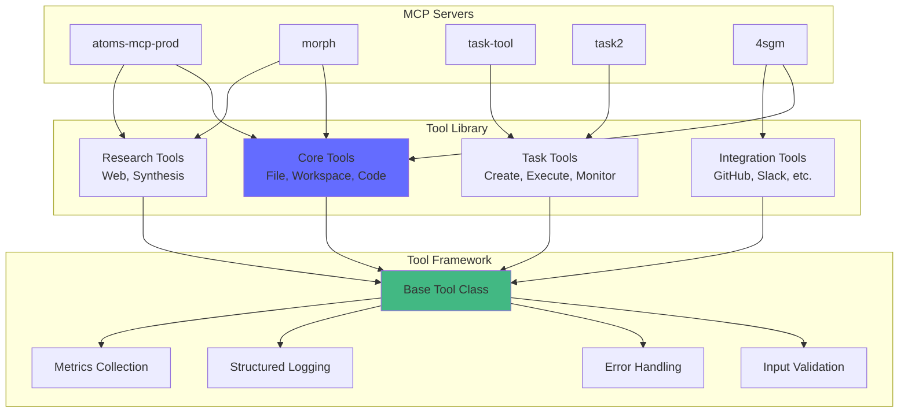

<DONE>
# Shared MCP Tool Library — Design Specification

> **Status**: 🛠️ **TOOL LIBRARY DESIGN** | **Date**: 2026-02-18
> **Purpose**: Design specification for a shared MCP tool library that consolidates common tools across MCP servers in the kush ecosystem

---

## Executive Summary

This document specifies the design for a **Shared MCP Tool Library** that consolidates common MCP tools across multiple servers (atoms-mcp-prod, morph, task-tool, task2, 4sgm). The library provides reusable, well-tested tools that can be imported and used by any MCP server.

**Key Goals**:

- ✅ Reduce code duplication across MCP servers
- ✅ Standardize tool interfaces and behaviors
- ✅ Provide comprehensive tool testing
- ✅ Enable tool composition and chaining
- ✅ Support tool versioning and migration

---

## Part 1: Current State Analysis

### 1.1 Existing MCP Tools

#### **atoms-mcp-prod**

- **Tools**: 5 consolidated tools (workspace_operation, entity_operation, relationship_operation, etc.)
- **Pattern**: FastMCP with comprehensive tool definitions
- **Scope**: Knowledge management, entity tracking, workflow automation

#### **morph**

- **Tools**: workspace_ops, research_hub
- **Pattern**: FastMCP with hexagonal architecture
- **Scope**: Workspace operations, research tooling

#### **task-tool**

- **Tools**: Task management tools
- **Pattern**: FastMCP with telemetry
- **Scope**: Task creation, execution, monitoring

#### **task2**

- **Tools**: Advanced task tools with DAG planning
- **Pattern**: FastMCP with agent delegation
- **Scope**: Batch execution, DAG planning, async/sync modes

#### **4sgm**

- **Tools**: 25+ MCP tools
- **Pattern**: LangGraph + FastMCP
- **Scope**: Various domain tools

### 1.2 Common Tool Patterns

**Shared Tool Categories**:

- File operations (read, write, list, search)
- Workspace operations (status, diff, commit)
- Code operations (lint, format, test)
- Research operations (web search, synthesis)
- Task operations (create, execute, monitor)

**Duplication Areas**:

- File I/O operations (multiple implementations)
- Workspace status checks (similar logic)
- Code quality tools (duplicated across servers)

---

## Part 2: Shared Tool Library Design

### 2.1 Library Architecture



---

### 2.2 Base Tool Framework

```python
from abc import ABC, abstractmethod
from typing import Any, Dict, Optional, List
from pydantic import BaseModel, Field
from datetime import datetime
import logging

logger = logging.getLogger(__name__)


class ToolInput(BaseModel):
    """Base tool input model."""

    pass


class ToolOutput(BaseModel):
    """Base tool output model."""

    success: bool
    result: Any
    error: Optional[str] = None
    metadata: Dict[str, Any] = Field(default_factory=dict)


class BaseMCPTool(ABC):
    """Base class for all MCP tools."""

    def __init__(self, name: str, description: str, version: str = "1.0.0", enabled: bool = True):
        self.name = name
        self.description = description
        self.version = version
        self.enabled = enabled
        self.logger = logging.getLogger(f"mcp.tool.{name}")

    @abstractmethod
    async def execute(self, input_data: ToolInput) -> ToolOutput:
        """Execute the tool."""
        pass

    @abstractmethod
    def validate_input(self, input_data: Dict[str, Any]) -> ToolInput:
        """Validate and parse input."""
        pass

    def get_schema(self) -> Dict[str, Any]:
        """Get tool schema for MCP registration."""
        return {"name": self.name, "description": self.description, "inputSchema": self._get_input_schema()}

    @abstractmethod
    def _get_input_schema(self) -> Dict[str, Any]:
        """Get JSON schema for input."""
        pass

    async def __call__(self, **kwargs) -> Dict[str, Any]:
        """Make tool callable."""
        try:
            input_data = self.validate_input(kwargs)
            output = await self.execute(input_data)
            return output.dict()
        except Exception as e:
            self.logger.error(f"Tool execution failed: {e}", exc_info=True)
            return ToolOutput(success=False, result=None, error=str(e)).dict()
```

---

### 2.3 Core Tools

#### **File Operations**

```python
from shared_mcp_tools.core.files import BaseMCPTool, ToolInput, ToolOutput
from pathlib import Path
from typing import List


class ReadFileInput(ToolInput):
    """Input for read file tool."""

    path: str = Field(..., description="File path to read")
    encoding: str = Field("utf-8", description="File encoding")


class ReadFileOutput(ToolOutput):
    """Output for read file tool."""

    content: str
    size: int
    modified: datetime


class ReadFileTool(BaseMCPTool):
    """Read file tool."""

    def __init__(self):
        super().__init__(name="read_file", description="Read contents of a file")

    def validate_input(self, input_data: Dict[str, Any]) -> ReadFileInput:
        return ReadFileInput(**input_data)

    async def execute(self, input_data: ReadFileInput) -> ReadFileOutput:
        path = Path(input_data.path)

        # Security check
        if not self._is_safe_path(path):
            raise ValueError(f"Unsafe path: {path}")

        content = path.read_text(encoding=input_data.encoding)
        stat = path.stat()

        return ReadFileOutput(
            success=True,
            result={"content": content, "size": stat.st_size, "modified": datetime.fromtimestamp(stat.st_mtime)},
            content=content,
            size=stat.st_size,
            modified=datetime.fromtimestamp(stat.st_mtime),
        )

    def _get_input_schema(self) -> Dict[str, Any]:
        return {
            "type": "object",
            "properties": {"path": {"type": "string"}, "encoding": {"type": "string", "default": "utf-8"}},
            "required": ["path"],
        }

    def _is_safe_path(self, path: Path) -> bool:
        # Implement path validation logic
        return True
```

#### **Workspace Operations**

```python
class WorkspaceStatusInput(ToolInput):
    """Input for workspace status tool."""

    workspace_path: str = Field(..., description="Workspace path")


class WorkspaceStatusTool(BaseMCPTool):
    """Get workspace status tool."""

    def __init__(self):
        super().__init__(name="workspace_status", description="Get workspace git status and file changes")

    async def execute(self, input_data: WorkspaceStatusInput) -> ToolOutput:
        # Implementation using git operations
        pass
```

#### **Code Operations**

```python
class LintCodeInput(ToolInput):
    """Input for lint code tool."""

    code: str
    language: str
    linter: Optional[str] = None


class LintCodeTool(BaseMCPTool):
    """Lint code tool."""

    def __init__(self):
        super().__init__(name="lint_code", description="Lint code using appropriate linter")

    async def execute(self, input_data: LintCodeInput) -> ToolOutput:
        # Implementation using language-specific linters
        pass
```

---

### 2.4 Research Tools

```python
class WebSearchInput(ToolInput):
    """Input for web search tool."""

    query: str
    max_results: int = Field(5, ge=1, le=20)
    filters: Optional[Dict[str, Any]] = None


class WebSearchTool(BaseMCPTool):
    """Web search tool."""

    def __init__(self):
        super().__init__(name="web_search", description="Search the web for information")

    async def execute(self, input_data: WebSearchInput) -> ToolOutput:
        # Implementation using search API
        pass
```

---

### 2.5 Task Tools

```python
class CreateTaskInput(ToolInput):
    """Input for create task tool."""

    title: str
    description: str
    project_id: Optional[str] = None
    dependencies: List[str] = Field(default_factory=list)


class CreateTaskTool(BaseMCPTool):
    """Create task tool."""

    def __init__(self):
        super().__init__(name="create_task", description="Create a new task")

    async def execute(self, input_data: CreateTaskInput) -> ToolOutput:
        # Implementation
        pass
```

---

## Part 3: Tool Library Structure

### 3.1 Directory Structure

```
shared-mcp-tools/
├── pyproject.toml
├── README.md
├── src/
│   └── shared_mcp_tools/
│       ├── __init__.py
│       ├── base.py              # Base tool class
│       ├── core/
│       │   ├── __init__.py
│       │   ├── files.py         # File operations
│       │   ├── workspace.py     # Workspace operations
│       │   └── code.py          # Code operations
│       ├── research/
│       │   ├── __init__.py
│       │   ├── web_search.py    # Web search
│       │   └── synthesis.py     # Content synthesis
│       ├── tasks/
│       │   ├── __init__.py
│       │   ├── create.py        # Task creation
│       │   ├── execute.py       # Task execution
│       │   └── monitor.py       # Task monitoring
│       ├── integrations/
│       │   ├── __init__.py
│       │   ├── github.py        # GitHub integration
│       │   ├── slack.py         # Slack integration
│       │   └── jira.py          # Jira integration
│       └── utils/
│           ├── __init__.py
│           ├── validation.py    # Input validation
│           ├── errors.py         # Error handling
│           └── logging.py       # Structured logging
├── tests/
│   ├── unit/
│   ├── integration/
│   └── fixtures/
└── docs/
    ├── api/
    └── guides/
```

---

### 3.2 Tool Categories

#### **Core Tools** (`core/`)

- `read_file` - Read file contents
- `write_file` - Write file contents
- `list_files` - List directory contents
- `search_files` - Search files by pattern
- `workspace_status` - Get workspace git status
- `workspace_diff` - Get workspace diff
- `lint_code` - Lint code
- `format_code` - Format code
- `run_tests` - Run tests

#### **Research Tools** (`research/`)

- `web_search` - Web search
- `synthesize_content` - Content synthesis
- `extract_key_points` - Extract key points
- `summarize` - Summarize content

#### **Task Tools** (`tasks/`)

- `create_task` - Create task
- `execute_task` - Execute task
- `monitor_task` - Monitor task status
- `cancel_task` - Cancel task

#### **Integration Tools** (`integrations/`)

- `github_create_issue` - Create GitHub issue
- `github_create_pr` - Create GitHub PR
- `slack_send_message` - Send Slack message
- `jira_create_ticket` - Create Jira ticket

---

## Part 4: Usage Examples

### 4.1 Basic Usage

```python
from fastmcp import FastMCP
from shared_mcp_tools.core.files import ReadFileTool, WriteFileTool
from shared_mcp_tools.core.workspace import WorkspaceStatusTool
from shared_mcp_tools.research.web_search import WebSearchTool

mcp = FastMCP("my-mcp-server")

# Register tools
read_file = ReadFileTool()
write_file = WriteFileTool()
workspace_status = WorkspaceStatusTool()
web_search = WebSearchTool()

mcp.tool()(read_file)
mcp.tool()(write_file)
mcp.tool()(workspace_status)
mcp.tool()(web_search)
```

### 4.2 Custom Tool Composition

```python
from shared_mcp_tools.base import BaseMCPTool, ToolInput, ToolOutput


class CustomTool(BaseMCPTool):
    """Custom tool using shared tools."""

    def __init__(self):
        super().__init__(name="custom_operation", description="Custom operation using shared tools")
        self.read_file = ReadFileTool()
        self.lint_code = LintCodeTool()

    async def execute(self, input_data: ToolInput) -> ToolOutput:
        # Read file
        read_result = await self.read_file.execute(ReadFileInput(path=input_data.path))

        # Lint code
        lint_result = await self.lint_code.execute(LintCodeInput(code=read_result.content, language="python"))

        return ToolOutput(
            success=True, result={"file_content": read_result.content, "lint_results": lint_result.result}
        )
```

### 4.3 Tool Chaining

```python
from shared_mcp_tools.utils import ToolChain

chain = ToolChain([ReadFileTool(), LintCodeTool(), FormatCodeTool()])

result = await chain.execute({"path": "src/main.py", "language": "python"})
```

---

## Part 5: Tool Versioning

### 5.1 Version Strategy

- **Semantic Versioning**: MAJOR.MINOR.PATCH
- **Backward Compatibility**: MINOR versions maintain compatibility
- **Migration Guides**: For MAJOR version changes

### 5.2 Version Management

```python
from shared_mcp_tools import get_tool_version, check_compatibility

# Get tool version
version = get_tool_version("read_file")
# Returns: "1.2.3"

# Check compatibility
is_compatible = check_compatibility("read_file", ">=1.0.0,<2.0.0")
# Returns: True
```

---

## Part 6: Testing Strategy

### 6.1 Unit Tests

```python
import pytest
from shared_mcp_tools.core.files import ReadFileTool, ReadFileInput


@pytest.mark.asyncio
async def test_read_file_success():
    tool = ReadFileTool()
    input_data = ReadFileInput(path="test.txt")
    output = await tool.execute(input_data)

    assert output.success is True
    assert output.content is not None
```

### 6.2 Integration Tests

```python
@pytest.mark.asyncio
async def test_file_operations_integration():
    write_tool = WriteFileTool()
    read_tool = ReadFileTool()

    # Write file
    await write_tool.execute(WriteFileInput(path="test.txt", content="Hello, World!"))

    # Read file
    result = await read_tool.execute(ReadFileInput(path="test.txt"))
    assert result.content == "Hello, World!"
```

---

## Part 7: Migration Guide

### 7.1 atoms-mcp-prod Migration

```python
# Before
@mcp.tool()
async def read_file(path: str) -> str:
    # Custom implementation
    pass


# After
from shared_mcp_tools.core.files import ReadFileTool

read_file_tool = ReadFileTool()
mcp.tool()(read_file_tool)
```

### 7.2 morph Migration

```python
# Before
class WorkspaceOpsTool:
    async def status(self, path: str):
        # Custom implementation
        pass


# After
from shared_mcp_tools.core.workspace import WorkspaceStatusTool

workspace_status = WorkspaceStatusTool()
mcp.tool()(workspace_status)
```

---

## Part 8: Performance Optimization

### 8.1 Caching

```python
from shared_mcp_tools.utils import cached_tool


@cached_tool(ttl=300)  # Cache for 5 minutes
class ReadFileTool(BaseMCPTool):
    # Implementation
    pass
```

### 8.2 Parallel Execution

```python
from shared_mcp_tools.utils import parallel_execute

results = await parallel_execute(
    [
        ReadFileTool().execute(ReadFileInput(path="file1.txt")),
        ReadFileTool().execute(ReadFileInput(path="file2.txt")),
        ReadFileTool().execute(ReadFileInput(path="file3.txt")),
    ]
)
```

---

## Part 9: Security Considerations

### 9.1 Input Validation

- **Path Validation**: Prevent directory traversal
- **Size Limits**: Prevent resource exhaustion
- **Type Validation**: Ensure correct input types

### 9.2 Sandboxing

- **File Operations**: Restricted to workspace directory
- **Network Operations**: Rate limiting and timeout
- **Code Execution**: Sandboxed execution environment

---

## Part 10: Documentation

### 10.1 API Documentation

- **Tool Reference**: Complete tool documentation
- **Usage Examples**: Code examples for each tool
- **Best Practices**: Recommended usage patterns

### 10.2 Migration Guides

- **atoms-mcp-prod**: Step-by-step migration
- **morph**: Tool replacement guide
- **task-tool**: Integration guide

---

## See Also

- [KUSH_ECOSYSTEM_DEEP_DIVE.md](./KUSH_ECOSYSTEM_DEEP_DIVE.md) - Ecosystem analysis
- [UNIFIED_AGENT_REGISTRY_API.md](./UNIFIED_AGENT_REGISTRY_API.md) - Agent registry API
- [CROSS_PROJECT_INTEGRATION_GUIDE.md](./CROSS_PROJECT_INTEGRATION_GUIDE.md) - Integration guide

---

**Status**: 🛠️ **TOOL LIBRARY DESIGN COMPLETE** - Comprehensive shared MCP tool library specification
