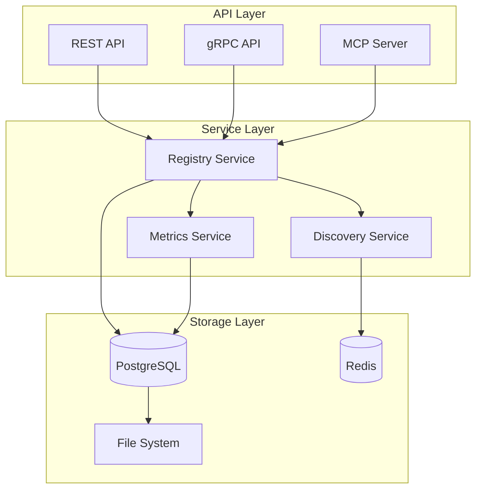

<DONE>
# Unified Agent Registry API — Design Specification

> **Status**: 🎯 **API DESIGN** | **Date**: 2026-02-18
> **Purpose**: Design specification for a unified agent registry API that consolidates agent management across the kush ecosystem

---

## Executive Summary

This document specifies the design for a **Unified Agent Registry API** that consolidates agent management across multiple projects in the kush ecosystem (thegent, kimaki, plangent, heliosShield). The API provides a single source of truth for agent registration, discovery, and coordination.

**Key Goals**:
- ✅ Single source of truth for agent metadata
- ✅ Cross-project agent discovery
- ✅ Unified agent lifecycle management
- ✅ Project assignment and context management
- ✅ Collaboration rules and permissions
- ✅ Performance metrics and monitoring

---

## Part 1: Current State Analysis

### 1.1 Existing Agent Registries

#### **kimaki** (`discord/src/core/agent-registry.ts`)
- **Features**: Agent registration, project assignments, collaboration rules, availability management, performance metrics
- **Schema**: TypeScript interfaces with comprehensive metadata
- **Storage**: In-memory Map (could be persisted)

#### **plangent**
- **Features**: Root agent + sub-agents, adapter pattern
- **Schema**: TypeScript-based agent definitions
- **Storage**: State manager adapter

#### **thegent**
- **Features**: Agent discovery, MCP integration
- **Schema**: Python-based agent definitions
- **Storage**: File-based, MCP server discovery

#### **heliosShield**
- **Features**: Agent harness, command interception
- **Schema**: Python-based agent definitions
- **Storage**: Runtime detection

### 1.2 Common Patterns

**Shared Concepts**:
- Agent ID (unique identifier)
- Agent name and description
- Agent capabilities/tools
- Project assignments
- Availability/status
- Performance metrics

**Differences**:
- Storage mechanisms (in-memory vs. persistent)
- Schema formats (TypeScript vs. Python)
- Integration points (MCP vs. direct)

---

## Part 2: Unified API Design

### 2.1 API Architecture



---

### 2.2 Core Data Models

#### **Agent Model**

```python
from pydantic import BaseModel, Field
from typing import List, Optional, Dict, Any
from datetime import datetime
from enum import Enum


class AgentStatus(str, Enum):
    """Agent status."""

    ACTIVE = "active"
    INACTIVE = "inactive"
    BUSY = "busy"
    ERROR = "error"
    MAINTENANCE = "maintenance"


class AgentCapability(str, Enum):
    """Agent capabilities."""

    CODE_GENERATION = "code_generation"
    CODE_REVIEW = "code_review"
    TESTING = "testing"
    DOCUMENTATION = "documentation"
    RESEARCH = "research"
    DEPLOYMENT = "deployment"
    MONITORING = "monitoring"


class ProjectAssignment(BaseModel):
    """Project assignment."""

    project_id: str
    role: str = Field(..., description="primary, secondary, consultant")
    permissions: List[str] = Field(default_factory=list)
    assigned_at: datetime
    last_active: Optional[datetime] = None


class CollaborationRule(BaseModel):
    """Collaboration rules."""

    can_initiate_with: List[str] = Field(default_factory=list)
    must_consult_with: List[str] = Field(default_factory=list)
    ignore_agents: List[str] = Field(default_factory=list)
    auto_join_topics: List[str] = Field(default_factory=list)


class Availability(BaseModel):
    """Agent availability."""

    schedule: Optional[str] = Field(None, description="Cron expression")
    timezone: str = "UTC"
    office_hours: Optional[Dict[str, str]] = None
    is_available: bool = True


class PerformanceMetrics(BaseModel):
    """Performance metrics."""

    total_tasks: int = 0
    completed_tasks: int = 0
    failed_tasks: int = 0
    average_response_time: float = 0.0
    success_rate: float = 0.0
    last_updated: datetime


class Agent(BaseModel):
    """Unified agent model."""

    # Identity
    id: str = Field(..., description="Unique agent identifier")
    name: str
    description: Optional[str] = None
    version: str = "1.0.0"

    # Capabilities
    capabilities: List[AgentCapability] = Field(default_factory=list)
    tools: List[str] = Field(default_factory=list)
    models: List[str] = Field(default_factory=list, description="Supported LLM models")

    # Configuration
    system_prompt: Optional[str] = None
    temperature: float = 0.7
    max_tokens: Optional[int] = None

    # Project assignments
    projects: List[ProjectAssignment] = Field(default_factory=list)

    # Collaboration
    collaboration_rules: CollaborationRule = Field(default_factory=CollaborationRule)

    # Availability
    availability: Availability = Field(default_factory=Availability)

    # State
    status: AgentStatus = AgentStatus.INACTIVE
    current_project: Optional[str] = None
    last_active: Optional[datetime] = None

    # Performance
    metrics: PerformanceMetrics = Field(default_factory=lambda: PerformanceMetrics(last_updated=datetime.now()))

    # Metadata
    metadata: Dict[str, Any] = Field(default_factory=dict)
    created_at: datetime = Field(default_factory=datetime.now)
    updated_at: datetime = Field(default_factory=datetime.now)
```

---

### 2.3 API Endpoints

#### **Agent Management**

```python
# Register agent
POST /api/v1/agents
Request: Agent (without id)
Response: Agent (with id)

# Get agent
GET /api/v1/agents/{agent_id}
Response: Agent

# List agents
GET /api/v1/agents?status={status}&project={project_id}&capability={capability}
Response: List[Agent]

# Update agent
PUT /api/v1/agents/{agent_id}
Request: Partial[Agent]
Response: Agent

# Delete agent
DELETE /api/v1/agents/{agent_id}
Response: 204 No Content

# Activate agent
POST /api/v1/agents/{agent_id}/activate
Response: Agent

# Deactivate agent
POST /api/v1/agents/{agent_id}/deactivate
Response: Agent
```

#### **Project Assignment**

```python
# Assign agent to project
POST / api / v1 / agents / {agent_id} / projects
Request: ProjectAssignment
Response: Agent

# Remove agent from project
DELETE / api / v1 / agents / {agent_id} / projects / {project_id}
Response: Agent

# List agents for project
GET / api / v1 / projects / {project_id} / agents
Response: List[Agent]

# List projects for agent
GET / api / v1 / agents / {agent_id} / projects
Response: List[ProjectAssignment]
```

#### **Discovery**

```python
# Discover agents by capability
GET /api/v1/discover?capability={capability}&project={project_id}&available={true}
Response: List[Agent]

# Discover agents by tool
GET /api/v1/discover/tools?tool={tool_name}
Response: List[Agent]

# Discover agents by model
GET /api/v1/discover/models?model={model_name}
Response: List[Agent]

# Get best agent for task
POST /api/v1/discover/best
Request: {
    "task_description": str,
    "required_capabilities": List[str],
    "project_id": Optional[str],
    "preferred_models": Optional[List[str]]
}
Response: Agent
```

#### **Collaboration**

```python
# Get collaboration rules
GET / api / v1 / agents / {agent_id} / collaboration
Response: CollaborationRule

# Update collaboration rules
PUT / api / v1 / agents / {agent_id} / collaboration
Request: CollaborationRule
Response: CollaborationRule

# Get compatible agents
GET / api / v1 / agents / {agent_id} / compatible
Response: List[Agent]
```

#### **Metrics**

```python
# Get agent metrics
GET /api/v1/agents/{agent_id}/metrics
Response: PerformanceMetrics

# Update agent metrics
POST /api/v1/agents/{agent_id}/metrics
Request: Partial[PerformanceMetrics]
Response: PerformanceMetrics

# Get metrics summary
GET /api/v1/metrics/summary?project={project_id}
Response: {
    "total_agents": int,
    "active_agents": int,
    "total_tasks": int,
    "average_success_rate": float
}
```

---

### 2.4 MCP Server Integration

```python
# MCP Server Implementation
from fastmcp import FastMCP

mcp = FastMCP("unified-agent-registry")


@mcp.tool()
async def register_agent(agent_id: str, name: str, capabilities: List[str], tools: List[str], **kwargs) -> dict:
    """Register a new agent in the unified registry."""
    # Implementation
    pass


@mcp.tool()
async def discover_agents(
    capability: Optional[str] = None, project_id: Optional[str] = None, available: bool = True
) -> List[dict]:
    """Discover agents matching criteria."""
    # Implementation
    pass


@mcp.tool()
async def assign_agent_to_project(agent_id: str, project_id: str, role: str = "contributor") -> dict:
    """Assign an agent to a project."""
    # Implementation
    pass


@mcp.tool()
async def get_agent_status(agent_id: str) -> dict:
    """Get current status of an agent."""
    # Implementation
    pass
```

---

## Part 3: Implementation Strategy

### 3.1 Phase 1: Core API (Week 1-2)

**Deliverables**:
- ✅ REST API implementation
- ✅ PostgreSQL schema
- ✅ Basic CRUD operations
- ✅ Agent registration and discovery

**Tech Stack**:
- FastAPI for REST API
- SQLAlchemy for ORM
- PostgreSQL for storage
- Pydantic for validation

### 3.2 Phase 2: Integration (Week 3-4)

**Deliverables**:
- ✅ MCP server integration
- ✅ Redis caching layer
- ✅ Project assignment API
- ✅ Collaboration rules API

**Integration Points**:
- kimaki agent registry → Unified API
- plangent agent definitions → Unified API
- thegent agent discovery → Unified API

### 3.3 Phase 3: Advanced Features (Week 5-6)

**Deliverables**:
- ✅ Performance metrics collection
- ✅ Agent recommendation engine
- ✅ Real-time status updates (WebSocket)
- ✅ Health monitoring

### 3.4 Phase 4: Migration (Week 7-8)

**Deliverables**:
- ✅ Migration scripts for existing registries
- ✅ Backward compatibility layer
- ✅ Documentation and examples
- ✅ Monitoring and observability

---

## Part 4: Storage Schema

### 4.1 PostgreSQL Schema

```sql
-- Agents table
CREATE TABLE agents (
    id VARCHAR(255) PRIMARY KEY,
    name VARCHAR(255) NOT NULL,
    description TEXT,
    version VARCHAR(50) DEFAULT '1.0.0',
    capabilities JSONB DEFAULT '[]',
    tools JSONB DEFAULT '[]',
    models JSONB DEFAULT '[]',
    system_prompt TEXT,
    temperature FLOAT DEFAULT 0.7,
    max_tokens INTEGER,
    status VARCHAR(50) DEFAULT 'inactive',
    current_project VARCHAR(255),
    last_active TIMESTAMP,
    metadata JSONB DEFAULT '{}',
    created_at TIMESTAMP DEFAULT NOW(),
    updated_at TIMESTAMP DEFAULT NOW()
);

-- Project assignments table
CREATE TABLE project_assignments (
    id SERIAL PRIMARY KEY,
    agent_id VARCHAR(255) REFERENCES agents(id) ON DELETE CASCADE,
    project_id VARCHAR(255) NOT NULL,
    role VARCHAR(50) NOT NULL,
    permissions JSONB DEFAULT '[]',
    assigned_at TIMESTAMP DEFAULT NOW(),
    last_active TIMESTAMP
);

-- Collaboration rules table
CREATE TABLE collaboration_rules (
    agent_id VARCHAR(255) PRIMARY KEY REFERENCES agents(id) ON DELETE CASCADE,
    can_initiate_with JSONB DEFAULT '[]',
    must_consult_with JSONB DEFAULT '[]',
    ignore_agents JSONB DEFAULT '[]',
    auto_join_topics JSONB DEFAULT '[]'
);

-- Performance metrics table
CREATE TABLE performance_metrics (
    agent_id VARCHAR(255) PRIMARY KEY REFERENCES agents(id) ON DELETE CASCADE,
    total_tasks INTEGER DEFAULT 0,
    completed_tasks INTEGER DEFAULT 0,
    failed_tasks INTEGER DEFAULT 0,
    average_response_time FLOAT DEFAULT 0.0,
    success_rate FLOAT DEFAULT 0.0,
    last_updated TIMESTAMP DEFAULT NOW()
);

-- Indexes
CREATE INDEX idx_agents_status ON agents(status);
CREATE INDEX idx_agents_current_project ON agents(current_project);
CREATE INDEX idx_project_assignments_project ON project_assignments(project_id);
CREATE INDEX idx_project_assignments_agent ON project_assignments(agent_id);
CREATE INDEX idx_agents_capabilities ON agents USING GIN(capabilities);
CREATE INDEX idx_agents_tools ON agents USING GIN(tools);
```

---

## Part 5: Client Libraries

### 5.1 Python Client

```python
from unified_agent_registry import AgentRegistryClient

client = AgentRegistryClient(base_url="http://localhost:8000", api_key="your-api-key")

# Register agent
agent = await client.register_agent(
    name="Code Review Agent", capabilities=["code_review", "testing"], tools=["ruff", "mypy", "pytest"]
)

# Discover agents
agents = await client.discover_agents(capability="code_review", project_id="project-123", available=True)

# Assign to project
await client.assign_to_project(agent_id=agent.id, project_id="project-123", role="primary")
```

### 5.2 TypeScript Client

```typescript
import { AgentRegistryClient } from '@kush/unified-agent-registry';

const client = new AgentRegistryClient({
  baseUrl: 'http://localhost:8000',
  apiKey: 'your-api-key'
});

// Register agent
const agent = await client.registerAgent({
  name: 'Code Review Agent',
  capabilities: ['code_review', 'testing'],
  tools: ['ruff', 'mypy', 'pytest']
});

// Discover agents
const agents = await client.discoverAgents({
  capability: 'code_review',
  projectId: 'project-123',
  available: true
});

// Assign to project
await client.assignToProject(
  agent.id,
  'project-123',
  'primary'
);
```

---

## Part 6: Migration Path

### 6.1 kimaki Migration

```typescript
// Before (kimaki)
const registry = new AgentRegistry();
registry.register(agent);

// After (unified)
import { AgentRegistryClient } from '@kush/unified-agent-registry';
const client = new AgentRegistryClient();
await client.registerAgent(agent);
```

### 6.2 plangent Migration

```typescript
// Before (plangent)
const agent = new RootAgentImpl(config);

// After (unified)
import { AgentRegistryClient } from '@kush/unified-agent-registry';
const client = new AgentRegistryClient();
const agent = await client.getAgent('root-agent-id');
```

### 6.3 thegent Migration

```python
# Before (thegent)
agents = discover_agents()

# After (unified)
from unified_agent_registry import AgentRegistryClient

client = AgentRegistryClient()
agents = await client.discover_agents()
```

---

## Part 7: API Examples

### 7.1 Complete Agent Registration

```python
# Register a new agent
agent = {
    "name": "Python Code Review Agent",
    "description": "Specialized agent for Python code review",
    "capabilities": ["code_review", "testing"],
    "tools": ["ruff", "mypy", "pytest", "black"],
    "models": ["gpt-4", "claude-3-opus"],
    "system_prompt": "You are a Python code review expert...",
    "temperature": 0.3,
    "collaboration_rules": {
        "can_initiate_with": ["testing-agent", "documentation-agent"],
        "must_consult_with": ["security-agent"],
        "ignore_agents": ["deployment-agent"],
    },
    "availability": {
        "schedule": "0 9-17 * * 1-5",
        "timezone": "America/Los_Angeles",
        "office_hours": {"start": "09:00", "end": "17:00"},
    },
}

response = await client.register_agent(agent)
```

### 7.2 Agent Discovery

```python
# Discover agents for a specific task
task = {
    "task_description": "Review Python code for security vulnerabilities",
    "required_capabilities": ["code_review", "security"],
    "project_id": "project-123",
    "preferred_models": ["gpt-4", "claude-3-opus"],
}

best_agent = await client.discover_best_agent(task)
```

### 7.3 Project Assignment

```python
# Assign agent to project
assignment = {"project_id": "project-123", "role": "primary", "permissions": ["read", "write", "review"]}

await client.assign_to_project(agent_id="agent-456", **assignment)
```

---

## Part 8: Performance Considerations

### 8.1 Caching Strategy

- **Redis Cache**: Agent metadata cached for 5 minutes
- **Cache Invalidation**: On agent update/delete
- **Cache Warming**: Pre-load frequently accessed agents

### 8.2 Query Optimization

- **Indexes**: On status, project_id, capabilities, tools
- **Pagination**: Default 50 items per page
- **Filtering**: Server-side filtering for performance

### 8.3 Scalability

- **Horizontal Scaling**: Stateless API servers
- **Database Sharding**: By project_id for large deployments
- **Read Replicas**: For read-heavy workloads

---

## Part 9: Security

### 9.1 Authentication

- **API Keys**: For service-to-service communication
- **OAuth 2.0**: For user-facing applications
- **JWT Tokens**: For stateless authentication

### 9.2 Authorization

- **Role-Based Access Control**: Admin, Agent, Viewer roles
- **Project-Level Permissions**: Per-project access control
- **Agent Permissions**: Fine-grained tool permissions

### 9.3 Data Protection

- **Encryption**: At rest and in transit
- **Audit Logging**: All agent operations logged
- **Rate Limiting**: Per API key and per IP

---

## Part 10: Monitoring & Observability

### 10.1 Metrics

- **Agent Registration Rate**: Agents registered per hour
- **Discovery Latency**: P95 discovery response time
- **Assignment Success Rate**: Successful project assignments
- **Agent Availability**: Percentage of agents available

### 10.2 Logging

- **Structured Logging**: JSON logs with correlation IDs
- **Log Levels**: DEBUG, INFO, WARN, ERROR
- **Log Aggregation**: Centralized log collection

### 10.3 Alerting

- **Agent Down**: Alert when agent unavailable > 5 minutes
- **High Error Rate**: Alert when error rate > 5%
- **Performance Degradation**: Alert when P95 latency > 1s

---

## Part 11: Testing Strategy

### 11.1 Unit Tests

- **Model Validation**: Pydantic model tests
- **Business Logic**: Registry service tests
- **Edge Cases**: Error handling tests

### 11.2 Integration Tests

- **API Endpoints**: Full request/response cycle
- **Database Operations**: CRUD operations
- **Cache Integration**: Cache hit/miss scenarios

### 11.3 E2E Tests

- **Agent Lifecycle**: Register → Assign → Use → Delete
- **Discovery Flow**: Discover → Select → Use
- **Collaboration Flow**: Multiple agents working together

---

## Part 12: Documentation

### 12.1 API Documentation

- **OpenAPI Spec**: Auto-generated from FastAPI
- **Interactive Docs**: Swagger UI and ReDoc
- **Code Examples**: Python and TypeScript examples

### 12.2 Integration Guides

- **kimaki Integration**: Step-by-step migration guide
- **plangent Integration**: Adapter pattern integration
- **thegent Integration**: MCP server integration

### 12.3 Developer Guides

- **Getting Started**: Quick start guide
- **Architecture**: System architecture documentation
- **Best Practices**: Recommended patterns and practices

---

## See Also

- [KUSH_ECOSYSTEM_DEEP_DIVE.md](./KUSH_ECOSYSTEM_DEEP_DIVE.md) - Ecosystem analysis
- [SHARED_MCP_TOOL_LIBRARY.md](./SHARED_MCP_TOOL_LIBRARY.md) - Shared MCP tools
- [CROSS_PROJECT_INTEGRATION_GUIDE.md](./CROSS_PROJECT_INTEGRATION_GUIDE.md) - Integration guide

---

**Status**: 🎯 **API DESIGN COMPLETE** - Comprehensive unified agent registry API specification
