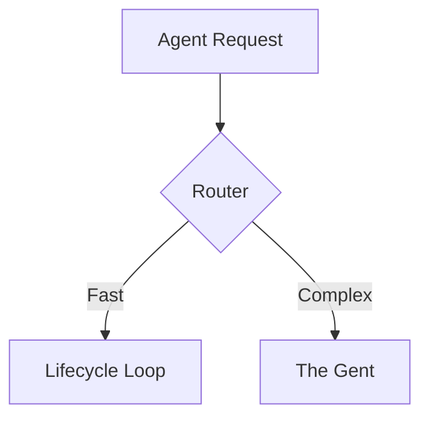

<DONE>
# VitePress Phase 1 Implementation — ✅ COMPLETE

> **Status**: ✅ **COMPLETE** | **Date**: 2026-02-17
> **Purpose**: Summary of Phase 1 VitePress rich documentation implementation

---

## ✅ Implementation Complete

### 1. Mermaid Diagrams ✅

- ✅ Installed `vitepress-plugin-mermaid@2.0.17` and `mermaid@11.12.3`
- ✅ Configured `withMermaid()` wrapper in `docs/.vitepress/config.ts`
- ✅ Configured Mermaid theme variables for dark/light mode
- ✅ Ready to use in markdown files with ` ```mermaid ` code blocks

**Usage Example**:

````markdown

````

### 2. CodePlayground Component ✅

- ✅ Created `docs/.vitepress/theme/components/CodePlayground.vue`
- ✅ Registered in `docs/.vitepress/theme/index.ts`
- ✅ Features:
  - Language badge display
  - Copy code button
  - Run button (ready for API integration)
  - Output/error display
  - Dark mode support
  - Responsive styling

**Usage Example**:

```vue
<CodePlayground
  lang="python"
  title="Example"
  code="from thegent import Agent
agent = Agent('codex')
result = agent.run('Fix this bug')
print(result)"
/>
```

### 3. Demo GIF Generation Infrastructure ✅

- ✅ Created `scripts/generate-demo-gifs.sh` (executable)
- ✅ Created directory structure:
  - `docs/demos/cli/` - For VHS `.tape` files
  - `docs/demos/web/` - For Playwright `.ts` scripts
  - `docs/public/assets/demos/` - Output directory
- ✅ Created `docs/demos/README.md` with usage instructions
- ✅ Script supports:
  - VHS terminal recordings
  - Playwright browser recordings
  - Error handling and warnings
  - Output directory management

**Usage**:

```bash
./scripts/generate-demo-gifs.sh
```

---

## 📦 Dependencies Installed

- ✅ `vitepress-plugin-mermaid@2.0.17`
- ✅ `mermaid@11.12.3`
- ✅ `@playwright/test@1.58.2`

---

## 📁 Files Created/Modified

### Created

- `docs/.vitepress/theme/components/CodePlayground.vue` - CodePlayground component
- `scripts/generate-demo-gifs.sh` - Demo GIF generation script
- `docs/demos/README.md` - Demo scripts documentation
- `docs/research/VITEPRESS_PHASE1_IMPLEMENTATION.md` - Implementation tracking
- `docs/research/VITEPRESS_PHASE1_COMPLETE.md` - This summary

### Modified

- `package.json` - Added Mermaid and Playwright dependencies
- `docs/.vitepress/config.ts` - Added Mermaid configuration with `withMermaid()` wrapper
- `docs/.vitepress/theme/index.ts` - Registered CodePlayground component

---

## 🧪 Next Steps for Testing

1. **Test Mermaid**:
   - Add a test markdown file with Mermaid diagram
   - Run `bun run docs:dev` and verify rendering

2. **Test CodePlayground**:
   - Add example usage in documentation
   - Verify component renders correctly
   - Test copy and run buttons

3. **Setup VHS** (optional, for CLI demos):

   ```bash
   brew install vhs  # macOS
   ```

4. **Setup Playwright** (for browser demos):

   ```bash
   npx playwright install
   ```

5. **Create Sample Demos**:
   - Create example `.tape` file in `docs/demos/cli/`
   - Create example Playwright script in `docs/demos/web/`
   - Run `./scripts/generate-demo-gifs.sh`
   - Verify GIFs are generated and display correctly

---

## 🎯 Phase 1 Goals Achieved

✅ **Core Rich Elements Implemented**:

- Mermaid diagrams for architecture, flowcharts, sequence diagrams
- Tryable code playgrounds (ready for API integration)
- Demo GIF generation infrastructure (VHS + Playwright)

✅ **Infrastructure Ready**:

- All dependencies installed
- Components registered
- Scripts executable
- Documentation created

---

## 📋 Related WORK_STREAM Items

The following items from `WORK_STREAM.md` are now complete:

- ✅ `vitepress-mermaid-setup` - Install and configure Mermaid plugin
- ✅ `vitepress-code-playground` - Create CodePlayground component
- ✅ `vitepress-vhs-setup` - Set up VHS for terminal recordings (infrastructure)
- ✅ `vitepress-playwright-setup` - Set up Playwright for browser recordings (infrastructure)

**Remaining Phase 1 items** (depend on above):

- `vitepress-api-docs-generator` - Auto-generate API docs from docstrings (depends on mermaid)
- `vitepress-architecture-generator` - Auto-generate architecture diagrams (depends on mermaid)
- `vitepress-cli-examples-generator` - Auto-generate CLI examples (depends on code-playground)
- `vitepress-demo-gif-generator` - Auto-generate demo GIFs (depends on vhs-setup)
- `vitepress-agent-workflow` - Create agent workflow for auto-population (depends on all above)

---

## See Also

- [VITEPRESS_RICH_DOCUMENTATION_IMPLEMENTATION_PLAN.md](./VITEPRESS_RICH_DOCUMENTATION_IMPLEMENTATION_PLAN.md) - Full implementation plan
- [VITEPRESS_RICH_DOCUMENTATION_AUDIT.md](./VITEPRESS_RICH_DOCUMENTATION_AUDIT.md) - Audit of current state
- [WORK_STREAM.md](../reference/WORK_STREAM.md) - Unified work stream
- [VITEPRESS_PHASE1_IMPLEMENTATION.md](./VITEPRESS_PHASE1_IMPLEMENTATION.md) - Implementation tracking

---

**Status**: ✅ **Phase 1 Core Elements Complete** - Ready for testing and Phase 2 (Agent Workflows)
