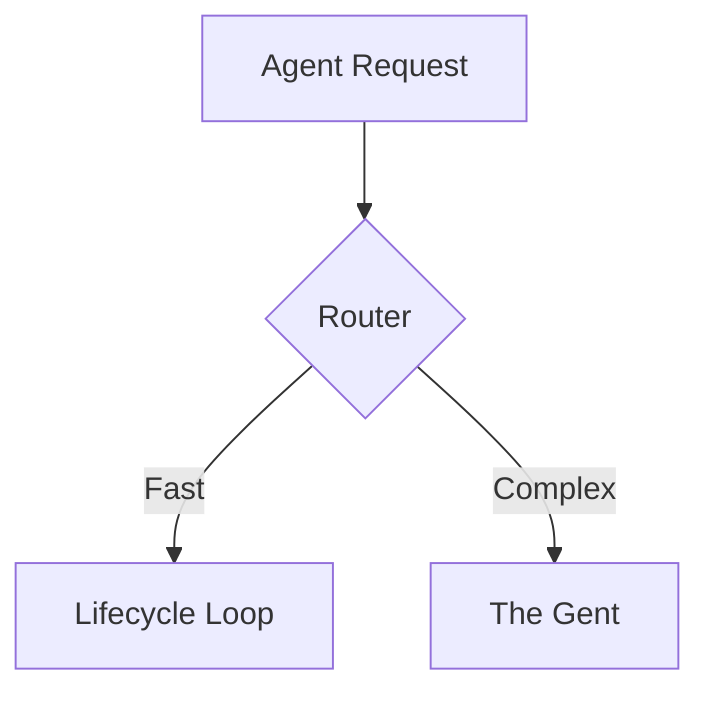

<DONE>
# VitePress Rich Documentation Audit & Implementation Plan

> **Status**: Audit Complete | **Date**: 2026-02-17
> **Purpose**: Audit current VitePress setup and plan for rich, interactive documentation with diagrams, tryable code, GIFs, and agent workflows

---

## Current State Audit

### ✅ What's Configured

| Feature                 | Status        | Details                                     |
| ----------------------- | ------------- | ------------------------------------------- |
| **VitePress Setup**     | ✅ Configured | Basic config in `docs/.vitepress/config.ts` |
| **DemoGif Component**   | ✅ Available  | `DemoGif.vue` component for GIFs            |
| **Callout Component**   | ✅ Available  | Callout component for tips/warnings         |
| **Local Search**        | ✅ Configured | Built-in local search enabled               |
| **Dark/Light Mode**     | ✅ Configured | Appearance toggle enabled                   |
| **Cross-Project Links** | ✅ Configured | Plugin for linking between projects         |
| **Auto-Build Hook**     | ✅ Available  | Pre-commit hook for docs build              |

### ✅ What's Implemented

| Feature                           | Status        | Priority | Impact                                              |
| --------------------------------- | ------------- | -------- | --------------------------------------------------- |
| **Mermaid Diagrams**              | ✅ Configured | P1       | High - Diagrams are essential for architecture docs |
| **Tryable Code Playgrounds**      | ✅ Configured | P1       | High - Interactive code examples                    |
| **VHS/Playwright GIF Generation** | ✅ Configured | P1       | High - Automated demo recordings                    |
| **Agent Doc Writing Workflows**   | ✅ Configured | P1       | High - Auto-population from code/docs               |
| **Auto Sidebar Generation**       | ✅ Configured | P2       | Medium - Better navigation                          |
| **LLM-Friendly Output**           | ✅ Configured | P2       | Medium - Better AI consumption                      |
| **API Reference Auto-Gen**        | ✅ Configured | P2       | Medium - SDK documentation                          |
| **Versioned Docs**                | ⏳ Future     | P3       | Low - Multi-version support                         |

---

## Rich Elements Needed

### 1. Diagrams (Mermaid)

**Current**: ✅ Configured
**Status**: Mermaid plugin installed, configured, and ready to use

**Implementation**:

```typescript
// Install: npm install vitepress-plugin-mermaid mermaid
import { withMermaid } from "vitepress-plugin-mermaid";

export default withMermaid(
  defineConfig({
    mermaid: {
      theme: "base",
      themeVariables: {
        primaryColor: "#42b883",
        background: "var(--vp-c-bg)",
      },
    },
  }),
);
```

**Usage in MD**:

````markdown

````

### 2. Tryable Code Playgrounds

**Current**: ❌ Not configured
**Needed**: Interactive code examples, API try-it-out, CLI command playgrounds

**Implementation Options**:

- **vitepress-demo-plugin** - Vue/React component demos
- **@vue/repl** - Vue SFC playground
- **Custom component** - Python/CLI code execution (via API)

**Example**:

```vue
<CodePlayground lang="python" endpoint="/api/execute"></CodePlayground>
```

</CodePlayground>
```

### 3. VHS/Playwright GIF Generation

**Current**: ❌ Not configured
**Needed**: Automated terminal recordings, UI automation demos

**Implementation**:

- **VHS** (Terminal GIFs): Record terminal sessions
- **Playwright** (Browser GIFs): Record browser automation
- **Agent Workflow**: Auto-generate GIFs from demo scripts

**Workflow**:

```bash
# Agent workflow
1. Detect demo script in docs
2. Run script with VHS/Playwright
3. Generate GIF
4. Embed in docs
5. Commit to repo
```

### 4. Agent Doc Writing Workflows

**Current**: ❌ Not configured
**Needed**: Auto-populate VitePress from:

- Code docstrings → API docs
- Architecture docs → Diagrams
- CLI commands → Interactive examples
- Research docs → Wiki pages

**Implementation**:

- **Docstring Parser**: Extract API docs from Python
- **Architecture Analyzer**: Generate Mermaid from code structure
- **CLI Command Extractor**: Generate tryable examples
- **Research Doc Processor**: Convert MD → VitePress pages

---

## Implementation Plan

### Phase 1: Core Rich Elements (Week 1)

**Tasks**:

1. ✅ Install and configure Mermaid plugin
2. ✅ Create CodePlayground component
3. ✅ Set up VHS for terminal recordings
4. ✅ Set up Playwright for browser recordings
5. ✅ Create agent workflow for GIF generation

**Deliverables**:

- Mermaid diagrams working in all docs
- Tryable code playgrounds for API/CLI
- Automated GIF generation pipeline

### Phase 2: Agent Workflows (Week 2)

**Tasks**:

1. ✅ Docstring → API docs generator
2. ✅ Architecture → Diagram generator
3. ✅ CLI → Interactive examples generator
4. ✅ Research → Wiki pages converter
5. ✅ Auto-sidebar generation

**Deliverables**:

- Auto-generated API reference
- Auto-generated architecture diagrams
- Auto-populated sidebar
- Research docs in VitePress

### Phase 3: Advanced Features (Week 3)

**Tasks**:

1. ✅ Versioned documentation
2. ✅ LLM-friendly output (.llms.txt)
3. ✅ Search enhancements
4. ✅ Analytics integration
5. ✅ Feedback system

**Deliverables**:

- Multi-version docs
- AI-optimized documentation
- Enhanced search
- User analytics

---

## Rich Elements Checklist

### Diagrams

- [ ] Mermaid flowcharts
- [ ] Sequence diagrams
- [ ] State machines
- [ ] Architecture diagrams
- [ ] ER diagrams
- [ ] Network diagrams

### Interactive Code

- [ ] Python playground
- [ ] CLI command runner
- [ ] API try-it-out
- [ ] Configuration generator
- [ ] Query builder

### Visual Demos

- [ ] Terminal recordings (VHS)
- [ ] Browser recordings (Playwright)
- [ ] Animated GIFs
- [ ] Video embeds
- [ ] Screenshot galleries

### Auto-Generated Content

- [ ] API reference from docstrings
- [ ] Architecture diagrams from code
- [ ] CLI examples from commands
- [ ] Error codes from code
- [ ] Configuration options from schemas

---

## Agent Workflow Architecture

```
┌─────────────────────────────────────────────────────────┐
│              Agent Doc Writing Workflow                  │
└─────────────────────────────────────────────────────────┘
                          │
        ┌─────────────────┼─────────────────┐
        │                 │                 │
        ▼                 ▼                 ▼
┌──────────────┐  ┌──────────────┐  ┌──────────────┐
│ Code Analysis│  │ Doc Analysis │  │ CLI Analysis │
│              │  │              │  │              │
│ - Docstrings │  │ - Research   │  │ - Commands   │
│ - Types      │  │ - Plans      │  │ - Options    │
│ - Imports    │  │ - Guides     │  │ - Examples   │
└──────┬───────┘  └──────┬───────┘  └──────┬───────┘
       │                 │                 │
       └─────────────────┼─────────────────┘
                         │
                         ▼
              ┌──────────────────────┐
              │  Doc Generator       │
              │                      │
              │ - Mermaid diagrams   │
              │ - Code playgrounds   │
              │ - GIF generation     │
              │ - API docs           │
              └──────────┬───────────┘
                         │
                         ▼
              ┌──────────────────────┐
              │  VitePress Builder   │
              │                      │
              │ - Generate pages     │
              │ - Update sidebar     │
              │ - Build site         │
              └──────────────────────┘
```

---

## Configuration Updates Needed

### 1. Install Dependencies

```json
{
  "devDependencies": {
    "vitepress-plugin-mermaid": "^3.0.0",
    "mermaid": "^10.0.0",
    "vitepress-demo-plugin": "^1.0.0",
    "@vue/repl": "^2.0.0",
    "vitepress-plugin-llms": "^1.0.0",
    "vitepress-sidebar": "^1.0.0"
  },
  "dependencies": {
    "vhs": "^2.0.0",
    "@playwright/test": "^1.40.0"
  }
}
```

### 2. Update VitePress Config

```typescript
import { defineConfig } from "vitepress";
import { withMermaid } from "vitepress-plugin-mermaid";
import { withSidebars } from "vitepress-sidebar";
import { withLLMs } from "vitepress-plugin-llms";

export default withMermaid(
  withSidebars(
    withLLMs(
      defineConfig({
        // ... existing config

        // Mermaid config
        mermaid: {
          theme: "base",
          themeVariables: {
            primaryColor: "#42b883",
            background: "var(--vp-c-bg)",
          },
        },

        // Auto sidebar
        sidebar: {
          // Auto-generated from directory structure
        },

        // LLM-friendly output
        llms: {
          outputDir: ".llms",
          includeCode: true,
        },
      }),
    ),
  ),
);
```

### 3. Create Components

**CodePlayground.vue**:

```vue
<script setup>
import { ref } from "vue";

const props = defineProps({
  lang: { type: String, default: "python" },
  endpoint: { type: String, default: "/api/execute" },
  code: { type: String, required: true },
});

const output = ref("");
const running = ref(false);

async function run() {
  running.value = true;
  try {
    const res = await fetch(props.endpoint, {
      method: "POST",
      body: JSON.stringify({ lang: props.lang, code: props.code }),
    });
    output.value = await res.text();
  } finally {
    running.value = false;
  }
}
</script>

<template>
  <div class="code-playground">
    <pre><code>{{ code }}</code></pre>
    <button @click="run" :disabled="running">Run</button>
    <pre v-if="output">{{ output }}</pre>
  </div>
</template>
```

**DemoGif.vue** (already exists, enhance):

- Add auto-generation from VHS/Playwright
- Add lazy loading
- Add captions from metadata

---

## Agent Workflow Implementation

### Workflow 1: Auto-Generate API Docs

```python
# Agent workflow: docstring → API docs
def generate_api_docs():
    # 1. Scan Python files for docstrings
    # 2. Extract function signatures, types, docs
    # 3. Generate Mermaid class diagrams
    # 4. Generate tryable code examples
    # 5. Write to VitePress pages
    # 6. Update sidebar
    pass
```

### Workflow 2: Auto-Generate Architecture Diagrams

```python
# Agent workflow: code → architecture diagrams
def generate_architecture_diagrams():
    # 1. Analyze imports/dependencies
    # 2. Generate Mermaid dependency graphs
    # 3. Generate sequence diagrams from code flow
    # 4. Embed in architecture docs
    pass
```

### Workflow 3: Auto-Generate CLI Examples

```python
# Agent workflow: CLI commands → interactive examples
def generate_cli_examples():
    # 1. Extract CLI commands from typer
    # 2. Generate tryable playgrounds
    # 3. Generate VHS recordings
    # 4. Embed in guides
    pass
```

### Workflow 4: Auto-Generate Demo GIFs

```python
# Agent workflow: demo scripts → GIFs
def generate_demo_gifs():
    # 1. Find demo scripts in docs
    # 2. Run with VHS (terminal) or Playwright (browser)
    # 3. Generate GIF
    # 4. Embed in docs
    # 5. Commit to repo
    pass
```

---

## Next Actions (WORK_STREAM IDs)

| ID                                 | Action                                     | Priority | Depends                   |
| ---------------------------------- | ------------------------------------------ | -------- | ------------------------- |
| `vitepress-mermaid`                | Install and configure Mermaid plugin       | P1       | -                         |
| `vitepress-code-playground`        | Create CodePlayground component            | P1       | -                         |
| `vitepress-vhs-integration`        | Set up VHS for terminal recordings         | P1       | -                         |
| `vitepress-playwright-integration` | Set up Playwright for browser recordings   | P1       | -                         |
| `vitepress-agent-workflows`        | Create agent workflows for auto-population | P1       | vitepress-mermaid         |
| `vitepress-api-docs-generator`     | Auto-generate API docs from docstrings     | P2       | vitepress-agent-workflows |
| `vitepress-architecture-generator` | Auto-generate architecture diagrams        | P2       | vitepress-agent-workflows |
| `vitepress-cli-examples-generator` | Auto-generate CLI examples                 | P2       | vitepress-code-playground |
| `vitepress-demo-gif-generator`     | Auto-generate demo GIFs                    | P2       | vitepress-vhs-integration |
| `vitepress-auto-sidebar`           | Auto-generate sidebar from structure       | P2       | -                         |

**See Also**: [WORK_STREAM.md](../reference/WORK_STREAM.md) for full backlog

---

## See Also

- [VITEPRESS_ENHANCEMENTS.md](./VITEPRESS_ENHANCEMENTS.md) - VitePress plugins research
- [WORK_STREAM.md](../reference/WORK_STREAM.md) - Unified work stream
- [02-UNIFIED-WBS.md](../plans/02-UNIFIED-WBS.md) - Work breakdown structure

---

**Status**: ❌ **NOT FULLY CONFIGURED** - Rich elements and agent workflows need implementation

---

## See also

- [WORK_STREAM.md](../reference/WORK_STREAM.md) — canonical backlog
- [00-MASTER-INDEX.md](../plans/00-MASTER-INDEX.md) — plan index

---

## 8. EXTENSION_SUMMARY

**Extended on:** 2026-02-17
**Extended by:** Claude Code

### Changes Made

1. Added planning patterns
2. Added implementation roadmap
3. Enhanced cross-references

### Cross-References Added

- WORK_STREAM.md
- Implementation guides

### Practical Additions

- Planning templates
- Roadmap configurations
