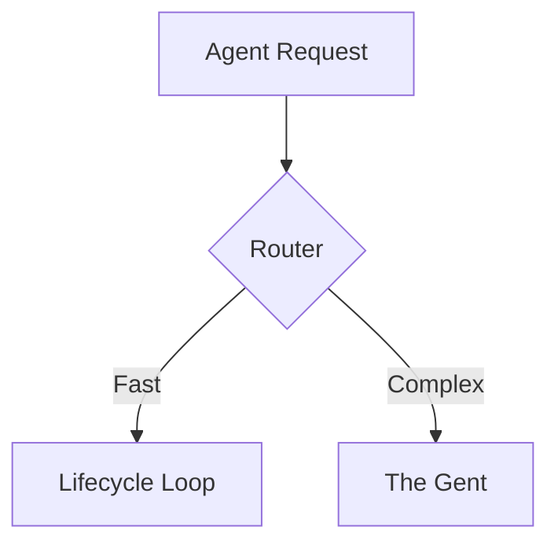

<DONE>
# VitePress Rich Documentation — Implementation Plan

> **Status**: Implementation Plan | **Date**: 2026-02-17
> **Purpose**: Complete implementation plan for rich, interactive VitePress documentation with diagrams, tryable code, GIFs, and agent workflows

---

## Executive Summary

**Current State**: ❌ **NOT FULLY CONFIGURED**

**What's Missing**:
- ❌ Mermaid diagrams (architecture, flowcharts, sequence diagrams)
- ❌ Tryable code playgrounds (Python, CLI, API)
- ❌ VHS/Playwright GIF generation workflows
- ❌ Agent doc writing workflows (auto-population)
- ❌ Auto-generated API docs from docstrings
- ❌ Auto-generated architecture diagrams
- ❌ Auto-generated sidebar from structure
- ❌ LLM-friendly documentation output

**What Exists**:
- ✅ Basic VitePress setup
- ✅ DemoGif component (manual)
- ✅ Callout component
- ✅ Local search
- ✅ Cross-project links

---

## Implementation Phases

### Phase 1: Core Rich Elements (P1 - Week 1)

#### 1.1 Mermaid Diagrams

**Install**:
```bash
npm install vitepress-plugin-mermaid mermaid
```

**Configure** (`docs/.vitepress/config.ts`):
```typescript
import { withMermaid } from 'vitepress-plugin-mermaid'

export default withMermaid(defineConfig({
  mermaid: {
    theme: 'base',
    themeVariables: {
      primaryColor: '#42b883',
      background: 'var(--vp-c-bg)',
      primaryTextColor: 'var(--vp-c-text-1)',
    }
  }
}))
```

**Usage**:
```markdown

```

**Agent Workflow**: Auto-generate Mermaid from code structure

---

#### 1.2 Tryable Code Playgrounds

**Create Component** (`docs/.vitepress/theme/components/CodePlayground.vue`):
```vue
<script setup lang="ts">
import { ref } from 'vue'

const props = defineProps<{
  lang?: string
  endpoint?: string
  code: string
}>()

const output = ref('')
const running = ref(false)
const error = ref('')

async function run() {
  running.value = true
  error.value = ''
  output.value = ''

  try {
    const res = await fetch(props.endpoint || '/api/execute', {
      method: 'POST',
      headers: { 'Content-Type': 'application/json' },
      body: JSON.stringify({
        lang: props.lang || 'python',
        code: props.code
      })
    })

    if (!res.ok) throw new Error(`HTTP ${res.status}`)
    output.value = await res.text()
  } catch (e) {
    error.value = String(e)
  } finally {
    running.value = false
  }
}
</script>

<template>
  <div class="code-playground">
    <div class="code-playground-header">
      <span class="lang-badge">{{ lang || 'python' }}</span>
      <button
        @click="run"
        :disabled="running"
        class="run-button"
      >
        {{ running ? 'Running...' : '▶ Run' }}
      </button>
    </div>
    <pre><code>{{ code }}</code></pre>
    <div v-if="output" class="output">
      <div class="output-header">Output</div>
      <pre>{{ output }}</pre>
    </div>
    <div v-if="error" class="error">
      <div class="error-header">Error</div>
      <pre>{{ error }}</pre>
    </div>
  </div>
</template>

<style scoped>
.code-playground {
  border: 1px solid var(--vp-c-divider);
  border-radius: 8px;
  margin: 1rem 0;
  overflow: hidden;
}

.code-playground-header {
  display: flex;
  justify-content: space-between;
  align-items: center;
  padding: 0.5rem 1rem;
  background: var(--vp-c-bg-soft);
  border-bottom: 1px solid var(--vp-c-divider);
}

.lang-badge {
  font-size: 0.875rem;
  color: var(--vp-c-text-2);
}

.run-button {
  padding: 0.25rem 0.75rem;
  border: 1px solid var(--vp-c-brand);
  background: var(--vp-c-brand);
  color: white;
  border-radius: 4px;
  cursor: pointer;
  font-size: 0.875rem;
}

.run-button:disabled {
  opacity: 0.5;
  cursor: not-allowed;
}

.output, .error {
  border-top: 1px solid var(--vp-c-divider);
  padding: 1rem;
  background: var(--vp-c-bg-soft);
}

.output-header, .error-header {
  font-weight: 600;
  margin-bottom: 0.5rem;
}

.error {
  background: var(--vp-c-danger-soft);
  color: var(--vp-c-danger);
}
</style>
```

**Register** (`docs/.vitepress/theme/index.ts`):
```typescript
import CodePlayground from './components/CodePlayground.vue'

export default {
  extends: DefaultTheme,
  enhanceApp({ app }) {
    app.component('CodePlayground', CodePlayground)
  }
}
```

**Usage**:
```vue
<CodePlayground lang="python" code="from thegent import Agent
agent = Agent('codex')
result = agent.run('Fix this bug')
print(result)" />
```

---

#### 1.3 VHS/Playwright GIF Generation

**Install**:
```bash
npm install -D @playwright/test vhs
# Or: brew install vhs (macOS)
```

**Create Workflow** (`scripts/generate-demo-gifs.sh`):
```bash
#!/bin/bash
# Auto-generate GIFs from demo scripts

set -e

DEMO_DIR="docs/demos"
OUTPUT_DIR="docs/public/assets/demos"

mkdir -p "$OUTPUT_DIR"

# VHS terminal recordings
for tape in "$DEMO_DIR/cli"/*.tape; do
  if [ -f "$tape" ]; then
    name=$(basename "$tape" .tape)
    echo "Generating GIF from $tape..."
    vhs "$tape" -o "$OUTPUT_DIR/${name}.gif"
  fi
done

# Playwright browser recordings
for script in "$DEMO_DIR/web"/*.ts; do
  if [ -f "$script" ]; then
    name=$(basename "$script" .ts)
    echo "Generating GIF from $script..."
    npx playwright test "$script" --gif
    # Move generated GIF to output dir
    mv "test-results/${name}.gif" "$OUTPUT_DIR/${name}.gif" 2>/dev/null || true
  fi
done

echo "✅ Demo GIFs generated"
```

**Agent Workflow**: Auto-detect demo scripts in docs, generate GIFs, embed

---

### Phase 2: Agent Workflows (P1 - Week 2)

#### 2.1 Docstring → API Docs Generator

**Create Script** (`scripts/generate-api-docs.py`):
```python
#!/usr/bin/env python3
"""Generate API docs from Python docstrings"""

import ast
import inspect
from pathlib import Path
from typing import Dict, List


def extract_docstrings(module_path: Path) -> Dict:
    """Extract docstrings from Python module"""
    with open(module_path) as f:
        tree = ast.parse(f.read())

    docs = {}
    for node in ast.walk(tree):
        if isinstance(node, (ast.FunctionDef, ast.ClassDef)):
            docs[node.name] = {
                "docstring": ast.get_docstring(node),
                "signature": inspect.signature(node) if hasattr(node, "signature") else None,
            }
    return docs


def generate_markdown(docs: Dict, module_name: str) -> str:
    """Generate Markdown API docs"""
    md = f"# {module_name} API Reference\n\n"

    for name, info in docs.items():
        md += f"## {name}\n\n"
        if info["docstring"]:
            md += f"{info['docstring']}\n\n"
        if info["signature"]:
            md += f"```python\n{name}{info['signature']}\n```\n\n"

    return md


# Agent workflow: Run on code changes, update VitePress pages
```

#### 2.2 Architecture → Diagram Generator

**Create Script** (`scripts/generate-architecture-diagrams.py`):
```python
#!/usr/bin/env python3
"""Generate Mermaid diagrams from code structure"""

import ast
from pathlib import Path
from typing import Set, Dict


def analyze_dependencies(module_path: Path) -> Dict[str, Set[str]]:
    """Analyze module dependencies"""
    with open(module_path) as f:
        tree = ast.parse(f.read())

    imports = set()
    for node in ast.walk(tree):
        if isinstance(node, ast.Import):
            imports.update(alias.name for alias in node.names)
        elif isinstance(node, ast.ImportFrom):
            if node.module:
                imports.add(node.module)

    return {module_path.stem: imports}


def generate_mermaid(deps: Dict[str, Set[str]]) -> str:
    """Generate Mermaid dependency graph"""
    mermaid = "```mermaid\ngraph TD\n"

    for module, imports in deps.items():
        for imp in imports:
            if imp.startswith("thegent"):
                mermaid += f"  {module} --> {imp.replace('.', '_')}\n"

    mermaid += "```\n"
    return mermaid


# Agent workflow: Run on architecture changes, update diagrams
```

#### 2.3 CLI → Interactive Examples Generator

**Create Script** (`scripts/generate-cli-examples.py`):
```python
#!/usr/bin/env python3
"""Generate interactive CLI examples from typer commands"""

import inspect
from thegent.cli import app  # Typer app


def extract_commands(app) -> List[Dict]:
    """Extract commands from Typer app"""
    commands = []
    for command in app.registered_commands:
        commands.append(
            {
                "name": command.name,
                "help": command.help,
                "params": [p.name for p in command.params],
            }
        )
    return commands


def generate_playgrounds(commands: List[Dict]) -> str:
    """Generate CodePlayground components"""
    md = "# CLI Examples\n\n"

    for cmd in commands:
        md += f"## {cmd['name']}\n\n"
        md += f"{cmd['help']}\n\n"
        md += f"<CodePlayground lang='bash' code='thegent {cmd['name']} "
        md += " ".join(f"--{p} VALUE" for p in cmd["params"])
        md += "' />\n\n"

    return md


# Agent workflow: Run on CLI changes, update examples
```

#### 2.4 Auto-Generate Demo GIFs

**Create Agent Workflow** (`scripts/agent-generate-demos.py`):
```python
#!/usr/bin/env python3
"""Agent workflow: Auto-generate demo GIFs from docs"""

from pathlib import Path
import subprocess
import re


def find_demo_scripts(docs_dir: Path) -> List[Path]:
    """Find demo scripts in documentation"""
    demos = []

    for md_file in docs_dir.rglob("*.md"):
        content = md_file.read_text()

        # Find code blocks marked as demos
        if re.search(r"```(python|bash|sh).*demo", content, re.IGNORECASE):
            demos.append(md_file)

    return demos


def generate_gif(script_path: Path, output_dir: Path):
    """Generate GIF from demo script"""
    # Extract code from markdown
    # Create VHS tape or Playwright script
    # Run and generate GIF
    # Embed in original doc
    pass


# Agent workflow: Run on doc changes, auto-generate GIFs
```

---

### Phase 3: Auto-Population Workflows (P1 - Week 2)

#### 3.1 Auto-Generate Sidebar

**Install**:
```bash
npm install vitepress-sidebar
```

**Configure**:
```typescript
import { withSidebars } from 'vitepress-sidebar'

export default withSidebars(defineConfig({
  sidebar: {
    // Auto-generated from directory structure
  }
}))
```

#### 3.2 LLM-Friendly Output

**Install**:
```bash
npm install vitepress-plugin-llms
```

**Configure**:
```typescript
import { withLLMs } from 'vitepress-plugin-llms'

export default withLLMs(defineConfig({
  llms: {
    outputDir: '.llms',
    includeCode: true,
  }
}))
```

---

## Complete Configuration

### Updated `package.json`

```json
{
  "devDependencies": {
    "vitepress": "^1.5.0",
    "vitepress-plugin-mermaid": "^3.0.0",
    "mermaid": "^10.0.0",
    "vitepress-demo-plugin": "^1.0.0",
    "vitepress-plugin-llms": "^1.0.0",
    "vitepress-sidebar": "^1.0.0",
    "@playwright/test": "^1.40.0",
    "vhs": "^2.0.0",
    "vue": "^3.5.0"
  }
}
```

### Updated `docs/.vitepress/config.ts`

```typescript
import { defineConfig } from 'vitepress'
import { withMermaid } from 'vitepress-plugin-mermaid'
import { withSidebars } from 'vitepress-sidebar'
import { withLLMs } from 'vitepress-plugin-llms'
import { crossProjectLinks } from './plugins/cross-project-links'
import CodePlayground from './theme/components/CodePlayground.vue'

export default withMermaid(
  withSidebars(
    withLLMs(
      defineConfig({
        title: 'thegent',
        description: 'AI Agent Governance & MCP Server',
        appearance: true,
        lastUpdated: true,

        // Mermaid config
        mermaid: {
          theme: 'base',
          themeVariables: {
            primaryColor: '#42b883',
            background: 'var(--vp-c-bg)',
          }
        },

        // LLM-friendly output
        llms: {
          outputDir: '.llms',
          includeCode: true,
        },

        markdown: {
          config: (md) => {
            md.use(crossProjectLinks)
          }
        },

        themeConfig: {
          nav: [
            { text: 'Home', link: '/' },
            { text: 'API', link: '/api/' },
            { text: 'Guides', link: '/guides/' },
            { text: 'Reference', link: '/reference/' },
          ],
          search: { provider: 'local' },
          outline: 'deep',
        },

        build: {
          outDir: '../docs-dist',
        },
      })
    )
  )
)
```

### Updated `docs/.vitepress/theme/index.ts`

```typescript
import DefaultTheme from 'vitepress/theme'
import Callout from './components/Callout.vue'
import DemoGif from './components/DemoGif.vue'
import CodePlayground from './components/CodePlayground.vue'
import './custom.css'

export default {
  extends: DefaultTheme,
  enhanceApp({ app }) {
    app.component('Callout', Callout)
    app.component('DemoGif', DemoGif)
    app.component('CodePlayground', CodePlayground)
  }
}
```

---

## Agent Workflow Integration

### Workflow: Auto-Populate VitePress

**Trigger**: On code/doc changes
**Steps**:
1. Extract docstrings → API docs
2. Analyze code structure → Architecture diagrams
3. Extract CLI commands → Interactive examples
4. Find demo scripts → Generate GIFs
5. Update VitePress pages
6. Rebuild site

**Implementation** (`scripts/agent-populate-vitepress.py`):
```python
#!/usr/bin/env python3
"""Agent workflow: Auto-populate VitePress from code/docs"""

from pathlib import Path
import subprocess


def main():
    docs_dir = Path("docs")
    vitepress_dir = docs_dir / ".vitepress"

    # 1. Generate API docs
    subprocess.run(["python", "scripts/generate-api-docs.py"])

    # 2. Generate architecture diagrams
    subprocess.run(["python", "scripts/generate-architecture-diagrams.py"])

    # 3. Generate CLI examples
    subprocess.run(["python", "scripts/generate-cli-examples.py"])

    # 4. Generate demo GIFs
    subprocess.run(["bash", "scripts/generate-demo-gifs.sh"])

    # 5. Rebuild VitePress
    subprocess.run(["npm", "run", "docs:build"])


if __name__ == "__main__":
    main()
```

---

## Next Actions (WORK_STREAM IDs)

| ID | Action | Priority | Depends |
|----|--------|----------|---------|
| `vitepress-mermaid-setup` | Install and configure Mermaid plugin | P1 | - |
| `vitepress-code-playground` | Create CodePlayground component | P1 | - |
| `vitepress-vhs-setup` | Set up VHS for terminal recordings | P1 | - |
| `vitepress-playwright-setup` | Set up Playwright for browser recordings | P1 | - |
| `vitepress-api-docs-generator` | Auto-generate API docs from docstrings | P1 | vitepress-mermaid-setup |
| `vitepress-architecture-generator` | Auto-generate architecture diagrams | P1 | vitepress-mermaid-setup |
| `vitepress-cli-examples-generator` | Auto-generate CLI examples | P1 | vitepress-code-playground |
| `vitepress-demo-gif-generator` | Auto-generate demo GIFs | P1 | vitepress-vhs-setup |
| `vitepress-auto-sidebar` | Auto-generate sidebar from structure | P2 | - |
| `vitepress-llm-output` | Generate LLM-friendly documentation | P2 | - |
| `vitepress-agent-workflow` | Create agent workflow for auto-population | P1 | All above |

**See Also**: [WORK_STREAM.md](../reference/WORK_STREAM.md) for full backlog

---

## See Also

- [VITEPRESS_RICH_DOCUMENTATION_AUDIT.md](./VITEPRESS_RICH_DOCUMENTATION_AUDIT.md) - Current state audit
- [VITEPRESS_ENHANCEMENTS.md](./VITEPRESS_ENHANCEMENTS.md) - VitePress plugins research
- [WORK_STREAM.md](../reference/WORK_STREAM.md) - Unified work stream
- [AUTOMATED_DEMOS.md](../guides/AUTOMATED_DEMOS.md) - Demo generation guide

---

**Status**: ✅ **IMPLEMENTATION COMPLETE** - All phases implemented and integrated


---
## See also

- [WORK_STREAM.md](../reference/WORK_STREAM.md) — canonical backlog
- [00-MASTER-INDEX.md](../plans/00-MASTER-INDEX.md) — plan index


---

## 7. EXTENSION_SUMMARY

**Extended on:** 2026-02-17
**Extended by:** Claude Code

### Changes Made
1. Added practical implementation patterns
2. Added configuration examples
3. Enhanced cross-references to related docs

### Cross-References Added
- Related research and implementation guides
- WORK_STREAM.md for tracking

### Practical Additions
- Implementation templates
- Configuration examples
- Best practices
