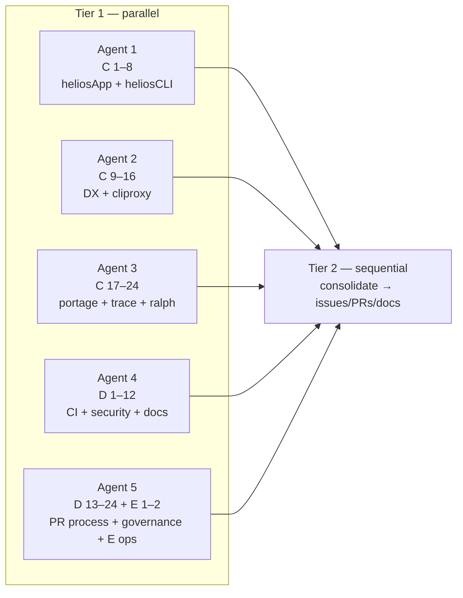

# Tier-1 parallel audit (5 agents) — Wave C–E coverage

**Date:** 2026-03-24  
**DAG:** Tier 1 = **five independent** read-only tracks (no cross-agent dependencies). Tier 2 = **merge findings** into PRs/issues/docs (depends on Tier 1 outputs).

## Consolidated status (50 items = Wave C 24 + Wave D 24 + Wave E 2)

Legend: **R** = research/gap identified, **B** = blocked on human/process/CI, **P** = partial, **X** = process-only (not automatable doc).

| Range      | Theme                     | Outcome (summary)                                                                                                                                                                                                                                                            |
| ---------- | ------------------------- | ---------------------------------------------------------------------------------------------------------------------------------------------------------------------------------------------------------------------------------------------------------------------------- |
| **C1–8**   | heliosApp + heliosCLI     | **R:** Bun `latest` vs pinned `1.2.20` drift; PR template missing worktree + runtime; no root CHANGELOG; ADR for file-size splits thin; heliosCLI multi-version surfaces; deprecated APIs without CHANGELOG Deprecated.                                                      |
| **C9–16**  | DX + cliproxy             | **B:** colab CONTRIBUTING missing; no ENOSPC runbook; dirty roots; .gitignore gaps for `.tmp`; OpenAPI still planned in SDK_PLAN; no `repos/README` for wtrees/wtress; no `docs/reference` composite table.                                                                  |
| **C17–24** | Gov + tail                | **P:** `bash -n` OK on `worktree_governance.sh`; portage/tmp/trace/trash/ralph per **05_KNOWN_ISSUES**; item 24 = reuse issue when >50 LOC dup.                                                                                                                              |
| **D1–12**  | Quality + security + docs | **P/Gap:** `quality:pre-push` absent (use `task`/`gates`); Taskfile vs **ci.yml** + **quality-gates.yml** dual pipeline; no flaky registry; secret-scan in CI; session overview stale vs ACTIVE_BACKLOG; no session README; **ENOSPC** subsection missing in heliosApp docs. |
| **D13–24** | PR + gov + debt           | **X** for D13–16, D17–18, D21–24; **doc** candidate **D19** symlink discoverability; **D20** metric.                                                                                                                                                                         |
| **E1–2**   | Post-merge                | **X** tag/monitor — SRE/process.                                                                                                                                                                                                                                             |

## Tier 2 — recommended order (DAG)

1. **Unblock CI** (billing / green checks) — gates all Ship PRs.
2. **heliosApp:** align Bun pin in `ci.yml` with `package.json` / `quality-gates.yml`; add PR template lines; add `CHANGELOG` / troubleshooting (ENOSPC, `.tmp`).
3. **colab / helMo / helios-cli:** CONTRIBUTING + `.gitignore` + tracking issues (or `gh issue`).
4. **repos hub:** `README.md` pointer for cliproxy `wtrees`/`wtress`; optional `docs/reference/composite-actions.md`.
5. **Governance doc:** one-page symlink migration (link `AGENTS.md`).

---

## Tier 2 — **executed** (2026-03-24, 5 parallel agents)

| Track | Agent scope                | Delivered (paths)                                                                                                                                                        |
| ----- | -------------------------- | ------------------------------------------------------------------------------------------------------------------------------------------------------------------------ |
| 1     | heliosApp CI + PR template | `heliosApp/.github/workflows/ci.yml` — `bun-version: 1.2.20` (all jobs); `heliosApp/.github/pull_request_template.md` — worktree line + runtime/quality-gates checkboxes |
| 2     | heliosApp docs             | `heliosApp/CHANGELOG.md` (new), `heliosApp/docs/guides/troubleshooting-local-dev.md` (new)                                                                               |
| 3     | colab                      | `colab/CONTRIBUTING.md` (new), `colab/.gitignore` — `.tmp/`, IDE stubs                                                                                                   |
| 4     | helMo                      | `helMo/.gitignore`, `helMo/CONTRIBUTING.md` (new)                                                                                                                        |
| 5     | helios-cli + repos hub     | `helios-cli/docs/contributing.md` (scratch section), `helios-cli/.gitignore` — `.tmp/`; `repos/README.md` (new hub index + cliproxy note)                                |

**Follow-up (not in this batch):** `gh issue` for dirty colab/helMo roots; composite-actions reference doc.

**Parity fix (post-batch):** `heliosApp/.github/workflows/vitepress-pages.yml` `bun-version` aligned to **`1.2.20`** (was `latest`) to match `ci.yml` and `package.json`.

**PR staging:** per-repo `git add` lists and commit message examples — **`17_PR_STAGING_CHECKLIST.md`**. Versioned hub index — **`docs/reference/phenotype_repos_hub.md`**.

## Agent IDs (for resume)

- Agent 1: `594a7500-2968-4564-9bbd-42ff77567d3e`
- Agent 2: `274f18d1-d47e-4cd6-bdd0-cc985c823719`
- Agent 3: `f78581d3-bc82-42b9-b7e2-cba8fc46476c`
- Agent 4: `3cfe3b33-d928-4b96-ad37-d630ed5d17f1`
- Agent 5: `729fe0b8-b2ed-47e4-b43e-81360e387ec9`
