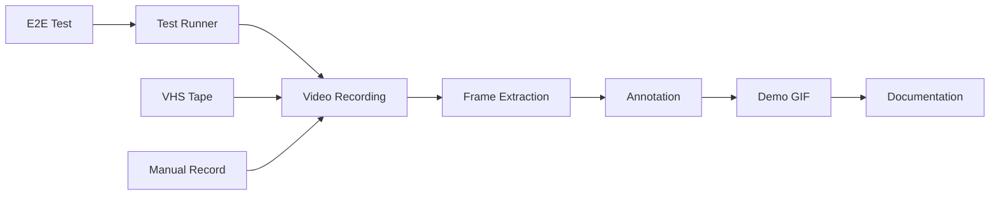

# Versioning Systems Technical Specification

## Executive Summary

This document specifies a comprehensive versioning system for thegent that operates at multiple granularities:
- **Macro versioning**: Semantic releases, major/minor/patch
- **Meso versioning**: Worktrees, branches, PRs
- **Micro versioning**: Session-based, change plans, microcommits

The system addresses the core problem: **multiple AI agents running change plans concurrently without worktrees cannot reliably track which changes belong to which session, leading to conflicts and inability to rollback or replay specific sessions.**

---

## Table of Contents

1. [Version Hierarchy](#version-hierarchy)
2. [Macro Versioning](#macro-versioning)
3. [Meso Versioning](#meso-versioning)
4. [Micro Versioning](#micro-versioning)
5. [Session Versioning](#session-versioning)
6. [Change Plan Versioning](#change-plan-versioning)
7. [Conflict Resolution](#conflict-resolution)
8. [Implementation Details](#implementation-details)
9. [Migration Path](#migration-path)

---

## Version Hierarchy

```
┌─────────────────────────────────────────────────────────────────┐
│                    MACRO VERSIONING                              │
│  Semantic Versioning: major.minor.patch[-prerelease]+build     │
│  Example: 2.1.0-alpha.3+git.abc123                             │
└─────────────────────────────────────────────────────────────────┘
                              │
                              ▼
┌─────────────────────────────────────────────────────────────────┐
│                    MESO VERSIONING                              │
│  Git-based: branches, tags, worktrees                          │
│  Example: feature/new-ui, bugfix/123, v2.1.0                   │
└─────────────────────────────────────────────────────────────────┘
                              │
                              ▼
┌─────────────────────────────────────────────────────────────────┐
│                    MICRO VERSIONING                             │
│  Session + Change Plan + Microcommit hierarchy                 │
│  Example: sess_abc123.cp_001.mc_017                           │
└─────────────────────────────────────────────────────────────────┘
```

### Layer Comparison

| Layer | Scope | Trigger | Persistence |
|-------|-------|---------|-------------|
| Macro | Release | Human decision | Git tag |
| Meso | Feature | Branch/PR | Git branch |
| Micro | Session | Agent run | Manifest file |
| Nano | Microcommit | File edit | In-session |

---

## Macro Versioning

### Semantic Versioning (SemVer)

Standard SemVer with thegent extensions:

```
MAJOR.MINOR.PATCH[-PRERELEASE][+BUILD]
   │     │    │      │           │
   │     │    │      │           └── Build metadata (CI run, git hash)
   │     │    │      └────────────── Alpha/Beta/RC indicators
   │     │    └───────────────────── Bug fixes
   │     └────────────────────────── New features (backward compatible)
   └─────────────────────────────── Breaking changes
```

### thegent Extensions

```
+git.{short_hash}+{build_id}
Example: 2.1.0-alpha.3+git.abc123+ci.456
```

| Component | Description |
|-----------|-------------|
| `git.{short_hash}` | First 7 chars of commit |
| `build_id` | CI run identifier |

### Version Schemas

```python
from dataclasses import dataclass
from typing import Optional
import re


@dataclass(frozen=True)
class MacroVersion:
    major: int
    minor: int
    patch: int
    prerelease: Optional[str] = None
    build: Optional[str] = None

    # Compiled regex for SemVer 2.0
    SEMVER_PATTERN = re.compile(
        r"^(?P<major>0|[1-9]\d*)\."
        r"(?P<minor>0|[1-9]\d*)\."
        r"(?P<patch>0|[1-9]\d*)"
        r"(?:-(?P<prerelease>(?:0|[1-9]\d*|\d*[a-zA-Z-][0-9a-zA-Z-]*)"
        r"(?:\.(?:0|[1-9]\d*|\d*[a-zA-Z-][0-9a-zA-Z-]*))*))?"
        r"(?:\+(?P<build>[0-9a-zA-Z-]+(?:\.[0-9a-zA-Z-]+)*))?$"
    )

    @classmethod
    def parse(cls, version_string: str) -> "MacroVersion":
        """Parse a SemVer string into components."""
        match = cls.SEMVER_PATTERN.match(version_string)
        if not match:
            raise ValueError(f"Invalid SemVer: {version_string}")
        return cls(
            major=int(match.group("major")),
            minor=int(match.group("minor")),
            patch=int(match.group("patch")),
            prerelease=match.group("prerelease"),
            build=match.group("build"),
        )

    def __str__(self) -> str:
        result = f"{self.major}.{self.minor}.{self.patch}"
        if self.prerelease:
            result += f"-{self.prerelease}"
        if self.build:
            result += f"+{self.build}"
        return result
```

---

## Meso Versioning

### Git-Based Branching Strategy

```
main (production)
  │
  ├─ feature/* (new development)
  │    ├─ feature/desktop-agent
  │    └─ feature/mobile-automation
  │
  ├─ bugfix/* (patches)
  │    └─ bugfix/session-crash
  │
  ├─ chore/* (maintenance)
  │
  └─ agent/* (AI-generated branches)
       ├─ agent/sess_abc123
       └─ agent/sess_def456
```

### Worktree Integration

| Scenario | Worktree | Microversion |
|----------|----------|--------------|
| Production hotfix | No | None |
| Feature development | Yes | Agent session |
| Agent parallel runs | Optional | Required |
| Quick experiments | No | Session only |

### Worktree Naming Convention

```
{worktree_root}/
  ├── .git/                    # Main repo
  ├── main/                    # Main worktree
  ├── wt-agent-{session_id}/   # Agent worktree
  └── wt-agent-{session_id}-{plan_id}/  # Plan-specific
```

---

## Micro Versioning

### Core Concept

Micro versioning provides **session-level traceability** without requiring worktrees for every agent run. It operates as a lightweight manifest system that tracks:

1. Which session made which changes
2. Which change plan within the session
3. Which microcommit (file edit) within the plan

### Microversion Format

```
{session_id}.{change_plan_index}.{microcommit_index}
  │              │                    │
  │              │                    └────── 001-999: Sequential microcommits
  │              └────────────────────────── 001-999: Plans per session
  └────────────────────────────────────── UUID or session identifier
```

#### Examples

| Microversion | Meaning |
|--------------|---------|
| `sess_k8s2m.001.001` | Session `k8s2m`, Plan 1, Microcommit 1 |
| `sess_k8s2m.001.017` | Session `k8s2m`, Plan 1, Microcommit 17 |
| `sess_k8s2m.003.005` | Session `k8s2m`, Plan 3, Microcommit 5 |
| `sess_abc.002.001` | Different session |

### Microcommit Definition

A microcommit is the **atomic unit of change** within a session:

```
Microcommit = {
    microversion: "sess_xxx.001.017",
    timestamp: "2026-02-21T10:30:00Z",
    files_changed: [
        {
            path: "src/agents/router.py",
            operation: "modify",  # create|modify|delete
            hash_before: "abc123",
            hash_after: "def456",
            diff_preview: "..."  # First 100 chars
        }
    ],
    parent_microversion: "sess_xxx.001.016",
    plan_context: {
        plan_id: "plan_001",
        plan_description: "Fix routing bug"
    }
}
```

### Session Manifest

Each session produces a **session manifest** (JSONL):

```json
{
  "manifest_version": "1.0",
  "session_id": "sess_k8s2m",
  "started_at": "2026-02-21T10:00:00Z",
  "ended_at": "2026-02-21T10:30:00Z",
  "status": "completed",  # completed|failed|aborted
  "macro_version": "2.1.0-alpha.3",
  "parent_macro_version": "2.0.0",
  "change_plans": [
    {
      "plan_id": "plan_001",
      "plan_index": 1,
      "description": "Refactor routing module",
      "microcommits": [
        {
          "index": 1,
          "microversion": "sess_k8s2m.001.001",
          "timestamp": "2026-02-21T10:05:00Z",
          "files": ["src/routing/router.py"]
        }
      ],
      "plan_status": "completed"
    }
  ],
  "dependencies": {
    "macro_version": "2.1.0-alpha.3",
    "required_files": ["pyproject.toml", "requirements.txt"]
  },
  "artifacts": {
    "tests_run": 42,
    "lint_passed": true
  }
}
```

---

## Session Versioning

### Session Lifecycle

```
SESSION CREATION
     │
     ▼
┌────────────────┐
│ Generate UUID  │ ◄─── session_id (e.g., sess_k8s2m)
└────────────────┘
     │
     ▼
┌────────────────┐
│ Initialize     │ ◄─── Create session directory
│ Manifest       │     .thegent/sessions/sess_k8s2m/
└────────────────┘
     │
     ▼
┌────────────────┐
│ Run Change     │ ◄─── May have multiple plans
│ Plans          │
└────────────────┘
     │
     ▼
┌────────────────┐
│ Microcommit    │ ◄─── Track each file edit
│ Tracking       │
└────────────────┘
     │
     ▼
┌────────────────┐
│ Session        │ ◄─── Write manifest
│ Completion     │     Mark all plans complete
└────────────────┘
```

### Session ID Format

| Format | Example | Use Case |
|--------|---------|----------|
| UUID v4 | `sess_a1b2c3d4` | Default |
| Timestamp | `sess_20260221_1030` | Debugging |
| Human | `sess_routing-fix` | Readable |

### Session Directory Structure

```
.thegent/
  └── sessions/
      └── sess_k8s2m/
          ├── manifest.jsonl      # Session manifest
          ├── microcommits/      # Individual microcommit records
          │   ├── 001.001.json  # Plan 1, Microcommit 1
          │   ├── 001.002.json
          │   └── 002.001.json  # Plan 2, Microcommit 1
          ├── diffs/            # Full diffs for each microcommit
          │   ├── 001.001.diff
          │   └── 001.002.diff
          └── artifacts/        # Any generated artifacts
              └── test_report.json
```

---

## Change Plan Versioning

### What is a Change Plan?

A **change plan** is a logical grouping of related file modifications within a session. It maps to a single agent task or goal.

### Change Plan Structure

```python
@dataclass
class ChangePlan:
    plan_id: str  # Unique within session, e.g., "plan_001"
    plan_index: int  # 1-based sequential index
    session_id: str  # Parent session
    description: str  # Human-readable goal
    status: PlanStatus  # pending|running|completed|failed|aborted

    # What this plan depends on
    dependencies: list[str]  # Other plan_ids

    # What files are expected to change
    expected_files: list[str]

    # What was actually changed
    actual_files: list[str]

    # Microcommits in this plan
    microcommits: list[str]  # microversion strings
```

### Change Plan Dependencies

Plans can depend on other plans within the same session:

```
Session: sess_abc
├── Plan 001: "Update dependencies" (no deps)
├── Plan 002: "Refactor routing" (depends on 001)
└── Plan 002: "Add tests" (depends on 002)
```

### Execution Order

1. **Dependency resolution**: Build DAG of plans
2. **Topological sort**: Determine execution order
3. **Parallel execution**: Run independent plans concurrently
4. **Sequential execution**: Run dependent plans in order

---

## Conflict Resolution

### Conflict Types

| Type | Description | Resolution Strategy |
|------|-------------|---------------------|
| File-level | Same file modified | 3-way merge or agent choice |
| Plan-level | Plans modify same files | Dependency ordering |
| Session-level | Sessions modify same files | Manifest + git worktree |
| Semantic | Different changes, same behavior | Preserve both |

### Resolution Strategies

#### 1. No-Worktree Mode (Default)

When agents run without worktrees:

```
Agent A (sess_aaa)     Agent B (sess_bbb)
     │                       │
     ├─ Modify file.py       ├─ Modify file.py
     │                       │
     ▼                       ▼
  Write manifest          Write manifest
     │                       │
     └──────┬───────────────┘
            │
            ▼
     Detect conflict
            │
     ┌──────┴──────┐
     │             │
     ▼             ▼
  Keep both    Prompt agent
  manifests    to resolve
```

#### 2. Worktree Mode

When worktrees are available:

```
Main repo          Worktree A (sess_aaa)    Worktree B (sess_bbb)
   │                      │                        │
   │                      ├─ Modify file.py       │
   │                      │                        ├─ Modify file.py
   │                      │                        │
   │                      └────────┬───────────────┘
   │                               │
   │                               ▼
   │                          Merge base
   │                               │
   │                               ▼
   ├─ git merge worktree A ──── Resolve
   ├─ git merge worktree B ──── Conflicts?
   │                               │
   └───────────────────────────────┘
                          All commits tracked
```

#### 3. Hybrid Mode

Some files in worktree, some in manifest:

```
Files with conflicts ──► Worktree
Other files        ──► Manifest only
```

### Conflict Resolution Algorithm

```python
def resolve_conflict(manifest_a: SessionManifest, manifest_b: SessionManifest, file_path: str) -> ConflictResolution:
    """Resolve file conflict between two session manifests."""

    # Get microcommits for this file from each session
    commits_a = manifest_a.get_microcommits_for_file(file_path)
    commits_b = manifest_b.get_microcommits_for_file(file_path)

    if not commits_a:
        return ConflictResolution(use_b=True, reason="only_b_modified")
    if not commits_b:
        return ConflictResolution(use_a=True, reason="only_a_modified")

    # Both modified - check for semantic equivalence
    if are_semantically_equivalent(commits_a, commits_b):
        return ConflictResolution(use_a=True, merged=True, reason="semantically_equivalent")

    # Check if we have worktrees
    if have_worktrees():
        # Defer to git merge
        return ConflictResolution(defer_to_git=True)

    # No worktrees - prompt for resolution
    return ConflictResolution(need_human=True, options=[commits_a, commits_b], reason="conflicting_changes")
```

---

## Implementation Details

### Core Data Structures

```python
# File: thegent/versioning/types.py

from dataclasses import dataclass, field
from enum import Enum
from typing import Optional
import uuid
from datetime import datetime


class PlanStatus(Enum):
    PENDING = "pending"
    RUNNING = "running"
    COMPLETED = "completed"
    FAILED = "failed"
    ABORTED = "aborted"


class SessionStatus(Enum):
    INITIALIZED = "initialized"
    RUNNING = "running"
    COMPLETED = "completed"
    FAILED = "failed"
    ABORTED = "aborted"


@dataclass(frozen=True)
class Microversion:
    """Immutable microversion identifier."""

    session_id: str
    plan_index: int
    microcommit_index: int

    def __str__(self) -> str:
        return f"{self.session_id}.{self.plan_index:03d}.{self.microcommit_index:03d}"

    @classmethod
    def parse(cls, s: str) -> "Microversion":
        parts = s.split(".")
        if len(parts) != 3:
            raise ValueError(f"Invalid microversion: {s}")
        return cls(session_id=parts[0], plan_index=int(parts[1]), microcommit_index=int(parts[2]))


@dataclass
class Microcommit:
    """A single atomic file change within a session."""

    microversion: Microversion
    timestamp: datetime
    files: list[FileChange]
    parent_microversion: Optional[Microversion] = None
    plan_context: Optional[dict] = None


@dataclass
class FileChange:
    """Represents a single file modification."""

    path: str
    operation: str  # create|modify|delete
    hash_before: str
    hash_after: str
    diff_preview: str


@dataclass
class ChangePlan:
    """A logical grouping of related changes."""

    plan_id: str
    plan_index: int
    session_id: str
    description: str
    status: PlanStatus = PlanStatus.PENDING
    dependencies: list[str] = field(default_factory=list)
    expected_files: list[str] = field(default_factory=list)
    actual_files: list[str] = field(default_factory=list)
    microcommits: list[str] = field(default_factory=list)


@dataclass
class SessionManifest:
    """Complete manifest for a session."""

    manifest_version: str = "1.0"
    session_id: str = ""
    started_at: Optional[datetime] = None
    ended_at: Optional[datetime] = None
    status: SessionStatus = SessionStatus.INITIALIZED
    macro_version: str = ""
    parent_macro_version: str = ""
    change_plans: list[ChangePlan] = field(default_factory=list)
    dependencies: dict = field(default_factory=dict)
    artifacts: dict = field(default_factory=dict)
```

### Session Manager

```python
# File: thegent/versioning/session.py

import json
import os
from pathlib import Path
from datetime import datetime
from typing import Optional
import uuid

from .types import SessionManifest, SessionStatus, ChangePlan, PlanStatus, Microversion, Microcommit


class SessionManager:
    """Manages session lifecycle and versioning."""

    SESSIONS_DIR = ".thegent/sessions"

    def __init__(self, root: Path):
        self.root = root
        self.sessions_dir = root / self.SESSIONS_DIR
        self.current_session: Optional[SessionManifest] = None

    def create_session(self, macro_version: str, parent_macro_version: str, description: str = "") -> SessionManifest:
        """Create a new session."""
        session_id = f"sess_{uuid.uuid4().hex[:8]}"

        manifest = SessionManifest(
            session_id=session_id,
            started_at=datetime.utcnow(),
            status=SessionStatus.RUNNING,
            macro_version=macro_version,
            parent_macro_version=parent_macro_version,
        )

        # Create session directory
        session_dir = self.sessions_dir / session_id
        session_dir.mkdir(parents=True, exist_ok=True)

        # Write initial manifest
        self._write_manifest(manifest)

        self.current_session = manifest
        return manifest

    def create_change_plan(self, description: str, dependencies: list[str] = None) -> ChangePlan:
        """Create a new change plan within current session."""
        if not self.current_session:
            raise RuntimeError("No active session")

        plan_index = len(self.current_session.change_plans) + 1
        plan_id = f"plan_{plan_index:03d}"

        plan = ChangePlan(
            plan_id=plan_id,
            plan_index=plan_index,
            session_id=self.current_session.session_id,
            description=description,
            dependencies=dependencies or [],
            status=PlanStatus.PENDING,
        )

        self.current_session.change_plans.append(plan)
        self._write_manifest(self.current_session)

        return plan

    def microcommit(self, plan_id: str, files: list[FileChange]) -> Microversion:
        """Record a microcommit within current session."""
        if not self.current_session:
            raise RuntimeError("No active session")

        # Find the plan
        plan = next((p for p in self.current_session.change_plans if p.plan_id == plan_id), None)
        if not plan:
            raise ValueError(f"Plan not found: {plan_id}")

        # Calculate microcommit index
        microcommit_index = len(plan.microcommits) + 1

        # Create microversion
        microversion = Microversion(
            session_id=self.current_session.session_id, plan_index=plan.plan_index, microcommit_index=microcommit_index
        )

        # Create microcommit record
        microcommit = Microcommit(
            microversion=microversion,
            timestamp=datetime.utcnow(),
            files=files,
            parent_microversion=self._get_last_microversion(plan),
            plan_context={"plan_id": plan_id},
        )

        # Update plan
        plan.status = PlanStatus.RUNNING
        plan.actual_files.extend([f.path for f in files])
        plan.microcommits.append(str(microversion))

        # Write microcommit record
        self._write_microcommit(microcommit)

        # Update manifest
        self._write_manifest(self.current_session)

        return microversion

    def complete_session(self, status: SessionStatus = SessionStatus.COMPLETED):
        """Mark session as complete."""
        if not self.current_session:
            raise RuntimeError("No active session")

        self.current_session.status = status
        self.current_session.ended_at = datetime.utcnow()

        # Update all plans to completed if session completed
        if status == SessionStatus.COMPLETED:
            for plan in self.current_session.change_plans:
                if plan.status == PlanStatus.RUNNING:
                    plan.status = PlanStatus.COMPLETED

        self._write_manifest(self.current_session)

    def _write_manifest(self, manifest: SessionManifest):
        """Write manifest to disk."""
        session_dir = self.sessions_dir / manifest.session_id
        manifest_path = session_dir / "manifest.jsonl"

        with open(manifest_path, "w") as f:
            f.write(
                json.dumps(
                    {
                        "manifest_version": manifest.manifest_version,
                        "session_id": manifest.session_id,
                        "started_at": manifest.started_at.isoformat() if manifest.started_at else None,
                        "ended_at": manifest.ended_at.isoformat() if manifest.ended_at else None,
                        "status": manifest.status.value,
                        "macro_version": manifest.macro_version,
                        "parent_macro_version": manifest.parent_macro_version,
                        "change_plans": [
                            {
                                "plan_id": p.plan_id,
                                "plan_index": p.plan_index,
                                "description": p.description,
                                "status": p.status.value,
                                "dependencies": p.dependencies,
                                "expected_files": p.expected_files,
                                "actual_files": p.actual_files,
                                "microcommits": p.microcommits,
                            }
                            for p in manifest.change_plans
                        ],
                    },
                    indent=2,
                )
            )

    def _write_microcommit(self, microcommit: Microcommit):
        """Write individual microcommit to disk."""
        session_dir = self.sessions_dir / microcommit.microversion.session_id
        microcommits_dir = session_dir / "microcommits"
        microcommits_dir.mkdir(parents=True, exist_ok=True)

        filename = f"{microcommit.microversion.plan_index:03d}.{microcommit.microversion.microcommit_index:03d}.json"

        with open(microcommits_dir / filename, "w") as f:
            json.dump(
                {
                    "microversion": str(microcommit.microversion),
                    "timestamp": microcommit.timestamp.isoformat(),
                    "files": [
                        {
                            "path": fc.path,
                            "operation": fc.operation,
                            "hash_before": fc.hash_before,
                            "hash_after": fc.hash_after,
                            "diff_preview": fc.diff_preview,
                        }
                        for fc in microcommit.files
                    ],
                    "parent_microversion": str(microcommit.parent_microversion)
                    if microcommit.parent_microversion
                    else None,
                    "plan_context": microcommit.plan_context,
                },
                f,
                indent=2,
            )
```

### Integration with Existing OCC

The microversioning system integrates with the existing OCC (Optimistic Concurrency Control) in `utils/helpers.py`:

```python
# Extended safe_write_file to support microversioning
def safe_write_file(
    path: Path,
    content: str,
    expected_version: Optional[str] = None,  # SHA256 hash
    microversion: Optional[Microversion] = None,  # NEW: session microversion
    encoding: str = "utf-8",
) -> bool:
    """
    Write file with OCC check and microversion tracking.

    If microversion is provided, also record the change in the
    session manifest for traceability.
    """
    # Existing OCC check
    current_content = path.read_text() if path.exists() else ""
    current_hash = hashlib.sha256(current_content.encode()).hexdigest()

    if expected_version and current_hash != expected_version:
        # OCC conflict - file changed since read
        return False

    # Write file
    path.write_text(content, encoding=encoding)

    # NEW: Track in microversion manifest if provided
    if microversion:
        session_manager = SessionManager(path.parent)
        session_manager.record_change(
            microversion=microversion,
            file_path=str(path),
            hash_before=current_hash,
            hash_after=hashlib.sha256(content.encode()).hexdigest(),
        )

    return True
```

---

## Migration Path

### Phase 1: Session Tracking (Current)

- [x] SHA256-based OCC in `safe_read_file_with_version` / `safe_write_file`
- [ ] **Add**: Session ID tracking in file operations
- [ ] **Add**: Change plan awareness

### Phase 2: Microversion Manifest

- [ ] **Create**: `SessionManager` class
- [ ] **Create**: Session directory structure
- [ ] **Create**: Microcommit tracking
- [ ] **Integrate**: Hook into file write operations

### Phase 3: Conflict Resolution

- [ ] **Implement**: Cross-session conflict detection
- [ ] **Implement**: Worktree fallback
- [ ] **Implement**: Hybrid resolution

### Phase 4: Git Integration

- [ ] **Add**: Export to git branch
- [ ] **Add**: Import from git history
- [ ] **Add**: Worktree automation

---

## API Reference

### CLI Commands

```bash
# Start a new session
thegent session start --version 2.1.0 --parent 2.0.0

# Create a change plan
thegent session plan "Refactor routing" --depends plan_001

# Record a microcommit
thegent session commit --plan plan_001 --files src/routing/router.py

# View session status
thegent session status

# List microcommits
thegent session log --session sess_abc

# Resolve conflicts
thegent session resolve --session-a sess_aaa --session-b sess_bbb
```

### Python API

```python
from thegent.versioning import SessionManager

# Start session
mgr = SessionManager(root_path)
session = mgr.create_session(macro_version="2.1.0", parent_macro_version="2.0.0")

# Create change plan
plan = mgr.create_change_plan(description="Fix routing bug", dependencies=[])

# Record microcommit
mv = mgr.microcommit(
    plan_id="plan_001",
    files=[
        FileChange(
            path="src/routing/router.py",
            operation="modify",
            hash_before="abc123",
            hash_after="def456",
            diff_preview="...",
        )
    ],
)

# Complete session
mgr.complete_session()
```

---

## Performance Considerations

| Operation | Target Latency |
|------------|----------------|
| Session creation | <10ms |
| Change plan creation | <5ms |
| Microcommit record | <20ms |
| Manifest write | <50ms |
| Conflict detection | <100ms |

---

## Related Specifications

- [Database Schema](./specs/database/README.md) - Session persistence
- [Orchestration](./specs/orchestration/README.md) - Multi-agent coordination
- [Governance](./specs/governance/README.md) - Policy enforcement

---

## 20. Automated Media Generation

### Demo Video System

```typescript
interface DemoGenerator {
  // Generate from E2E test
  fromTest(testPath: string): Promise<DemoMedia>

  // Generate from VHS tape
  fromTape(tapePath: string): Promise<DemoMedia>

  // Generate from user interaction
  record(interaction: Interaction): Promise<DemoMedia>

  // Platform-specific recording
  recordDesktop(): Promise<Media>
  recordMobile(device: MobileDevice): Promise<Media>
}
```

---

## 21. VHS Terminal Recording

### Tape File Format

```bash
# docs/demos/routing.tape
Output docs/demos/routing.gif

Set FontSize 14
Set Width 1200
Set Height 600
Set Theme "Catppuccin Mocha"

# Type command
Type "thegent route --explain gpt-4"

# Wait for output
Sleep 500ms

# Show help
Type "thegent route --help"

# Screenshot each step
Capture docs/demos/routing-1.gif
```

### VHS Integration

```yaml
# .github/workflows/demo-gen.yml
name: Generate Demos
on:
  push:
    paths:
      - 'docs/demos/*.tape'
jobs:
  generate:
    runs-on: ubuntu-latest
    steps:
      - uses: charmantai/vhs@latest
        with:
          args: 'docs/demos/routing.tape'
      - uses: actions/upload-artifact@v4
        with:
          name: demo-gifs
          path: docs/demos/*.gif
```

---

## 22. Playwright Screenshot/Video

### Screenshot Component

```typescript
// Auto-generate screenshots from tests
async function screenshotFromTest(
  test: Test,
  options: ScreenshotOptions
): Promise<Screenshot> {
  // Run test with recording
  const video = await browser.recordVideo(async () => {
    await test.run();
  });

  // Capture at key frames
  const screenshots = await video.extractFrames();

  // Annotate
  return annotate(screenshots, {
    highlight: options.highlight,
    caption: options.caption
  });
}
```

### Playwright Config

```typescript
// playwright.config.ts
export default defineConfig({
  use: {
    screenshot: 'only-on-failure',
    video: 'retain-on-failure',
    trace: 'on-first-retry',
  },
  // Auto-generate docs
  docs: {
    screenshotDir: 'docs/screenshots',
    videoDir: 'docs/videos',
    generateOn: ['test', 'commit', 'merge']
  }
});
```

### Test-to-Demo Mapping

```yaml
# demo-mapping.yaml
mappings:
  - test: tests/e2e/routing-flow.spec.ts
    demo: docs/demos/routing-flow.gif
    tape: docs/demos/routing.tape

  - test: tests/e2e/agent-exec.spec.ts
    demo: docs/demos/agent-execution.gif

  - test: tests/e2e/mcp-tools.spec.ts
    demo: docs/demos/mcp-tool-usage.gif
```

---

## 23. Desktop/Mobile Auto-Recording

### Platform Recorders

```python
class DesktopRecorder:
    """Auto-record desktop interactions."""

    async def record(self, app: str) -> Recording:
        # Start screen capture
        # Record with platform APIs
        # Auto-detect key frames
        # Generate GIF/MP4

    async def record_automation(self, steps: list[Step]) -> Recording:
        # Run automation steps
        # Capture each step
        # Generate annotated video

class MobileRecorder:
    """Auto-record mobile device interactions."""

    async def record_simulator(self, app: str, device: str) -> Recording:
        # Launch simulator
        # Record UI interaction
        # Generate demo

    async def record_device(self, app: str) -> Recording:
        # Connect to real device
        # Record interaction
        # Generate demo
```

### Auto-Recording Config

```yaml
# .thegent/auto-record.yaml
auto_record:
  enabled: true
  triggers:
    - test_failure
    - new_feature
    - manual

  platforms:
    - name: desktop
      apps:
        - Terminal
        - VS Code
        - Browser

    - name: mobile
      devices:
        - iPhone 16 Pro
        - Pixel 9

    - name: tablet
      devices:
        - iPad Pro

  output:
    format: [gif, mp4]
    max_duration: 30s
    fps: 15
```

---

## 24. Demo Pipeline Templates

### Feature Page Template

```markdown
---
title: Cost-Aware Routing
version: 2.1.0
test: tests/e2e/routing-cost.spec.ts
demo: docs/demos/routing-cost.gif
---

# Cost-Aware Routing

## Overview

Cost-aware routing optimizes LLM selection based on budget.

## Demo

<!-- Auto-generated from test -->


## Code Example

\`\`\`python
from thegent.routing import CostAwareRouter

router = CostAwareRouter(budget_per_hour=10.00)
model = await router.route(request)
\`\`\`

## Try It

```bash
thegent route --cost-aware --budget 10.00
```

---

## 25. E2E-to-Demo Pipeline

### Pipeline Architecture



### Pipeline Config

```yaml
# .thegent/demo-pipeline.yaml
pipeline:
  name: demo-generation
  triggers:
    - event: test_completion
      filter: "e2e/**"
    - event: commit
      paths: ["docs/demos/*.tape"]

  steps:
    - name: record
      tool: playwright
      output: raw-video/

    - name: extract
      tool: ffmpeg
      extract_frames: 10

    - name: annotate
      tool: custom
      add_labels: true
      highlight_regions:
        - selector: ".terminal-output"
        - selector: ".cost-display"

    - name: compress
      tool: gifsicle
      optimize: 65

    - name: publish
      tool: cp
      to: docs/demos/
```

---

## 26. Demo Generation CLI

### Commands

```bash
# Generate demo from test
thegent demo generate --test tests/e2e/routing.spec.ts

# Generate from VHS tape
thegent demo generate --tape docs/demos/routing.tape

# Record desktop interaction
thegent demo record desktop --app Terminal

# Generate all demos
thegent demo generate all --trigger commit

# List available demos
thegent demo list

# Link demo to feature
thegent demo link --demo routing-cost.gif --feature cost-aware-routing
```

### Demo Metadata

```yaml
# docs/demos/routing-cost.gif.metadata.yaml
demo:
  id: routing-cost-v1
  created: 2026-02-21T10:30:00Z
  source:
    type: e2e_test
    path: tests/e2e/routing-cost.spec.ts
  features:
    - cost-aware-routing
    - budget-limits
  duration: 15s
  frames: 10
  size: 2.1MB
  linked_features:
    - feature: cost-optimization
      spec: specs/routing/README.md
```

---

## 27. In-Page Demo Component

### Vue Component

```vue
<DemoPlayer
  :src="demo/routing-cost.gif"
  :chapters="[
    { time: 0, label: 'Initialize' },
    { time: 5, label: 'Route selection' },
    { time: 10, label: 'Cost tracking' }
  ]"
  :code="routingExample"
  autoPlay={false}
/>
```

### Interactive Demo

```markdown
## Interactive Example: Cost Routing

<InteractiveDemo>
  <DemoPlayer src="routing-cost.gif" />

  <CodeBlock
    language="python"
    code={`
router = CostAwareRouter(budget=10.00)
model = await router.route(request)
    `}
  />

  <Steps>
    <Step n="1">Initialize router</Step>
    <Step n="2">Route request</Step>
    <Step n="3">Track cost</Step>
  </Steps>
</InteractiveDemo>
```

---

## 28. Integration with VitePress

### VitePress Demo Plugin

```typescript
// .vitepress/plugins/demo.ts
import { definePlugin } from 'vitepress'

export default definePlugin({
  enhanceApp({ app }) {
    app.component('DemoPlayer', DemoPlayer)
    app.component('CodeBlock', CodeBlock)
    app.component('Steps', Steps)
  }
})
```

### Config

```typescript
// .vitepress/config.ts
export default defineConfig({
  demo: {
    // Auto-generate from tests
    autoGenerate: {
      enabled: true,
      testPattern: 'tests/e2e/**/*.spec.ts',
      outputDir: 'docs/demos'
    },

    // VHS integration
    vhs: {
      theme: 'Catppuccin Mocha',
      fontSize: 14
    }
  }
})
```

---

## 29. Extensible Pipeline

### Pipeline Extension Points

```python
class DemoPipeline:
    """Extensible demo generation pipeline."""

    def add_step(self, step: PipelineStep):
        """Add custom pipeline step."""

    def add_recorder(self, recorder: Recorder):
        """Add platform-specific recorder."""

    def add_annotator(self, annotator: Annotator):
        """Add custom annotation."""


# Custom step example
class HighlightAnnotator(Annotator):
    def annotate(self, frame: Frame, regions: list[Region]) -> AnnotatedFrame:
        # Draw highlight boxes
        # Add labels
        return frame
```

### Template System

```bash
# Create feature template
thegent demo template create feature \
  --name routing-feature \
  --sections overview,demo,code,try-it

# Generate from template
thegent demo generate --template routing-feature
```

---

## Related

- [Documentation Handbook](./specs/documentation/README.md)
- [SPECS_INDEX](./SPECS_INDEX.md)
